> [!NOTE]
> 本笔记汇总 UWorld 题库重点、错题考点解析及高频临床知识点。后续新的考点将持续追加记录。

---

## 肠套叠与腹膜炎 (Intussusception & Peritonitis)

> [!TIP] **核心速记 (TL;DR)**
> - **肠套叠 (Intussusception)**：一段肠管套入相邻肠管（Telescoping），经典三联征为**突发阵发性腹痛、右上腹香肠样包块、果酱样大便**。
> - **最危急并发症**：肠坏死/穿孔 $\to$ **腹膜炎 (Peritonitis)**。若出现**发热、腹肌板状强直 (Rigidity)、肌卫 (Guarding) 与反跳痛 (Rebound tenderness)**，提示已进展为急腹症，需警惕败血症及多器官衰竭！

### 一、 病理生理机制 (Pathophysiology)

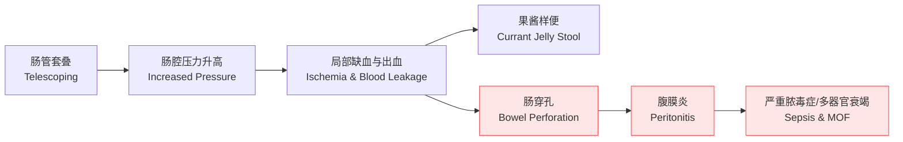
```mermaid
flowchart LR
    A[肠管套叠\nTelescoping] --> B[肠腔压力升高\nIncreased Pressure]
    B --> C[局部缺血与出血\nIschemia & Blood Leakage]
    C --> D[果酱样便\nCurrant Jelly Stool]
    C --> E[肠穿孔\nBowel Perforation]
    E --> F[腹膜炎\nPeritonitis]
    F --> G[严重脓毒症/多器官衰竭\nSepsis & MOF]
    
    style E fill:#ffe6e6,stroke:#ff4d4f
    style F fill:#ffe6e6,stroke:#ff4d4f
    style G fill:#ffe6e6,stroke:#ff4d4f
```

### 二、 预期临床表现 (Expected Clinical Findings)

| 临床体征 (Sign / Symptom) | 中文说明 | 英文机制与考点 (Clinical Rationale) |
| :--- | :--- | :--- |
| **香肠样腹部包块**<br>`Sausage-shaped mass` | 常位于**右上腹** | **Expected finding** due to the invagination/telescoping of the bowel segment. |
| **果酱样血便**<br>`Currant jelly stool` | 混有血液与黏液的大便 | **Expected finding** caused by increased intraluminal pressure leading to mucosal ischemia and blood leakage. |
| **呕吐**<br>`Vomiting` | 早期非胆汁性喷射性，晚期可为胆汁性 | Initially **projectile nonbilious**; progression to **bilious vomiting** strongly suggests complete bowel obstruction. |

### 三、 红色警报：穿孔与腹膜炎 (Red Flag: Peritonitis)

> [!CAUTION] **生命危险标志：急腹症体征 (Peritoneal Signs)**
> 肠穿孔导致肠道菌群和内容物泄漏至腹腔，迅速诱发**腹膜炎 (Peritonitis)**。必须立刻警惕以下体征：
> 1. **Fever**（发热）
> 2. **Abdominal rigidity**（腹部板状强直）
> 3. **Guarding**（腹部肌卫/肌紧张）
> 4. **Rebound tenderness**（反跳痛）
> 
> *未及时处理将迅速恶化为**败血症 (Sepsis)** 和**多重器官功能衰竭 (Multiple Organ Failure)**，危及生命。*

### 四、 中英高频专业词汇表 (Bilingual Terminology)

- **Intussusception** /ˌɪntəssəˈsɛpʃən/：肠套叠
- **Telescoping / Invagination**：套入 / 叠缩
- **Intestinal lumen**：肠腔
- **Ischemia** /ɪˈskiːmiə/：局部缺血
- **Peritonitis** /ˌpɛrɪtəˈnaɪtɪs/：腹膜炎
- **Abdominal rigidity**：腹部僵硬 / 板状腹
- **Guarding**：腹肌紧张 / 肌卫
- **Rebound tenderness**：反跳痛
- **Currant jelly–like stool**：果酱样便
- **Projectile nonbilious vomiting**：喷射状非胆汁性呕吐
- **Sepsis**：脓毒症 / 败血症

---

## 腹主动脉瘤与破裂风险 (Abdominal Aortic Aneurysm, AAA)

> [!TIP] **核心速记 (TL;DR)**
> - **病理核心**：腹主动脉壁局部薄弱并永久性扩张。未治疗时，持续血流静水压（Hydrostatic pressure）促使瘤体扩大，最终导致**破裂（Rupture）**。
> - **NCLEX 第一优先级**：**防范、识别和紧急处置 AAA 破裂**永远是最高优先级！破裂会导致灾难性腹腔大出血（Massive intraabdominal hemorrhage）和出血性休克，数分钟内致命。
> - **关键手术阈值**：瘤体直径 **$\ge 5.5\text{ cm}$** 需行**择期手术修补（Elective repair）**。

### 一、 风险因素与筛查 (Risk Factors & Screening)

| 类别 | 关键考点 (High-Yield NCLEX Points) | 临床说明 |
| :--- | :--- | :--- |
| **可逆风险因素**<br>`Modifiable Risks` | **吸烟 (Smoking)**<br>高血压 (Hypertension)<br>动脉粥样硬化 (Atherosclerosis) | **吸烟是最关键且可改变的独立危险因素**；需长期联合抗血小板（Aspirin）与他汀类药物（Statin）治疗。 |
| **不可逆风险因素**<br>`Non-modifiable Risks` | **男性 (Male sex)**<br>**年龄 >60 岁 (Age >60)**<br>白人群体 (White) | 65~75岁有吸烟史的男性为高危人群。 |
| **首选筛查手段**<br>`Screening Gold Standard` | **腹部超声 (Abdominal ultrasonography)** | 无创、快速、准确评估瘤体直径。 |

### 二、 临床表现与破裂红色警报 (Clinical Signs & Red Flag)

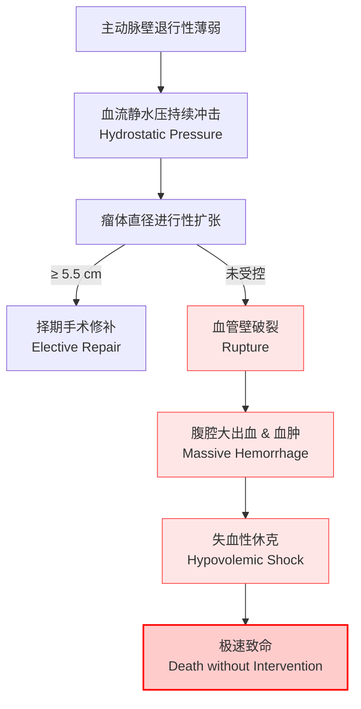
```mermaid
flowchart TD
    A[主动脉壁退行性薄弱] --> B[血流静水压持续冲击\nHydrostatic Pressure]
    B --> C[瘤体直径进行性扩张]
    C -->|≥ 5.5 cm| D[择期手术修补\nElective Repair]
    C -->|未受控| E[血管壁破裂\nRupture]
    E --> F[腹腔大出血 & 血肿\nMassive Hemorrhage]
    F --> G[失血性休克\nHypovolemic Shock]
    G --> H[极速致命\nDeath without Intervention]

    style E fill:#ffe6e6,stroke:#ff4d4f
    style F fill:#ffe6e6,stroke:#ff4d4f
    style G fill:#ffe6e6,stroke:#ff4d4f
    style H fill:#ffcccc,stroke:#ff0000,stroke-width:2px
```

> [!CAUTION] **生命危险标志：AAA 破裂 (Rupture)**
> 多数未破裂患者**常无明显症状 (Mostly asymptomatic)**，可能仅偶然触及**脐周搏动性包块（Pulsatile abdominal mass）**伴血管杂音（Bruit），或有轻微腹痛/腰背部痛（Flank/back pain）。
> **一旦破裂出现急症表现：**
> 1. **突发剧烈腰腹部/背部撕裂样剧痛** (Severe abdominal / back / flank pain)
> 2. **腹部膨隆** (Abdominal distension)
> 3. **失血性休克体征** (Hypovolemic Shock)：低血压、心动过速、苍白、大汗、外周脉搏微弱。

> [!DANGER] **NCLEX 实战警报：识别破裂的三大动态恶化体征 (Clinical Signs of Rupture)**
> 在临床监测中，出现以下任何一项动态指标改变，护士必须立即怀疑**动脉壁撕裂与腹腔大出血**：
> 1. **血压断崖式下跌（收缩压降幅 >40 mmHg）**：
>    - **考点数值**：例如基线为 `150/90 mmHg`，骤降至 `106/68 mmHg`（收缩压降幅 >40 mmHg）。
>    - **伴随症状**：伴发头晕 (Dizziness)、冷汗等**症状性低血压 (Symptomatic hypotension)**，为腹腔大出血导致循环容量锐减的直接证据。
> 2. **远端外周/足背动脉搏动减弱 (Diminished Pedal Pulses)**：
>    - **考点体征**：足背动脉搏动由基线 **+2 减弱至 +1**。
>    - **机制**：腹腔持续大失血导致外周有效循环血容量不足，下肢远端组织灌注急剧下降。
> 3. **疼痛突发急剧恶化 (Sudden Worsening of Pain)**：
>    - **机制**：动脉瘤壁发生急性撕裂（Arterial wall tearing）或破裂出血外渗刺激。

### 三、 NCLEX 优先级与鉴别诊断思维 (Priority / Differential Diagnosis)

在 NCLEX 多选题或优先级排序中，常见干扰项分析：

| 诊断 (Condition) | 潜在危害与特点 | 为什么不是第一优先级 (NCLEX Priority Rationale) |
| :--- | :--- | :--- |
| **肾结石**<br>`Kidney stones` | 尿路梗阻、尿潴留、肾盂积水 (Hydronephrosis) 及感染 | 疼痛剧烈，但**不具备立即致死性**，生命体征通常平稳。 |
| **消化性溃疡**<br>`Peptic ulcer disease` | 溃疡穿孔可致腹膜炎 (Peritonitis) | 属于急腹症，但相较于大动脉破裂引发的**秒级腹腔喷射性大出血**，危及生命速度次于 AAA 破裂。 |
| **腰椎间盘突出**<br>`Intervertebral disc herniation` | 神经根受压放射痛；巨大中央型可致马尾综合征（截瘫、大小便功能障碍） | 需急诊减压，但**无急性循环崩溃及猝死风险**。 |
| **腹主动脉瘤破裂**<br>`AAA Rupture` | **致命性大出血、低血容量性休克** | **⭐ 绝对第一优先级 (Priority 1)**：大动脉急性破裂为不可逆循环崩溃，几分钟内即可致死。 |

### 四、 临床管理重点 (Management Pearls)

1. **生活方式干预**：严格**戒烟 (Smoking cessation)**，控制血压与血脂。
2. **药物治疗**：长期服用**阿司匹林 (Aspirin)** 和 **他汀类药物 (Statin therapy)** 以降低心血管事件风险。
3. **手术修补指征**：
   - 动脉瘤直径 **$\ge 5.5\text{ cm}$** 时，破裂风险显著超过手术风险，应行择期手术修补（开放性手术或经皮血管内支架修补术 EVAR）。
   - 增长过快（如半年增长 $\ge 0.5\text{ cm}$）亦为急需评估指征。

### 五、 中英高频专业词汇表 (Bilingual Terminology)

- **Abdominal aortic aneurysm (AAA)**：腹主动脉瘤
- **Hydrostatic pressure**：静水压
- **Rupture**：破裂
- **Massive intraabdominal hemorrhage**：腹腔内大出血
- **Hypovolemic shock**：低血容量性休克
- **Abdominal ultrasonography**：腹部超声检查
- **Pulsatile mass**：搏动性包块
- **Flank pain**：腰腹部/季肋部疼痛
- **Abdominal distension**：腹部膨隆
- **Elective repair**：择期修补手术
- **Atherosclerosis** /ˌæθəroʊskləˈroʊsɪs/：动脉粥样硬化
- **Hydronephrosis** /ˌhaɪdroʊnəˈfroʊsɪs/：肾积水
- **Intervertebral disc herniation**：椎间盘突出
- **Radicular pain**：神经根性放射痛
- **Pedal pulses**：足背动脉搏动
- **Diminished pulses**：动脉搏动减弱（如 +2 $\to$ +1）
- **Arterial wall tearing**：动脉管壁撕裂
- **Symptomatic hypotension**：症状性低血压（如伴头晕 Dizziness）

---

## 婴儿囟门评估与闭合时限 (Infant Fontanels Assessment & Closure)

> [!TIP] **核心速记 (TL;DR)**
> - **两大囟门与闭合时限（必考数字）**：
>   - **后囟 (Posterior Fontanel)**：三角形，出生后 **2 个月内闭合**（by age 2 months / 6~8 周）。
>   - **前囟 (Anterior Fontanel)**：菱形，出生后 **18 个月内闭合**（by age 18 months / 12~18 个月）。
> - **触诊形态与鉴别**：
>   - **正常 (Normal)**：应平坦（Flat）、柔软未融合（Soft & nonfused）。轻微搏动（Slight pulsations）或哭闹/咳嗽/平躺时**一过性隆起 (Temporary bulging)** 属正常生理现象。
>   - **红色警报 (Red Flag)**：在婴儿**安静或睡眠状态下持续膨隆 (Bulging at rest/sleep)** $\to$ 高度提示**颅内压增高 (Increased ICP)**（如脑膜炎、脑积水、颅内出血）。

### 一、 前囟 vs 后囟核心考点对照 (Anterior vs. Posterior Fontanel)

| 考点维度 (Feature) | 前囟 (Anterior Fontanel) | 后囟 (Posterior Fontanel) |
| :--- | :--- | :--- |
| **形态与位置** | 呈**菱形**（Diamond-shaped），位于额骨与顶骨交界 | 呈**三角形**（Triangle-shaped），位于顶骨与枕骨交界 |
| **闭合时间**<br>*(NCLEX 必考)* | **18 个月 (by age 18 months)**<br>*(范围：12~18 个月)* | **2 个月 (by age 2 months)**<br>*(范围：6~8 周)* |
| **主要功能** | 适应婴儿大脑第一年的快速发育并容纳颅腔扩张 | 产道分娩时允许颅骨重叠（Molding）通过 |

### 二、 囟门触诊评估：正常生理 vs 异常病理 (Assessment Pearls)

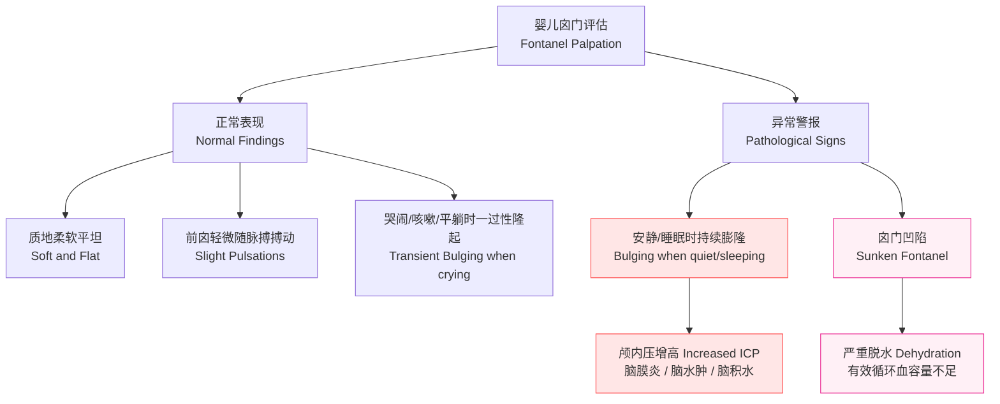
```mermaid
flowchart TD
    A[婴儿囟门评估\nFontanel Palpation] --> B[正常表现\nNormal Findings]
    A --> C[异常警报\nPathological Signs]
    
    B --> B1[质地柔软平坦\nSoft and Flat]
    B --> B2[前囟轻微随脉搏搏动\nSlight Pulsations]
    B --> B3[哭闹/咳嗽/平躺时一过性隆起\nTransient Bulging when crying]
    
    C --> C1[安静/睡眠时持续膨隆\nBulging when quiet/sleeping]
    C --> C2[囟门凹陷\nSunken Fontanel]
    
    C1 --> D1[颅内压增高 Increased ICP\n脑膜炎 / 脑水肿 / 脑积水]
    C2 --> D2[严重脱水 Dehydration\n有效循环血容量不足]

    style C1 fill:#ffe6e6,stroke:#ff4d4f
    style D1 fill:#ffe6e6,stroke:#ff4d4f
    style C2 fill:#fff0f6,stroke:#eb2f96
    style D2 fill:#fff0f6,stroke:#eb2f96
```

> [!CAUTION] **NCLEX 常见混淆点与陷阱 (Clinical Traps)**
> 1. **哭闹时的膨隆不要慌**：当婴儿**哭闹 (crying)、用力咳嗽 (coughing) 或平躺 (lying down)** 时，因胸腹腔压力增加导致静脉回流受阻，出现**短暂一过性膨隆是正常的**。
> 2. **何时报告医生？**：必须在婴儿**处于平静、坐位或直立位、未哭闹睡眠时**进行评估。若此时触诊前囟明显张力增高、隆起饱满（Bulging），必须立即报告医生评估颅内压！
> 3. **关联高频考点（脱水）**：若囟门**凹陷/深陷 (Sunken/depressed fontanel)**，常伴随尿量减少、黏膜干燥，提示**中重度脱水 (Dehydration)**。

### 三、 中英高频专业词汇表 (Bilingual Terminology)

- **Fontanel** /ˌfɒntəˈnɛl/：囟门
- **Anterior fontanel**：前囟
- **Posterior fontanel**：后囟
- **Nonossified membranes**：未骨化膜
- **Cranium** /ˈkreɪniəm/：颅骨
- **Fuse / Fusion**：闭合 / 骨化愈合
- **Flat**：平坦的
- **Pulsations**：搏动
- **Bulging**：膨隆 / 隆起
- **Sunken fontanel**：囟门凹陷
- **Increased intracranial pressure (ICP)**：颅内压增高
- **Dehydration**：脱水

---

## 哮喘急性发作的管理与用药鉴别 (Acute Asthma Exacerbation Management & Pharmacology)

> [!TIP] **核心速记 (TL;DR)**
> - **急性发作“急救三剑客 + 氧疗”**：
>   1. **吸入性短效 $\beta_2$ 激动剂 (SABA)**：如 **Albuterol（沙丁胺醇）** 雾化吸入 $\to$ 极速舒张支气管（解痉）。
>   2. **吸入性短效抗胆碱药 (SAMA)**：如 **Ipratropium（异丙托溴铵）** 雾化吸入 $\to$ 协同扩张支气管、减少黏液。
>   3. **全身性糖皮质激素 (Systemic Steroids)**：如 **IV / PO Methylprednisolone（甲泼尼龙）** $\to$ 强效消除气道炎症与水肿。
>   4. **高流量吸氧 (Supplemental $\text{O}_2$)**：维持血氧饱和度 **$\text{SpO}_2 > 90\%$**。
> - **NCLEX 经典禁忌与避坑黄金法则**：
>   - **慢药绝不能急用！** **Montelukast（孟鲁司特）** 和 **Salmeterol（沙美特罗 / LABA）** 属于**长期维持与预防用药**，起效慢，**绝对不能用于急性发作抢救**！

### 一、 急性发作期急救用药方案 (Rescue Interventions)

| 药物类别 / 措施 | 代表药物 / 手段 | 给药途径 | 药理机制与临床考点 (Clinical Rationale) |
| :--- | :--- | :--- | :--- |
| **SABA**<br>短效 $\beta_2$ 受体激动剂 | **Albuterol**<br>*(沙丁胺醇)* | 雾化吸入<br>`Nebulized` | **首选一线急救药**。直接兴奋气道平滑肌 $\beta_2$ 受体，数分钟内迅速扩张支气管（Bronchodilation）。注意监测心动过速与震颤震颤副作用。 |
| **SAMA / 抗胆碱药**<br>短效抗胆碱能药 | **Ipratropium**<br>*(异丙托溴铵)* | 雾化吸入<br>`Nebulized` | 阻断毒蕈碱受体，与 Albuterol 协同舒张气道，并显著减少气道黏稠分泌物生成。 |
| **Systemic Steroids**<br>全身性糖皮质激素 | **Methylprednisolone**<br>*(甲泼尼龙琥珀酸钠)* | 静脉注射 (IV)<br>或口服 (PO) | 抑制全身炎症介质释放，减轻支气管黏膜水肿。*虽然起效需要数小时，但必须在急诊初期尽早给予。* |
| **氧疗**<br>`Oxygen Therapy` | **Supplemental $\text{O}_2$** | 鼻导管 / 面罩 | 纠正通气血流比例失调导致的低氧血症，严格维持 **$\text{SpO}_2 > 90\%$**。 |

### 二、 维持预防 vs 急性抢救：NCLEX 必考混淆项 (Rescue vs. Maintenance)

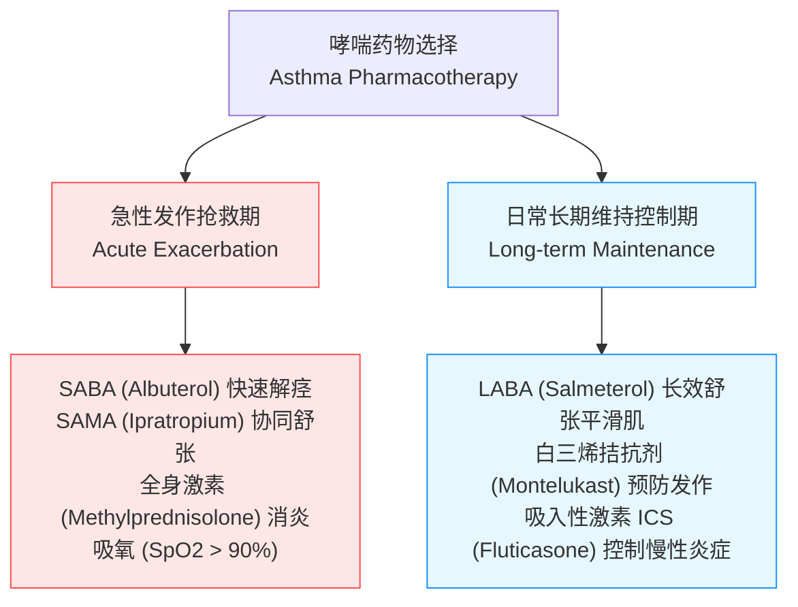
```mermaid
flowchart TD
    A[哮喘药物选择\nAsthma Pharmacotherapy] --> B[急性发作抢救期\nAcute Exacerbation]
    A --> C[日常长期维持控制期\nLong-term Maintenance]
    
    B --> B1["SABA (Albuterol) 快速解痉\nSAMA (Ipratropium) 协同舒张\n全身激素 (Methylprednisolone) 消炎\n吸氧 (SpO2 > 90%)"]
    
    C --> C1["LABA (Salmeterol) 长效舒张平滑肌\n白三烯拮抗剂 (Montelukast) 预防发作\n吸入性激素 ICS (Fluticasone) 控制慢性炎症"]
    
    style B fill:#ffe6e6,stroke:#ff4d4f
    style B1 fill:#ffe6e6,stroke:#ff4d4f
    style C fill:#e6f7ff,stroke:#1890ff
    style C1 fill:#e6f7ff,stroke:#1890ff
```

> [!CAUTION] **NCLEX 常见干扰项深度避坑 (Common Distractor Traps)**
> 1. **Montelukast (孟鲁司特 / 白三烯受体拮抗剂 LTRA)**：
>    - **真实用途**：口服药，通过阻断白三烯受体减少慢性炎症和气道高反应性，用于**预防**哮喘发作与过敏性鼻炎。
>    - **陷阱**：需要数周积累起效，**在急性发作（Acute attack）时给药完全无效**，切勿误选！
> 2. **Salmeterol (沙美特罗 / LABA 长效 $\beta_2$ 激动剂)**：
>    - **真实用途**：药效持续 12 小时以上，必须与吸入性皮质激素（ICS，如氟替卡松）联合使用作为**日常维持治疗（Maintenance therapy）**。
>    - **陷阱**：起效非常缓慢（通常需 15~30 分钟以上才能缓慢舒张），**绝对不可作为急救吸入剂（Rescue inhaler）**使用。

### 三、 中英高频专业词汇表 (Bilingual Terminology)

- **Acute exacerbation**：急性加重 / 急性发作
- **Bronchodilation** /ˌbrɒŋkoʊdaɪˈleɪʃən/：支气管舒张
- **Bronchial inflammation**：支气管炎症
- **Short-acting beta agonist (SABA)**：短效 $\beta_2$ 受体激动剂
- **Anticholinergics** /ˌæntiˌkoʊlɪˈnɜːrdʒɪks/：抗胆碱能药物
- **Ipratropium**：异丙托溴铵
- **Albuterol**：沙丁胺醇
- **Systemic corticosteroids**：全身性糖皮质激素
- **Methylprednisolone succinate**：甲泼尼龙琥珀酸钠
- **Leukotriene receptor antagonist (LTRA)**：白三烯受体拮抗剂
- **Montelukast**：孟鲁司特
- **Long-acting beta-2 agonists (LABA)**：长效 $\beta_2$ 受体激动剂
- **Salmeterol**：沙美特罗
- **Maintenance therapy**：维持治疗
- **Supplemental oxygen**：辅助给氧
- **Oxygen saturation ($\text{SpO}_2$)**：血氧饱和度

---

备孕，孕期不能喝酒，然后也算备孕阶段补充400，孕期补充600

 There is no need to routinely check blood pressure before taking the medicine.  This client should be instructed to check the pulse and withhold digoxin if the heart rate is <60/min.

The chain of command should be followed when reporting incidents of lateral violence.  If the immediate supervisor takes no action, the employee can move up the chain.


| **动词类型**       | **典型英文词汇**                                                                          | **适任人员**            |
| -------------- | ----------------------------------------------------------------------------------- | ------------------- |
| **禁止委派给 UAP**  | **Teach**, **Assess**, **Evaluate**, **Monitor**, **Develop care plan**             | 只能由 **RN / LPN** 负责 |
| **可安全委派给 UAP** | **Remind**, **Assist**, **Reapply**, **Position**, **Report**, **Record / Collect** | **UAP（护理员）** 即可执行   |
对于骨骼牵引不应该使用logrolling方式移动，可以使用overhead trapeze头顶移动架，logrolling用于脊椎或者全身无法移动的手术外伤

Nutritional deficiencies (eg, zinc, protein, vitamin C) and dehydration (ie, hypernatremia, elevated BUN) can impair wound healing.


Famotidine is an H2-receptor antagonist that is commonly used to treat gastroesophageal reflux disease and is safe to use for older adult clients.

---

## 水痘疫苗接种与不良反应宣教 (Varicella Vaccine Administration & Adverse Effects)

> [!TIP] **核心速记 (TL;DR)**
> - **疫苗目的与程序**：预防**水痘-带状疱疹病毒 (Varicella-Zoster Virus, VZV)**。必须完成 **2 剂接种（2 doses）** 才能获得最佳终身免疫保护（常规第 1 剂：12~15 个月；第 2 剂：4~6 岁）。
> - **联合接种规则 (Co-administration)**：**可以**在同一就诊日与其它儿童疫苗（如 **MMR、DTaP、Hib**）同时接种（需在不同解剖部位/肢体分别注射）。
> - **NCLEX 最爱考的家长宣教考点**：
>   - 常见的良性轻微反应包括：低热（Low-grade fever）、注射部位红肿（Erythema/swelling）、烦躁易激惹（Irritability）。
>   - ⭐ **延迟性散在皮疹 (Rash up to 1 month)**：在**接种后最长至 1 个月内**，患儿身上出现少许散在斑丘疹/水疱疹是**预期的正常弱化病毒反应**，无需惊慌！

### 一、 疫苗接种程序与联合接种原则 (Schedule & Administration)

| 项目维度 | 核心考点 (High-Yield Points) | 临床说明与规范 |
| :--- | :--- | :--- |
| **目标病毒** | 水痘-带状疱疹病毒 (VZV) | 预防水痘感染及其严重并发症（如继发细菌感染、脑炎、肺炎）。 |
| **免疫程序** | **必须接种 2 剂 (Two doses)** | 单剂保护力不足，需满 2 剂方能达到最佳免疫状态（Optimal immunity）。 |
| **同日同期接种**<br>`Co-administration` | **可以与多种疫苗同时接种** | 可同日接种 **MMR**（麻腮风）、**DTaP**（百白破）、**Hib**（b型流感嗜血杆菌）。<br>*注意：必须使用不同注射器并在不同肢体/解剖部位（至少间隔 1 英寸）给药。* |
| **活疫苗间隔铁律**<br>`Live Vaccine Rule` | **活疫苗若不同天打，必隔 4 周** | 水痘疫苗与 MMR 均为**减毒活疫苗 (Live attenuated)**。若未能在**同一天同时接种**，两者之间必须**至少间隔 4 周（28 天）**，避免第一种活疫苗的干扰素反应抑制第二种的免疫应答。 |

### 二、 预期轻度反应与家长宣教重点 (Expected Mild Reactions & Teaching)

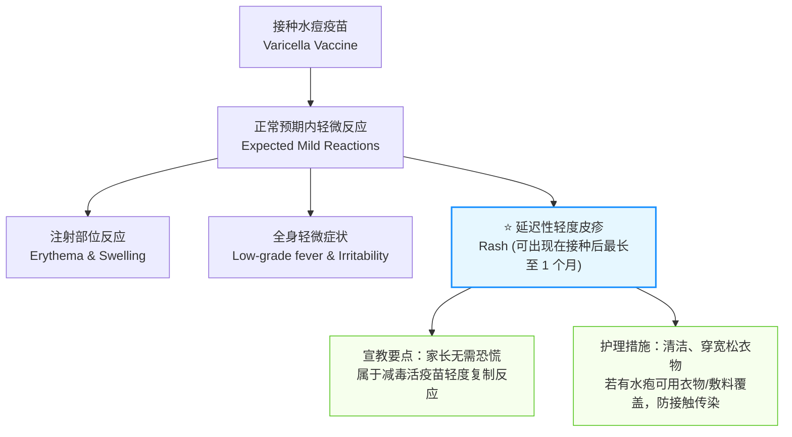
```mermaid
flowchart TD
    A[接种水痘疫苗\nVaricella Vaccine] --> B[正常预期内轻微反应\nExpected Mild Reactions]
    
    B --> B1[注射部位反应\nErythema & Swelling]
    B --> B2[全身轻微症状\nLow-grade fever & Irritability]
    B --> B3["⭐ 延迟性轻度皮疹\nRash (可出现在接种后最长至 1 个月)"]
    
    B3 --> C1[宣教要点：家长无需恐慌\n属于减毒活疫苗轻度复制反应]
    B3 --> C2[护理措施：清洁、穿宽松衣物\n若有水疱可用衣物/敷料覆盖，防接触传染]

    style B3 fill:#e6f7ff,stroke:#1890ff,stroke-width:2px
    style C1 fill:#f6ffed,stroke:#52c41a
    style C2 fill:#f6ffed,stroke:#52c41a
```

> [!CAUTION] **NCLEX 考题避坑陷阱：接种数周后的“皮疹”不是医疗事故！**
> - **考题情境**：家长带着接种水痘疫苗 2~3 周后的幼儿就诊，焦虑反映“孩子身上冒出了 2~5 个小红疹/小水泡”。
> - **护士正确应对 (Correct Action)**：
>   1. **安抚家长**：解释这是减毒活疫苗引起的**预期良性反应（Expected finding）**，最长在注射后 **1 个月内**均可能出现。
>   2. **隔离与覆盖**：皮疹处若有水疱，其内含少量减毒病毒，应使用衣物或创口贴轻柔覆盖，直至结痂，**避免让患儿与免疫力低下者（如孕妇、化疗患者）直接皮肤接触**。
>   3. **退热护理**：若有低热可物理降温或使用对乙酰氨基酚，**严禁使用阿司匹林**（预防水痘/病毒感染下阿司匹林引发 **Reye 综合征**）！

### 三、 中英高频专业词汇表 (Bilingual Terminology)

- **Varicella vaccine**：水痘疫苗
- **Varicella-zoster virus (VZV)**：水痘-带状疱疹病毒
- **Optimal immunity**：最佳免疫力
- **Adverse reactions**：不良反应
- **Low-grade fever**：低热
- **Swelling and erythema**：肿胀与红斑
- **Irritability**：烦躁易激惹
- **Vesicular / Maculopapular rash**：疱疹 / 斑丘疹
- **Co-administration**：联合给药 / 同期接种
- **Measles, mumps, and rubella (MMR)**：麻疹、腮腺炎、风疹联合疫苗
- **Diphtheria-tetanus-acellular pertussis (DTaP)**：白喉、破伤风、无细胞百日咳联合疫苗
- **Haemophilus influenzae type b (Hib)**：b型流感嗜血杆菌疫苗
- **Live attenuated vaccine**：减毒活疫苗

---

## 妊娠期糖尿病 (DM in Pregnancy)：母儿并发症与病理机制

> [!TIP] **核心速记 (TL;DR)**
> - **胎儿三大经典并发症 (Fetal Triad)**：
>   1. **巨大儿 (Fetal macrosomia)**：胎儿体重 $>4000\text{ g}$（或 $>4500\text{ g}$）。
>   2. **肩难产 (Fetal shoulder dystocia)**：肩部与躯干脂肪堆积不成比例，分娩时胎儿前肩卡在耻骨联合后方。
>   3. **羊水过多 (Polyhydramnios)**：胎儿高血糖导致高渗性利尿（多尿），羊水量异常增多。
> - **母体核心并发症**：
>   - **子痫前期 (Preeclampsia)**：与**孕前糖尿病 (Pregestational DM)** 及 **妊娠期糖尿病 (Gestational DM, GDM)** 均显著相关。
> - **核心病生链条 (Pedersen 假说)**：
>   母体高血糖 $\to$ 穿过胎盘 $\to$ 刺激胎儿胰岛 $\beta$ 细胞增生 $\to$ **胎儿高胰岛素血症 (Fetal hyperinsulinemia)** $\to$ 胰岛素作为强效生长激素促成**巨大儿与器官增大**；同时胎儿高渗性利尿导致**羊水过多**。

### 一、 母儿并发症与病理机制对照表 (Complications & Rationale)

| 观察对象 | 并发症 (Complication) | 病理生理机制 (Mechanism) | NCLEX 临床意义与重点 (Clinical Pearls) |
| :--- | :--- | :--- | :--- |
| **胎儿** | **巨大儿**<br>`Fetal Macrosomia` | 母体葡萄糖自由通过胎盘，促发**胎儿高胰岛素血症**。胰岛素促进脂肪沉积和糖原合成。 | 增加剖宫产率、产道撕裂风险；躯干肩径增大为肩难产的直接诱因。 |
| **胎儿** | **肩难产**<br>`Shoulder Dystocia` | 巨大儿胸围及双肩径不成比例过度发育，阴道分娩时前肩嵌顿在耻骨联合后方。 | **产科急症！** 易导致新生儿臂丛神经损伤（Erb palsy）、锁骨骨折及胎儿窒息。 |
| **胎儿** | **羊水过多**<br>`Polyhydramnios` | 胎儿持续处于高血糖状态，产生**渗透性利尿 (Osmotic diuresis)**，胎尿排入羊膜腔增多。 | 子宫过度膨隆，增加**胎膜早破 (PROM)、早产、胎盘早剥 (Placental abruption)** 及产后出血风险。 |
| **母体** | **子痫前期**<br>`Preeclampsia` | 广泛血管内皮细胞损伤、微血管病变与胰岛素抵抗恶化全身血管痉挛。 | 无论是孕前糖尿病还是妊娠期糖尿病，均属于子痫前期的**高危独立危险因素**。 |

### 二、 病理生理传导链图 (Pathophysiology Chain)

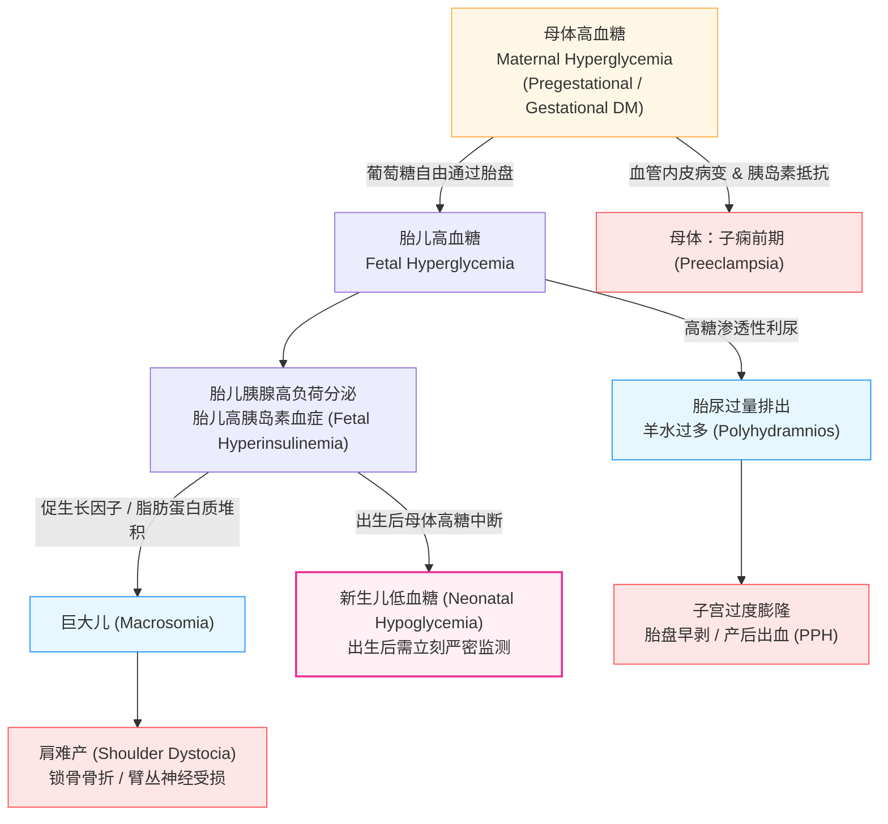
```mermaid
flowchart TD
    A["母体高血糖\nMaternal Hyperglycemia\n(Pregestational / Gestational DM)"] -->|葡萄糖自由通过胎盘| B["胎儿高血糖\nFetal Hyperglycemia"]
    
    A -->|血管内皮病变 & 胰岛素抵抗| M["母体：子痫前期 (Preeclampsia)"]
    
    B --> C["胎儿胰腺高负荷分泌\n胎儿高胰岛素血症 (Fetal Hyperinsulinemia)"]
    
    C -->|促生长因子 / 脂肪蛋白质堆积| D["巨大儿 (Macrosomia)"]
    D --> E["肩难产 (Shoulder Dystocia)\n锁骨骨折 / 臂丛神经受损"]
    
    B -->|高糖渗透性利尿| F["胎尿过量排出\n羊水过多 (Polyhydramnios)"]
    F --> G["子宫过度膨隆\n胎盘早剥 / 产后出血 (PPH)"]
    
    C -->|出生后母体高糖中断| H["新生儿低血糖 (Neonatal Hypoglycemia)\n出生后需立刻严密监测"]

    style A fill:#fff7e6,stroke:#ffa940
    style M fill:#ffe6e6,stroke:#ff4d4f
    style D fill:#e6f7ff,stroke:#1890ff
    style E fill:#ffe6e6,stroke:#ff4d4f
    style F fill:#e6f7ff,stroke:#1890ff
    style G fill:#ffe6e6,stroke:#ff4d4f
    style H fill:#fff0f6,stroke:#eb2f96,stroke-width:2px
```

> [!CAUTION] **NCLEX 必考联动考点：分娩中与分娩后警报 (Clinical Alerts)**
> 1. **分娩期警报（肩难产紧急配合）**：
>    - 若发生肩难产，护士首选执行 **McRoberts 操作法**（产妇双腿极度屈曲向腹部靠拢）和 **耻骨上加压 (Suprapubic pressure)**。
>    - **绝对禁忌**：**严禁在宫底加压 (NO fundal pressure)**，否则会加重前肩嵌顿或造成子宫破裂！
> 2. **产后即刻警报（低血糖与产伤）**：
>    - 脐带结扎后，母体供应的高糖突然中断，但新生儿体内的高胰岛素水平仍会持续数小时，极易发生**严重低血糖与产伤并发症**。

### 三、 糖尿病产妇新生儿 (IDM) 专项评估：两大核心危机体征

| 风险类别 | 核心评估体征 (Key Signs to Monitor) | 机制与 NCLEX 实战考点 (Clinical Rationale) |
| :--- | :--- | :--- |
| **低血糖危象**<br>`Hypoglycemia` | ⭐ **抖动 / 震颤 (Jitteriness)**<br>• 嗜睡、肌张力低下 (Hypotonia)<br>• 吸吮无力 / 喂养困难<br>• 低体温、尖叫 (High-pitched cry) | **Jitteriness 是新生儿低血糖最经典、最高频的首发警报体征！**<br>*鉴别考点*：低血糖性抖动在护士**轻柔握住/屈曲肢体时会停止 (stops with passive flexion)**；而癫痫发作（Seizure）握住肢体仍会持续抽搐。 |
| **肩难产致骨折**<br>`Clavicle Fracture` | ⭐ **锁骨处触及骨擦音 (Crepitus over clavicle)**<br>• 局部肿胀与压痛<br>• 患侧上肢自主活动减少 | 巨大儿阴道分娩通过骨盆时前肩卡压，极易发生**锁骨骨折**。<br>触诊锁骨有捻发音/骨擦感，移动患肢患儿哭闹。 |
| **臂丛神经损伤**<br>`Brachial Plexus Injury` | ⭐ **拥抱反射不对称或减弱 (Decreased Moro reflex)**<br>• 患肢下垂、内旋（侍者小费手） | 肩难产牵拉胎头过度导致颈神经根（C5-C6）拉伤（Erb palsy）。<br>评估时**患侧 Moro 反射减弱或消失**，健侧反应正常。 |

> [!TIP] **护士优先行动总结 (Nursing Priorities)**
> - **出生后立刻**：监测微量血糖（目标 $\ge 40\sim45\text{ mg/dL}$），首选尽早母乳或配方奶喂养。
> - **全面体格检查**：必须系统触诊两侧锁骨对称性及有无**骨擦音（Crepitus）**，叩击床面激发并评估**拥抱反射（Moro reflex）**是否完全对称。

### 四、 中英高频专业词汇表 (Bilingual Terminology)

- **Diabetes mellitus (DM)**：糖尿病
- **Pregestational DM**：孕前糖尿病
- **Gestational diabetes mellitus (GDM)**：妊娠期糖尿病
- **Infant of a diabetic mother (IDM)**：糖尿病母亲所生婴儿
- **Fetal macrosomia**：胎儿巨大儿（通常体重 $>4000\text{ g}$ 或 $>4500\text{ g}$）
- **Shoulder dystocia**：肩难产
- **Polyhydramnios** /ˌpɒlihaɪˈdræmniɒs/：羊水过多
- **Preeclampsia** /ˌpriːɪˈklæmpsiə/：子痫前期
- **Fetal hyperinsulinemia**：胎儿高胰岛素血症
- **Osmotic diuresis**：高渗性利尿
- **Neonatal hypoglycemia**：新生儿低血糖
- **Jitteriness** /ˈdʒɪtərinəs/：抖动 / 震颤（低血糖典型体征）
- **Crepitus over the clavicle**：锁骨骨擦音 / 捻发音（锁骨骨折体征）
- **Decreased Moro reflex**：拥抱反射减弱 / 消失（臂丛神经损伤体征）
- **Brachial plexus injury / Erb palsy**：臂丛神经损伤 / 厄尔布麻痹
- **Suprapubic pressure**：耻骨上加压
- **Fundal pressure**：宫底加压（肩难产时禁止）
- **Postpartum hemorrhage (PPH)**：产后出血

---

## 婴幼儿生长发育：体重增长核心里程碑 (Infant & Toddler Weight Milestones)

> [!TIP] **核心速记 (TL;DR) —— NCLEX 必背黄金乘数法则**
> - **6 个月**：体重达到出生体重的 **2 倍 (Doubles)**。
> - **12 个月（1 岁）**：体重达到出生体重的 **3 倍 (Triples)**。
> - ⭐ **30 个月（2 岁半）**：体重达到出生体重的 **4 倍 (Quadruples / 4 times)**。
> - **幼儿期（Toddler 1~3 岁）增长规律**：体重增长速度明显放缓，平均每年增加 **4~6 lb (1.8~2.7 kg)**。

### 一、 婴幼儿体重里程碑对照表 (Growth Milestones Timeline)

| 年龄阶段 (Age) | 预期体重标准 (Expected Weight) | 年增重规律 (Rate of Gain) | 临床考点与护理意义 (Clinical Pearls) |
| :--- | :--- | :--- | :--- |
| **出生时 (Birth)** | 基线参考值（通常约 6~8 lb / 2.7~3.6 kg） | — | 出生后最初几天可有 5%~10% 生理性体重下降，通常在 10~14 天内恢复到出生体重。 |
| **6 个月** | **出生体重的 2 倍 (2× Birth Weight)** | 婴儿期高速增长阶段 | 生长发育评估的重要早期节点。 |
| **12 个月 (1 岁)** | **出生体重的 3 倍 (3× Birth Weight)** | 婴儿期结束，体格发育最快的一年 | 婴儿期结束标志，此后生长速率开始断崖式放缓。 |
| **30 个月 (2.5 岁)**<br>*(高频必考)* | **出生体重的 4 倍 (4× Birth Weight)** | 幼儿期体格稳步增长 | **NCLEX 计算题常考考点！** 例如：出生 7 lb 的婴儿，30 个月时预期体重约为 $7 \times 4 = 28\text{ lb}$。 |
| **幼儿期总体 (1~3 岁)** | 稳步递增 | **平均每年增长 4~6 lb**<br>*(1.8~2.7 kg / 年)* | 增重明显慢于婴儿期，腹部膨出（外形凸肚），四肢逐渐拉长。 |

### 二、 幼儿期生理特点与家长宣教 (Developmental Insights & Teaching)

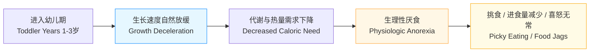
```mermaid
flowchart LR
    A[进入幼儿期\nToddler Years 1-3岁] --> B[生长速度自然放缓\nGrowth Deceleration]
    B --> C[代谢与热量需求下降\nDecreased Caloric Need]
    C --> D[生理性厌食\nPhysiologic Anorexia]
    D --> E[挑食 / 进食量减少 / 喜怒无常\nPicky Eating / Food Jags]
    
    style B fill:#e6f7ff,stroke:#1890ff
    style D fill:#fff7e6,stroke:#ffa940
    style E fill:#fffbe6,stroke:#faad14
```

> [!NOTE] **高频联动考点：生理性厌食 (Physiologic Anorexia)**
> - **现象**：幼儿期由于生长速度由婴儿期的“爆发式”放缓为每年仅增重 4~6 lb，机体代谢率相对降低，患儿常表现为**食欲明显下降、挑食或只爱吃单一食物（Food jags）**。
> - **护士宣教指导**：
>   1. 告知家长这是**正常发育过程中的生理现象**，切勿焦虑或强迫进食。
>   2. 采用**少量多餐**，提供结构化的健康点心（如切片水果、奶酪）。
>   3. 避免在正餐前饮用过多果汁或牛奶（牛奶每天限制在 16~24 oz，防止缺铁性贫血）。

### 三、 中英高频专业词汇表 (Bilingual Terminology)

- **Toddler** /ˈtɒdlər/：幼儿（通常指 1~3 岁儿童）
- **Weight gain**：体重增加 / 增重
- **Birth weight**：出生体重
- **Double / Triple / Quadruple**：翻倍（2倍）/ 三倍 / 四倍
- **Physiologic anorexia**：生理性厌食
- **Food jag**：对单一食物的偏好/挑食发作
- **Growth deceleration**：生长速度减缓
- **Caloric requirement**：热量需求

---

## 膝关节置换术 (TKR)：手杖使用与上下楼梯规律

> [!TIP] **核心可循规律与记忆口诀 (Golden Rules & Mnemonic)**
> - **持杖原则**：**永远健侧持拐 (Hold cane on the STRONGER side)**（扩大支撑底面积，健肢与拐杖协同承重）。
> - **上下楼梯经典口诀**：⭐ **"Up with the GOOD, Down with the BAD"**（好人上天堂，坏人下地狱）
>   - **上楼梯 (Ascend)**：**好腿（健侧腿）先上**。
>   - **下楼梯 (Descend)**：**拐杖与坏腿（患侧腿）先下**，好腿最后下承重。

### 考点与动作顺序速记

1. **上楼梯三步法 (Ascending Stairs)**：
   - 步骤 ①：面朝前方，**健腿 (Stronger leg)** 先迈上一级台阶。
   - 步骤 ②：健腿承重站稳，**手杖 (Cane)** 随之移上台阶。
   - 步骤 ③：最后将**患腿 (Weaker leg)** 迈上台阶。
2. **出院负重标准 (Weight-bearing Milestone)**：
   - 全膝关节置换术（TKR）患者在**出院时通常即可达到完全负重 (Bear full weight by discharge)**。

---

## 婴幼儿发育里程碑 (1~3 岁)：核心全览与 4 大可循规律

> [!TIP] **⭐ NCLEX 必背 4 大秒杀规律 (The Golden Patterns)**
> 
> 1. **2 岁全是“2” (Age 2 = Everything "2")**：
>    - 说 **2** 词短语（`2-word phrases`）
>    - 指出 **2** 个身体部位（`2 body parts`）
>    - **双**脚一台阶迈上楼梯（`Walks up stairs`）
>    - **两**个小孩各玩各的平行游戏（`Parallel play`）
>    - 用**双**腿奔跑、踢球（`Runs` & `Kicks ball`）
> 
> 2. **3 岁全是“3” (Age 3 = Everything "3")**：
>    - 骑 **3** 轮车（`Rides tricycle`）
>    - 说 **3** 词完整句子（`≥3-word sentences`）
>    - 言语 **3/4（75%）** 能被外人听懂（`Speech 75% intelligible`）
>    - 画 **3**60 度的圆圈（`Copies circle`）
>    - 知道自己 **3** 个身份信息：姓名、年龄、性别（`Knows age/sex`）
>    - **3** 个人一起合作玩耍，告别平行游戏（`Plays with other children`）
>    - 上楼梯**双脚交替一步一阶**（`Walks up stairs alternating feet`）
> 
> 3. **指令理解递进规律 (Commands Progression)**：
>    - **15 个月**：需配合**手势**执行 1 步指令（`1-step with gesture`）
>    - **18 个月**：**无需手势**纯凭语言执行 1 步指令（`1-step without gesture`）
>    - **30 个月**：可连续执行 **2 步复合指令**（`2-step command`）
> 
> 4. **进食工具与动作递进规律 (Feeding & Fine Motor)**：
>    - 1 岁：精细钳状捏起食物（`Pincer grasp`）
>    - 18 个月：用手指抓着吃（`Feeds with fingers`）+ 乱涂画（`Scribbles`）
>    - 2 岁：进阶学会**用勺子**（`Uses spoon`）
>    - 3 岁：进阶学会**用叉子**（`Uses fork`）+ 协助下穿衣（`Dresses with help`）

---

### 1~3 岁发育里程碑核心对照表 (Developmental Milestones Table)

| 年龄 (Age) | 粗大动作 (Gross Motor) | 精细动作 (Fine Motor) | 语言能力 (Language) | 社交 / 认知 (Social/Cognitive) |
| :--- | :--- | :--- | :--- | :--- |
| **1 岁**<br>*(12 个月)* | • 扶着站立（`Pulls to stand`）<br>• 扶走/巡航（`Cruises`） | • 钳状抓握 / 捏取小物件（`Pincer grasp`） | • 会叫爸爸妈妈（`Says mama/dada`）<br>• 听懂“不行”（`Understands "no"`） | • 玩拍手歌游戏（`Pat-a-cake`）<br>• 寻找隐藏物体（`Looks for hidden object / 客体永久性`） |
| **15 个月** | • 能独立迈出几步（`Takes a few steps`） | • 搭建 **2 块积木**（`Stacks 2 blocks`） | • 会说 1~2 个独立单词（除 mama/dada 以外） | • 需**手势**执行 1 步指令（`Follows 1-step with gesture`）<br>• 用手指指示想索要的物品（`Points to get something`）<br>• 表达喜爱之情（`Shows affection`） |
| **18 个月** | • 走路自如（`Walks easily`）<br>• 爬上家具（`Climbs onto furniture`） | • 乱涂乱画（`Scribbles`）<br>• 自己用手指抓食物吃（`Feeds with fingers`） | • 会说 **$\ge 3$ 个单词**（除 mama/dada 以外） | • **无需手势**即听懂 1 步指令（`Follows 1-step without gesture`）<br>• 模仿成人行为（`Imitates`） |
| **2 岁**<br>*(24 个月)* | • 会奔跑（`Runs`）<br>• 会踢球（`Kicks ball`）<br>• 一步一停迈上楼梯（`Walks up stairs`） | • **学会使用勺子**进食（`Uses spoon`） | • 说 **2 个词的短语**（`Says 2-word phrases`） | • 指出 **2 个身体部位**（`Knows 2 body parts`）<br>• **平行游戏**（`Parallel play`：旁边各玩各的） |
| **30 个月**<br>*(2.5 岁)* | • **双脚原地跳跃**（`Jumps`） | • 会自己脱衣（`Removes clothes`）<br>• 翻书页（`Turns pages`） | • 词汇量达到 **$\ge 50$ 个词**（`Says ≥50 words`） | • 执行 **2 步复合指令**（`Follows 2-step command`）<br>• 能辨认 **1 种颜色**（`Knows 1 color`） |
| **3 岁**<br>*(36 个月)* | • **双脚交替上楼梯**（`Walks up stairs alternating feet`）<br>• 骑三轮脚踏车（`Rides tricycle`） | • 协助下穿衣（`Dresses with help`）<br>• **学会使用叉子**（`Uses fork`）<br>• 临摹**画圆圈**（`Copies circle`） | • 说 **$\ge 3$ 个词的完整句子**<br>• **言语 75% 能被外人理解**（`Speech 75% intelligible`） | • 知道自己的**年龄与性别**（`Knows age/sex`）<br>• **与同伴一起合作玩耍**（`Plays with other children`） |

---

### 中英高频专业词汇表 (Bilingual Terminology)

- **Cruises**：扶走 / 扶着家具移动
- **Pincer grasp**：钳状抓握（拇指与食指捏取）
- **Scribbles**：随手乱涂画
- **Parallel play**：平行游戏（幼儿期各玩各的，无互动）
- **Alternating feet**：双脚交替（上楼梯一步一脚）
- **Tricycle**：三轮车
- **Copies circle**：临摹圆圈
- **Intelligible speech**：可被外人理解的清晰言语

---

## 协同照护 (Coordinated Care)：跨学科沟通与患者安全法则

> [!TIP] **核心可循规律与沟通铁律 (Golden Principles & SBAR Tool)**
> - **核心宗旨**：跨学科高效沟通（Interdisciplinary communication）是交付安全照护（Safe client care）、**预防不良事件与降低医疗差错（Reduce medical errors）的决定性保障**。
> - **跨学科汇报标准化黄金工具 —— SBAR 模型**：
>   - **S (Situation 现状)**：说明身份、患者姓名、当前发生的紧急核心问题。
>   - **B (Background 背景)**：提供与当前问题直接相关的入院诊断、用药、重要病史与既往基线。
>   - **A (Assessment 评估)**：护士当前测得的客观异常生命体征、体查发现及临床判断。
>   - **R (Recommendation 建议)**：明确提出需要医生采取的行动（如：“需要您立刻到床旁评估”、“建议复查血气/调整用药”）。
> - **口头/电话医嘱闭环铁律**：执行 **Read-back / Repeat-back（完整复述并核对）**，确保零差错闭环。

### 考点速记
- **跨学科协同（Coordinated Care）核心成员**：医生、护士、药剂师（Pharmacist）、理疗师（PT/OT）、社工/个案管理员（Social Worker / Case Manager）。
- **高频考题方向**：当出现病情恶化、药物冲突、出院安置困难时，**优先组织跨学科团队协商（Interdisciplinary conference）**，而非单打独斗。

---

## 肝素 (Heparin)：双人核对原则与核心禁忌证

> [!TIP] **核心可循规律与双人核对铁律 (Golden Rules)**
> - **高危药物 (High-Alert Medication) 铁律**：
>   - 静脉肝素属于极高危药物。任何时候**启动输注、更换药袋、调整静脉滴速 (Change IV rate / Titration)**，必须由 **2 名注册护士 (Two RNs) 执行独立双人核对 (Independent Double-Check)**（分别独立核对医嘱、计算剂量及输液泵速率设置）。
> - **两大核心致命禁忌证 (Major Contraindications)**：
>   1. **出血性脑卒中 (Hemorrhagic Stroke)**：颅内正在出血，抗凝将直接导致血肿扩大与脑疝猝死！
>   2. **近期重大手术后 (Recent Major Surgery)**：特别是眼部（Eye）、脑部（Brain）、脊髓（Spinal cord）手术，微量渗血即可致盲或瘫痪。
>   3. *(伴随禁忌)*：活动性出血（Active bleeding）、消化道大溃疡、既往有 **HIT（肝素诱导的血小板减少症）** 史。

### 必背衍生联动考点 (High-Yield Pearls)
- **疗效监测指标**：**aPTT**（活化部分凝血活酶时间），治疗目标通常维持在对照值的 **1.5~2.5 倍**（约 46~70 秒；$>100$ 秒提示过量大出血风险，需停药并报告）。
- **特异性特效解毒剂**：**硫酸鱼精蛋白 (Protamine Sulfate)**。

---

## 患者安全转移 (Bed-to-Chair Transfer)：决策规律与护腰红线

> [!TIP] **⭐ NCLEX 必背 3 大秒杀决策规律 (Golden Rules)**
> 
> 1. **“不配合 / 没力气”终极法则**：
>    - 只要患者**不配合 (Uncooperative)** 或 **无上肢力量 (No upper body strength)** $\to$ **直接选【2 人协助 + 全身悬吊式移位机 (2-person + Full-body sling)】**，杜绝徒手拖拽！
> 
> 2. **“能配合 (Cooperative)”分级递进规律**：
>    - **完全负重 (Full)**：自主独立转移；若跌倒高危/不配合则 **1 人在旁监护备用 (1-person standby)**。
>    - **部分负重 (Partial)**：**1 人协助 + 移位腰带 (Gait belt)** 站立-旋转转移（Stand & pivot）。
>    - **完全不负重 (None)**：若**有上肢肌力**，使用**电动辅助设备 (Motorized assist device)**。
> 
> 3. **护士防腰伤安全红线（必考关键数字）**：
>    - 凡是需要护士承担的徒手搬运重量 **$>35\text{ lb (15.9 kg)}$**，**必须强制使用机械辅助设备 (Assistive device)**！

---

### 床到轮椅安全转移速查表 (Bed-to-Chair Transfer Matrix)

| 负重能力 (Weight Bearing) | 患者配合度与状态 | 推荐转移方案 (Transfer Method) |
| :--- | :--- | :--- |
| **完全负重**<br>`Full` | 配合良好 / 状态稳定 | • **独立完成**（`Independent`），无需协助 |
| **完全负重**<br>`Full` | 不配合 / 跌倒高危（`High fall risk`） | • **1 人在旁备用协助 / 观察**（`1-person standby`） |
| **部分负重**<br>`Partial` | **能配合**（`Cooperative`） | • **1 人协助 + 移位腰带**（`Gait belt`）站立旋转转移（`Stand & pivot`）或电动辅助设备 |
| **部分负重**<br>`Partial` | **不配合**（`Uncooperative`） | • **2 人协助 + 全身悬吊式移位机**（`2-person with full-body sling`） |
| **完全不负重**<br>`None` | 能配合 **+ 有上肢力量** | • **电动辅助设备**（`Motorized assist device`） |
| **完全不负重**<br>`None` | **不配合 / 无上肢力量** | • **2 人协助 + 全身悬吊式移位机**（`2-person with full-body sling`） |

### 中英核心专业词汇表 (Bilingual Terminology)
- **Stand & pivot transfer**：站立-轴向旋转移位
- **Gait belt**：步态带 / 移位保护腰带
- **Motorized assist device**：电动移位辅助设备
- **Full-body sling**：全身悬吊式吊兜（配合移位机）
- **Standby assistance**：在旁备用监护协助

---

## 预先医疗指示 (Advance Directive)：生效法则与护士代言职责

> [!TIP] **⭐ NCLEX 核心可循规律与生效铁律 (Golden Rules)**
> 
> 1. **生效前提法则 —— “失能才生效，清醒本人定”**：
>    - **生效条件**：预先医疗指示（Advance Directive, AD）**仅在患者丧失沟通或决策能力时（Incapacitated / Not able to communicate）才被激活使用**。
>    - **自主权高于一切**：只要患者意识清醒且具备决策能力（Competent），患者当下的直接决定**始终高于**既往签署的任何书面 AD。
> 
> 2. **护士代言人核心职责（Nurse as Client Advocate）**：
>    - **精准记录**：确保患者表达的真实治疗意愿（Expressed wishes）已被清晰记录在 AD 文本及病历（Medical record）中。
>    - **促进知情沟通**：积极鼓励患者将具体的医疗愿望（如插管、按压、姑息治疗）**提前与指定的医疗代理人（Health care proxy）充分沟通**，确保代理人真正知晓患者诉求。

### 考点速记与结构组成 (High-Yield Pearls)
- **AD 的两大核心组成**：
  - **生前预嘱 (Living Will)**：明确拒绝或接受哪些维持生命措施（如 CPR、呼吸机、人工营养鼻饲）。
  - **医疗代理人 (Health Care Proxy / DPOA)**：指定信任的人在患者失能时代为决策。
- **护士行为禁忌**：护士只能作为代言人（Advocate）记录与传达愿望，**绝不可代替患者做伦理决策**，也不应强加个人偏好。

### 中英核心专业词汇表 (Bilingual Terminology)
- **Advance directive (AD)**：预先医疗指示
- **Health care proxy**：医疗代理人
- **Client advocacy**：患者权益倡导
- **Living will**：生前预嘱
- **Incapacitated**：丧失行为能力 / 决策能力的

---

## 传染性单核细胞增多症 (Mononucleosis)：病原、传播与支持疗法

> [!TIP] **⭐ NCLEX 核心可循规律与记忆口诀 (Golden Rules)**
> 
> 1. **病原与传播口诀 —— “EB 病毒青少年，唾液共享接吻传”**：
>    - **病原体**：**EB 病毒（Epstein-Barr virus, EBV）**。
>    - **好发群体**：**青少年 (Adolescents)**。
>    - **传播途径**：直接接触感染者**唾液 (Saliva)**（共用饮品/餐具、接吻，俗称“接吻病”）。
> 
> 2. **管理原则 —— “病毒自限对症治，支持照护四件套”**：
>    - **病程性质**：**自限性疾病 (Self-limited)**。
>    - **支持疗法 (Supportive care)**：
>      ① 充足补液（`Hydration`）
>      ② 卧床充分休息（`Rest`）
>      ③ 咽痛控制（`Pain control`）
>      ④ 解热镇痛（`Antipyretics`，禁用阿司匹林预防 Reye 综合征）。

### NCLEX 必考联动避坑警报 (Critical Complication)
- ⭐ **防致命并发症：禁剧烈/接触性运动 3~4 周 (Avoid Contact Sports)**：
  - EB 病毒感染常引起**脾脏肿大（Splenomegaly）**。
  - 为防止**致命性脾破裂（Splenic rupture）**，患病后 3~4 周内**绝对禁止剧烈运动、打球与负重**！
  - 若突发**左上腹剧痛（LUQ pain）**，提示急性脾破裂，需立即急诊手术！

### 中英核心专业词汇表 (Bilingual Terminology)
- **Mononucleosis** /ˌmɒnoʊˌnjuːkliˈoʊsɪs/：单核细胞增多症
- **Epstein-Barr virus (EBV)**：EB 病毒
- **Self-limited**：自限性的
- **Supportive care**：支持性治疗 / 对症照护
- **Antipyretics**：解热药 / 退热剂
- **Splenomegaly**：脾肿大
- **Splenic rupture**：脾破裂

---

## 幼年特发性关节炎 (JIA)：运动锻炼原则与推荐

> [!TIP] **⭐ NCLEX 核心可循规律与运动法则 (Golden Rules)**
> 
> 1. **核心锻炼目的 —— “动以防畸，不可久卧”**：
>    - 运动锻炼对 JIA 患儿至关重要，核心目的为**预防关节畸形与屈曲挛缩（Prevent joint deformity & contractures）**，并保持**肌肉力量与耐力（Muscle strength & endurance）**。
> 
> 2. **活动选择黄金法则 —— “低冲击是首选 (Low-impact is best)”**：
>    - 绝非盲目卧床，应鼓励患儿进行**低冲击力运动（Low-impact activities）**（负重或非负重均可）。
>    - **推荐安全项目 (Best Activities)**：
>      - ⭐ **游泳 (Swimming)**（首选黄金项目！水体浮力大幅减轻关节负荷与疼痛）。
>      - **骑固定自行车 (Riding a stationary bike)**。
>      - **瑜伽与伸展 (Yoga)**。
>      - **轻度投掷或踢球 (Throwing or kicking a ball)**。
>    - **高频错误干扰项（禁忌）**：高冲击力运动如**跳蹦床 (Trampoline)**、硬地跑步等，极易加重关节微损伤。

### 必考联动护理小锦囊 (Clinical Pearls)
- **晨僵护理 (Morning Stiffness)**：早晨起床关节僵硬疼痛时，首选**温水晨浴（Warm bath in the morning）**或局部热敷，舒缓后再进行日常活动。
- **防畸形体位**：夜间佩戴**夹板 (Splints)** 维持伸展位；**切忌在膝盖下长期垫软枕**（极易诱发不可逆屈曲挛缩）。

### 中英核心专业词汇表 (Bilingual Terminology)
- **Juvenile idiopathic arthritis (JIA)**：幼年特发性关节炎
- **Joint deformity**：关节畸形
- **Muscle strength and endurance**：肌肉力量与耐力
- **Low-impact activities**：低冲击运动
- **Stationary bike**：固定自行车
- **Morning stiffness**：晨僵

---

## 胃复安与抗精神病药：锥体外系反应 (EPS) 与迟发性运动障碍 (TD)

> [!TIP] **⭐ NCLEX 核心可循规律与跨科用药陷阱 (Golden Rules)**
> 
> 1. **“跨科同源机制”陷阱 —— 胃复安并非单纯胃药！**：
>    - **抗精神病药 (Antipsychotics)**（如氟哌啶醇、利培酮）与 **甲氧氯普胺 (Metoclopramide / 胃复安)** 均为**多巴胺受体拮抗剂 (Dopamine receptor antagonists)**。
>    - **考点陷阱**：很多考生只记得胃复安是消化科止吐药，忽视了其中枢多巴胺阻断作用，**同样能引发严重的锥体外系反应 (EPS)**！
> 
> 2. **迟发性运动障碍 (TD) 警报法则 —— “舔唇伸舌做鬼脸，不可逆转立汇报”**：
>    - **典型体征**：
>      - 口面部不自主运动：**咂嘴/舔唇 (Lip smacking)**、**伸舌 (Tongue protrusion)**、**鬼脸 (Grimacing)**、**反复咀嚼动作 (Chewing movements)**。
>      - 肢体不自主舞蹈样扭动。
>    - **临床特征**：长期用药后隐匿出现，**常为不可逆的永久性损伤 (Often irreversible)**！
> 
> 3. **护士首要干预 (Nursing Priority)**：
>    - 一旦患者出现任何口面部不自主动作，必须**立即向医生汇报 (Immediately communicate to HCP)**，及早停药/换药是防止不可逆后遗症的唯一机会！

### 中英核心专业词汇表 (Bilingual Terminology)
- **Metoclopramide (Reglan)**：甲氧氯普胺（胃复安）
- **Antipsychotics**：抗精神病药物
- **Extrapyramidal side effects (EPS)**：锥体外系副反应
- **Tardive dyskinesia (TD)**：迟发性运动障碍
- **Lip smacking**：咂嘴 / 舔唇动作
- **Tongue protrusion**：伸舌动作
- **Grimacing**：做怪相 / 面部抽搐鬼脸
- **Irreversible**：不可逆的

---

## 17. 5-羟色胺综合征 (Serotonin Syndrome) vs 恶性综合征 (NMS) 鉴别与急救

> [!TIP] **核心速记 (TL;DR)**
> - **5-羟色胺综合征 (Serotonin Syndrome, SS)**：中枢 5-HT 过量蓄积引起的致命性急症。**最典型秒杀特征：阵挛 (Clonus) + 腱反射亢进 (Hyperreflexia)**，发病急骤（数小时内）。
> - **高危用药陷阱**：**抗抑郁药 (SSRI 如舍曲林 Sertraline)** 联合 **曲马多 (Tramadol，具有 5-HT 活性的中枢镇痛药)**！
> - **急救首要干预**：① **立即停用所有拟 5-羟色胺类药物**；② 静脉给予 **苯二氮䓬类 (Benzodiazepines，如劳拉西泮 Lorazepam)** 以镇静、松弛肌肉（消除阵挛）、快速降温。
> - **核心鉴别 (vs NMS)**：抗精神病药引起的 **恶性综合征 (NMS)** 是**“铅管样”肌肉强直 ("Lead-pipe" rigidity)**，通常**无阵挛、无反射亢进**；而 SS 是**剧烈抖动、腱反射亢进、阵挛**。

### 黄金秒杀对比表：SS vs NMS 核心鉴别 (NCLEX S-Tier Matrix)

| 鉴别维度 | 5-羟色胺综合征 (Serotonin Syndrome, SS) | 恶性综合征 (Neuroleptic Malignant Syndrome, NMS) |
| :--- | :--- | :--- |
| **致病机制** | **5-羟色胺 (5-HT) 过量蓄积** | **多巴胺 (Dopamine, D2) 受体被过度阻断** |
| **诱发药物** | **SSRI**（舍曲林）、**SNRI**、**曲马多 (Tramadol)**、单胺氧化酶抑制剂 (MAOI)、利奈唑胺 (Linezolid)、贯叶连翘 (St. John's Wort) | **典型/非典型抗精神病药**（氟哌啶醇 Haloperidol、利培酮 Risperidone）、胃复安 (Metoclopramide) |
| **发病速度** | **急骤 (Rapid)**：用药或加量后数小时至 24 小时内起病 | **渐进 (Gradual)**：用药数天至数周内缓慢发展 |
| **神经肌肉特征 (核心秒杀点)** | **神经肌肉过度兴奋**：<br>• **阵挛 (Clonus)**（踝阵挛、眼阵挛）<br>• **腱反射亢进 (Hyperreflexia)**<br>• 肢体震颤 (Tremor) | **弥漫性肌肉极度僵硬**：<br>• **“铅管样”强直 ("Lead-pipe" rigidity)**<br>• **腱反射减弱或正常 (Hyporeflexia / Normal)**<br>• 无肌阵挛 |
| **瞳孔与肠鸣音** | **瞳孔散大 (Mydriasis)**、**肠鸣音亢进 (Hyperactive bowel sounds / 腹泻)** | 瞳孔通常正常、肠鸣音正常或减弱 |
| **共有表现** | 精神状态改变（焦虑、激越、谵妄）、自主神经紊乱（**严重高热 >40℃**、心动过速、大汗、血压波动） | 精神状态改变（木僵、昏迷）、自主神经紊乱（**超高热 >40℃**、心动过速、大汗、血压波动） |
| **特效解救药物** | • **首选 Benzodiazepines**（镇静降温、控制肌阵挛）<br>• 严重者用 5-HT 受体拮抗剂（**赛庚啶 Cyproheptadine**） | • **首选停药 + 补液降温**<br>• 骨骼肌松弛剂（**丹曲林 Dantrolene**）<br>• 多巴胺激动剂（**溴隐亭 Bromocriptine**） |

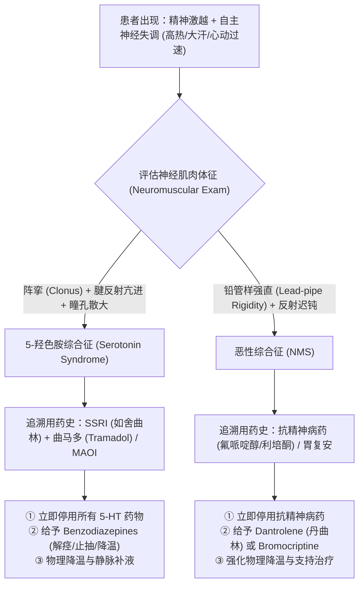
```mermaid
flowchart TD
    Start["患者出现：精神激越 + 自主神经失调 (高热/大汗/心动过速)"] --> Assess{"评估神经肌肉体征 (Neuromuscular Exam)"}
    
    Assess -->|"阵挛 (Clonus) + 腱反射亢进 + 瞳孔散大"| SS["5-羟色胺综合征 (Serotonin Syndrome)"]
    Assess -->|"铅管样强直 (Lead-pipe Rigidity) + 反射迟钝"| NMS["恶性综合征 (NMS)"]
    
    SS --> SS_Drug["追溯用药史：SSRI (如舍曲林) + 曲马多 (Tramadol) / MAOI"]
    SS_Drug --> SS_Action["① 立即停用所有 5-HT 药物<br>② 给予 Benzodiazepines (解痉/止抽/降温)<br>③ 物理降温与静脉补液"]
    
    NMS --> NMS_Drug["追溯用药史：抗精神病药 (氟哌啶醇/利培酮) / 胃复安"]
    NMS_Drug --> NMS_Action["① 立即停用抗精神病药<br>② 给予 Dantrolene (丹曲林) 或 Bromocriptine<br>③ 强化物理降温与支持治疗"]
```

### 临床表现与经典三联征 (Clinical Triad of SS)

1. **精神状态改变 (Mental Status Changes)**：
   - 早期表现为极度焦虑 (Anxiety)、坐立不安 (Restlessness)；
   - 进展为烦躁激越 (Agitation)、定向力障碍、谵妄 (Delirium) 与昏迷。
2. **自主神经紊乱 (Autonomic Dysregulation)**：
   - **体温过高 (Hyperthermia)**：严重者可达 40°C~41°C 以上，危及生命；
   - **大汗淋漓 (Diaphoresis)**、皮肤潮红；
   - **心动过速 (Tachycardia)**、血压骤升或剧烈波动、瞳孔扩大 (Dilated pupils)。
3. **神经肌肉亢进 (Neuromuscular Hyperactivity)**：
   - **肌阵挛 (Clonus)**（尤其是下肢踝阵挛，最具诊断特异性）；
   - **腱反射亢进 (Hyperreflexia)**；
   - 震颤 (Tremor)、共济失调与肌张力增高。

---

### 高危配伍陷阱：引发 5-羟色胺综合征的药物组合 (High-Risk Interactions)

> [!WARNING] **NCLEX 常见连环用药大坑**
> 1. **抗抑郁药 + 镇痛药**：
>    - **SSRI / SNRI**（如 Sertraline, Fluoxetine, Venlafaxine） + **曲马多 (Tramadol)** 或 **杜冷丁 (Meperidine)**。*(曲马多不仅抑制痛觉，还阻断 5-HT 再摄取，极易被误当成普通止痛药而忽视！)*
> 2. **抗抑郁药 + 抗生素**：
>    - SSRI + **利奈唑胺 (Linezolid)**。*(利奈唑胺具有不可逆的非选择性 MAOI 活性，联合使用为绝对禁忌！)*
> 3. **抗抑郁药 + 草本补充剂 / OTC 止咳药**：
>    - SSRI + **圣约翰草 (St. John's Wort / 贯叶连翘)**。
>    - SSRI + **右美沙芬 (Dextromethorphan)**。
> 4. **换药清洗期不足 (Washout Period Trap)**：
>    - 从 SSRI 换为 MAOI（或反之）时，必须留出 **2 周（氟西汀需要 5 周）的清洗期**，否则体内蓄积即发病。

---

### 急救管理与护理干预 (Emergency Management & Nursing Priority)

1. **首要行动 (First Action)**：
   - **立即停止给药 (Discontinue all serotonergic agents immediately)**，切断毒性来源。
2. **控制肌肉兴奋与降温 (Benzodiazepines)**：
   - 遵医嘱静脉给予 **苯二氮䓬类药物 (如 Lorazepam, Diazepam)**。
   - **药理作用**：镇静缓解激越，更关键的是**阻断肌肉阵挛与异常收缩**，从源头上减少产热，从而使体温下降。
3. **退热陷阱提醒 (Antipyretics Are Ineffective)**：
   - **警惕**：对乙酰氨基酚 (Acetaminophen) 和布洛芬等退热药**完全无效**！因为高热是骨骼肌过度收缩产热造成的，不是下丘脑体温调定点改变引起的。必须采用**主动物理降温（冰毯、冰袋置于腋下及腹股沟）**与大量补液。
4. **重症解毒**：
   - 严重病例可遵医嘱使用口服/胃管注入 5-HT 拮抗剂 —— **赛庚啶 (Cyproheptadine)**。

---

### 中英核心专业词汇表 (Bilingual Terminology)

| 英文专业术语 | 中文医学规范表达 | 考点记忆要诀 |
| :--- | :--- | :--- |
| **Serotonin syndrome (toxicity)** | 5-羟色胺综合征（毒性反应） | 5-HT 过剩；阵挛 + 反射亢进 + 瞳孔散大 |
| **Neuroleptic malignant syndrome (NMS)** | 恶性综合征 | 多巴胺受阻；铅管样强直 + 反射减退 |
| **Tramadol** | 曲马多（具有 5-HT 活性的中枢镇痛药） | 止痛药陷阱；与 SSRI 联用诱发 SS |
| **Sertraline (Zoloft)** | 舍曲林（SSRI 类抗抑郁药） | 常见 5-HT 蓄积原发药 |
| **Clonus** | 阵挛（踝阵挛/眼阵挛） | SS 最特征性的肌肉体征 |
| **Hyperreflexia** | 腱反射亢进 | SS 特征；反射灵敏亢进 |
| **"Lead-pipe" rigidity** | 铅管样强直 | NMS 绝杀体征；肌肉极度僵硬如铅管 |
| **Autonomic dysregulation** | 自主神经功能紊乱 | 剧烈体温过高、大汗、心动过速、血压不稳 |
| **Benzodiazepines (Lorazepam)** | 苯二氮䓬类（劳拉西泮） | SS 抢救首选药；抑制肌震颤以降低体温 |
| **Cyproheptadine** | 赛庚啶 | 5-HT 受体拮抗解毒剂 |
| **Dantrolene** | 丹曲林 | NMS 骨骼肌松弛解毒药 |

---

## 18. 血友病 (Hemophilia A & B) 凝血异常鉴别与关节积血护理

> [!TIP] **核心速记 (TL;DR)**
> - **血友病本质**：**X 连锁隐性遗传 (X-linked recessive)** 的凝血因子缺乏症（母传子，男性发病为主）。
>   - **血友病 A (Hemophilia A)**：缺乏 **凝血因子 VIII (Factor 8)**（最常见，占 80%）。
>   - **血友病 B (Hemophilia B)**：缺乏 **凝血因子 IX (Factor 9)**（克里斯马斯病 Christmas disease）。
> - **生化化验绝杀特征 (Lab Hallmark)**：**仅 aPTT 显著延长 (↑ aPTT)**；**血小板计数 (Platelets) 与 凝血酶原时间 (PT/INR) 均完全正常**！
> - **最典型特征并发症**：**关节积血 (Hemarthrosis)**（膝关节最常见），反复积血可导致永久性关节畸形（血友病性关节病）。
> - **首要治疗与用药禁忌**：
>   - 替代疗法：静脉补充缺乏的重组凝血因子（VIII 或 IX）；轻度血友病 A 可使用 **去氨加压素 (DDAVP / Desmopressin)** 促进内源因子释放。
>   - **绝对禁忌**：**阿司匹林 (Aspirin) 与 非甾体抗炎药 (NSAIDs/布洛芬)**！镇痛首选对乙酰氨基酚 (Acetaminophen)。

### 凝血障碍三大核心疾病实验室化验对比 (Differential Lab Matrix)

| 疾病分类 | 缺陷核心机理 | 血小板计数 (Platelets) | 活化部分凝血活酶时间 (aPTT) | 凝血酶原时间 (PT/INR) | 关键临床特征与病因 |
| :--- | :--- | :--- | :--- | :--- | :--- |
| **血友病 (Hemophilia A / B)** | **内源性凝血因子 (VIII 或 IX) 缺乏** | **正常 (Normal)** | **延长 (↑ Prolonged)** | **正常 (Normal)** | 遗传性（男童为主）；关节腔积血、轻微创伤后持续延迟出血 |
| **免疫性血小板减少症 (ITP)** | **免疫系统异常抗体介导破坏血小板** | **骤降 (↓ Decreased)** | **正常 (Normal)** | **正常 (Normal)** | 皮肤黏膜瘀点瘀斑 (Petechiae/Purpura)、鼻出血、牙龈出血 |
| **弥散性血管内凝血 (DIC)** | **异常广泛微血栓消耗了全部凝血因子与血小板** | **骤降 (↓ Decreased)** | **延长 (↑ Prolonged)** | **延长 (↑ Prolonged)** | 继发于**脓毒症 (Sepsis)、重度创伤、产科重症 (胎盘早剥)**；广泛渗血伴多器官缺血 |

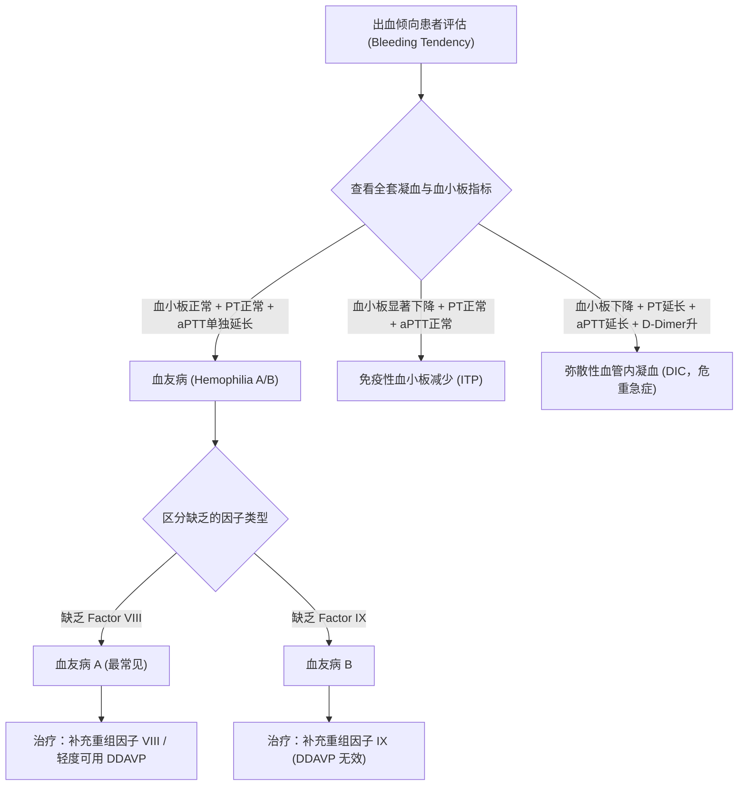
```mermaid
flowchart TD
    Bleed["出血倾向患者评估 (Bleeding Tendency)"] --> Labs{"查看全套凝血与血小板指标"}
    
    Labs -->|"血小板正常 + PT正常 + aPTT单独延长"| Hemo["血友病 (Hemophilia A/B)"]
    Labs -->|"血小板显著下降 + PT正常 + aPTT正常"| ITP["免疫性血小板减少 (ITP)"]
    Labs -->|"血小板下降 + PT延长 + aPTT延长 + D-Dimer升"| DIC["弥散性血管内凝血 (DIC，危重急症)"]
    
    Hemo --> HemoType{"区分缺乏的因子类型"}
    HemoType -->|"缺乏 Factor VIII"| HemoA["血友病 A (最常见)"]
    HemoType -->|"缺乏 Factor IX"| HemoB["血友病 B"]
    
    HemoA --> Care["治疗：补充重组因子 VIII / 轻度可用 DDAVP"]
    HemoB --> CareB["治疗：补充重组因子 IX (DDAVP 无效)"]
```

### 临床表现与高危并发症 (Clinical Features & Complications)

1. **关节积血 (Hemarthrosis) —— 最具特异性的表现**：
   - 负重或活动关节（膝关节、踝关节、肘关节）出血；
   - 表现为关节局部**肿胀、灼热发烫 (Warmth)、剧烈剧痛、活动受限**；
   - **慢性后遗症**：长期反复积血导致滑膜炎、软骨破坏与纤维化骨性强直，即**血友病性关节病 (Hemophilic Arthropathy)**。
2. **轻微外伤后的延迟性/进行性出血 (Delayed / Prolonged Bleeding)**：
   - 跌倒、磕碰或微小割伤后数小时开始渗血，数日不止；
   - 拔牙、割礼 (Circumcision) 后大量渗血。
3. **致命性内出血警戒 (Red Flag Emergencies)**：
   - **颅内出血 (Intracranial Hemorrhage)**：头痛、嗜睡、喷射性呕吐、烦躁、意识水平改变 —— **儿科血友病首位死亡原因，一旦怀疑立即急查脑 CT 并直接输注因子**！
   - 深部肌肉血肿（腰大肌血肿伴下肢无力麻木）、胃肠道/泌尿道隐匿性出血。

---

### 关节积血急性发作的护理干预：RICE 原则 (Emergency Care of Hemarthrosis)

> [!IMPORTANT] **急性关节出血黄金护理 4 步走**
> 1. **首要干预 —— 立即输注缺乏的凝血因子 (Factor Replacement First)**：
>    - 绝不要等影像学检查完成才给药，一旦有出血迹象，必须**立即静脉给予重组因子**！
> 2. **制动与功能位 (Rest & Immobilization)**：
>    - 绝对卧床制动，将受累关节保持在**伸直/中立位 (Extension)**，**严禁屈曲固定**，防止关节挛缩屈曲畸形。
> 3. **冰敷 (Ice/Cold Application)**：
>    - 每次局部冰敷 15~20 分钟，促使局部血管收缩减缓出血；**严禁热敷**！
> 4. **加压包扎与抬高患肢 (Compression & Elevation)**：
>    - 弹性绷带适度加压，将患肢抬高至心脏水平以上，促进静脉与淋巴回流。
> 5. **康复期被动/主动活动时机**：
>    - **急性期（出血未止前）绝对禁止进行主动或被动关节屈伸运动**！
>    - 只有在**出血彻底停止、疼痛缓解且因子水平达标后**，才能在物理治疗师指导下开始被动/轻柔主动运动，防止肌肉萎缩与关节强直。

---

### 日常健康宣教与用药安全红线 (Health Promotion & Safety Rules)

* 🚫 **止痛用药绝对禁忌 (Medication Safety)**：
  - **严禁使用阿司匹林 (Aspirin) 和非甾体抗炎药 (NSAIDs，如布洛芬 Ibuprofen、萘普生 Naproxen)**，因其抑制血小板聚集并破坏胃黏膜，可引发致命出血。
  - **安全止痛药**：首选**对乙酰氨基酚 (Acetaminophen)**。
* 💉 **注射途径禁忌**：
  - **严禁常规肌肉注射 (Avoid IM injections)**，极易引发巨大深部肌层血肿；
  - 必须接种疫苗时，首选皮下注射 (SQ)，注射后使用细针头，并**持续按压针孔至少 5 分钟**，切勿揉搓。
* 🏀 **运动选择**：
  - **推荐非接触性低冲击运动**：游泳 (Swimming，首选全身无负重运动)、散步、慢速骑单车、佩戴护具的高尔夫。
  - **严格禁止高风险接触性对抗运动**：橄榄球 (Football)、冰球、摔跤、篮球、拳击。
* 🛡️ **生活防护**：
  - 使用软毛牙刷 (Soft-bristled toothbrush)、电动剃须刀 (Electric razor)；
  - 幼童学步期家具拐角安装防撞软包，常备医疗警示手环 (Medical alert bracelet)。

---

### 中英核心专业词汇表 (Bilingual Terminology)

| 英文专业术语 | 中文医学规范表达 | 考点记忆要诀 |
| :--- | :--- | :--- |
| **Hemophilia A** | 甲型血友病（经典血友病） | 缺乏因子 VIII；X 连锁隐性；仅 aPTT 延长 |
| **Hemophilia B** | 乙型血友病（克里斯马斯病） | 缺乏因子 IX；X 连锁隐性；仅 aPTT 延长 |
| **Hemarthrosis** | 关节积血 | 膝/踝关节肿胀发烫；RICE 原则 + 禁热敷 |
| **Hemophilic arthropathy** | 血友病性关节病 | 反复积血遗留的长期永久畸形骨强直 |
| **Immune thrombocytopenia (ITP)** | 免疫性血小板减少症 | 仅血小板骤降；PT 与 aPTT 完全正常 |
| **Disseminated intravascular coagulation (DIC)** | 弥散性血管内凝血 | 消耗性凝血；血小板降 + PT/aPTT 均延长 |
| **Factor VIII replacement** | 因子 VIII 替代疗法 | 血友病急救与预防核心用药 |
| **Desmopressin (DDAVP)** | 去氨加压素 | 刺激血管内皮释放因子 VIII；仅对轻度甲型有效 |
| **X-linked recessive** | X 连锁隐性遗传 | 母亲携带、男童发病；女儿多为无症状携带者 |
| **Intracranial hemorrhage** | 颅内出血 | 剧烈头痛/喷射呕吐；首要致死并发症 |
| **Avoid NSAIDs/Aspirin** | 禁用阿司匹林与布洛芬 | 避开抗血小板药；镇痛首选对乙酰氨基酚 |

---

## 19. 发育性髋关节脱位：帕夫利克吊带 (Pavlik Harness) 护理黄金法则

> [!TIP] **极简规律速记卡 (Rule Card)**
> - **核心目的与体位**：治疗 6 个月以下婴儿**发育性髋关节发育不良 (DDH)**，使髋关节保持在**轻度屈曲与外展位 (Flexed & Abducted position / 青蛙腿位)**，促进股骨头稳固对准髋臼发育。
> - **秒杀口诀**：**“内衣长袜垫在下，尿布穿在绑带内；家长切莫调松紧，乳膏粉末全不用；青蛙屈外不可直，全天佩戴防脱位。”**

### 帕夫利克吊带 (Pavlik Harness) 护理 4 大核心黄金法则

```
                    ┌───────────────────────────────────────────────────┐
                    │       帕夫利克吊带 (Pavlik Harness) 护理核心        │
                    └─────────────────────────┬─────────────────────────┘
        ┌───────────────────┬─────────────────┴─────────────────┬───────────────────┐
        ▼                   ▼                                   ▼                   ▼
【穿衣层次规则】      【绑带调整权限】                    【皮肤护理禁忌】     【佩戴与包裹禁忌】
全棉衬衫 + 过膝长袜   ★ 严禁父母自行调节绑带              每日数次查皱褶       全天持续佩戴 (23-24h)
★ 垫在吊带下方防摩擦  必须由 HCP 定期随诊调节             轻柔按摩促循环       严禁强行伸直并拢双腿
纸尿裤穿在绑带内侧    调太紧易致股神经麻痹与股骨头坏死    ★ 严禁涂抹乳膏与爽身粉 避免紧密襁褓包裹 (Swaddling)
```

1. **穿戴层次法则 —— “内衣长袜垫在下，纸尿裤在吊带内” (Clothing & Diaper Layering)**：
   - **防压疮摩擦**：吊带下方必须穿一件**柔软棉质内衣 (Shirt/Onesie)** 和**过膝长袜 (Knee-high socks)**，严禁绑带直接接触裸露皮肤。
   - **换尿布技巧**：纸尿裤必须穿在**吊带绑带的下方/内侧 (Diapers applied UNDER the straps)**，更换尿布时**切勿解开肩胸绑带**。

2. **绑带调整权限法则 —— “家长切莫调松紧，唯有医生定长短” (No Parental Strap Adjustment)**：
   - **高频大坑**：家长觉得绑带松了或紧了，**绝对不可自行调节 (Do NOT adjust straps)**！
   - **理由**：婴儿生长迅速，必须由医生 (HCP) 或专科矫形师在每周/隔周复查时精密调整。若自行调太紧，会导致**股神经受压麻痹 (Femoral nerve neuropathy)** 或 **股骨头无菌性坏死 (Avascular necrosis)**；若调太松则失去复位治疗效果。

3. **皮肤护理与防浸渍法则 —— “干爽轻揉促循环，粉末乳液全禁用” (Skin Integrity & No Lotions)**：
   - 保持皮肤清洁干燥，每日重点检查易受磨损的皱褶处（腹股沟、大腿根、腋下与颈部）。
   - 可在绑带下方轻柔按摩健康皮肤以促进血液循环。
   - **用药大忌**：**严禁在吊带下方涂抹任何润肤乳 (Lotions)、润肤油或爽身粉 (Powders)**！粉末和乳液与汗液混合后极易引起局部皮肤角质层浸渍剥脱 (Skin maceration) 和继发严重感染。

4. **体位与全天候佩戴法则 —— “全日佩戴不间断，不可襁褓并腿裹” (Continuous Wear & Frog-Leg Position)**：
   - **全天候固定**：通常需全天佩戴 **23~24 小时**，持续维持 6~12 周；只有在医生明确允许短时间擦浴时才可暂时解开。
   - **体位保护**：维持双髋关节**轻度屈曲 (Flexion) 与 外展 (Abduction)**。
   - **禁忌**：抱婴儿或襁褓包裹时，**严禁将双下肢伸直并拢包裹 (Avoid swaddling with legs extended & adducted)**，否则会直接将股骨头拉出髋臼导致复发脱位。

---

### 中英核心专业词汇表 (Bilingual Terminology)

| 英文专业术语 | 中文医学规范表达 | 考点记忆要诀 |
| :--- | :--- | :--- |
| **Developmental dysplasia of the hip (DDH)** | 发育性髋关节发育不良（脱位） | 髋臼发育不良；股骨头脱位 |
| **Pavlik harness** | 帕夫利克吊带（自大腿到胸肩的动态外展支具） | 6 个月内婴儿首选非手术矫形器 |
| **Flexion and abduction** | 屈曲外展位（青蛙腿位 Frog-leg position） | 髋关节最稳定对合复位体位 |
| **Under the straps** | 穿在绑带下方/内侧 | 衬衫、过膝袜、纸尿裤全部在吊带下方 |
| **Do NOT adjust straps** | 严禁家长自行调节绑带松紧 | 绝对交由 HCP 调整；防股神经受损 |
| **Skin breakdown / Maceration** | 皮肤破损 / 皮肤浸渍剥脱 | 严禁使用润肤露或爽身粉 (No lotions/powders) |
| **Avoid swaddling with legs extended** | 避免双腿伸直襁褓包裹 | 伸直内收直接破坏复位 |

---

## 20. 婴儿心导管术前评估红旗：严重尿布疹与感染延期手术规律

> [!TIP] **极简规律速记卡 (Rule Card)**
> - **秒杀核心**：拟行**介入性心导管术 (Interventional Cardiac Catheterization)** 的婴儿，若腹股沟区存在**严重尿布疹 (Severe Diaper Rash)**，护士必须**立即报告主管护士与医生 (Report to RN & HCP)**！
> - **临床后果**：手术通常必须**暂缓/推迟 (Delayed/Cancelled)**，直至皮疹完全愈合！
> - **背后的病理机制 (Why?)**：婴儿心导管穿刺点位于**腹股沟股动/静脉 (Femoral vessels)**。穿破破损/充血/念珠菌或大肠埃希菌滋生的尿布疹皮肤，会直接将致病菌带入血液与心脏，引发致命的**菌血症 (Bacteremia) 或 感染性心内膜炎 (Infective Endocarditis)**！

### 心导管术 (Cardiac Cath) 术前评估 4 大黄金秒杀规律

```
                        ┌────────────────────────────────────────────────────────┐
                        │        婴儿/儿童心导管术前评估 4 大核心安全红线          │
                        └───────────────────────────┬────────────────────────────┘
        ┌─────────────────────────┬─────────────────┴─────────────────┬─────────────────────────┐
        ▼                         ▼                                   ▼                         ▼
【穿刺点感染评估】          【基线外周脉搏标记】                【造影剂过敏史】          【禁食禁水与脱水平衡】
★ 腹股沟严重尿布疹          术前必须触诊并记号笔标记            询问碘 (Iodine) 与        按麻醉要求严格 NPO
必须立即报告 HCP            双下肢足背/胫后动脉脉搏             贝类海鲜 (Shellfish)      防止全麻误吸
★ 手术必须推迟延期          供术后对比血栓/闭塞 (0~4+)          过敏史备好抢救预案        但婴儿警惕低血糖与脱水
```

1. **局部皮肤感染红线 —— “尿布红疹临腹股，严防菌血急推迟” (Infection at Access Site)**：
   - **高危陷阱**：很多人只关注发热或肺部感染，忽视了**臀部和腹股沟的尿布皮炎**。
   - **临床决策**：腹股沟区（Femoral area）是心导管穿刺的必经之路。存在活动性擦烂红斑、丘疹或破损时，穿刺即等同于“将大肠杆菌/真菌直接注入心腔”。**推迟手术是唯一合乎安全规范的选择**。

2. **基线末梢脉搏标记 —— “术前画圈摸足背，术后对比防栓塞” (Baseline Pulses)**：
   - **标准操作**：术前必须触诊双下肢**足背动脉 (Dorsalis pedis pulse)** 和 **胫后动脉 (Posterior tibial pulse)**，并用记号笔在体表做标记。
   - **目的**：术后一旦发现穿刺侧远端动脉搏动变弱（如从 +2 降至 +1 或摸不清）、皮温冰凉苍白，立即警惕**股动脉痉挛或血栓形成 (Thrombosis)**！

3. **过敏史排查 —— “碘剂贝类需详问，水化利尿排造影” (Allergy & Contrast)**：
   - 术中需要注入含碘造影剂进行血管造影，术前必须核实有无**碘 (Iodine) 或贝类海鲜 (Shellfish)** 过敏史。
   - 术后需加强水化以促进造影剂从肾脏排泄，防造影剂肾病。

4. **体温与全身感染 —— “呼吸道感染是禁忌，择期手术全暂缓” (Systemic Illness)**：
   - 发热、咳嗽、急性上呼吸道感染（URI）同样是择期介入手术的绝对禁忌，均需报告并重新预约。

---

### 中英核心专业词汇表 (Bilingual Terminology)

| 英文专业术语 | 中文医学规范表达 | 考点记忆要诀 |
| :--- | :--- | :--- |
| **Interventional cardiac catheterization** | 介入性心导管术（如室缺封堵、瓣膜球囊扩张） | 经股动/静脉入路，穿刺点在腹股沟 |
| **Severe diaper rash** | 严重尿布疹（红臀/接触性或念珠菌皮炎） | 术前绝对红旗；直接导致手术推迟 |
| **Femoral site contamination** | 股动脉穿刺点污染 | 皮肤屏障受损，致病菌直接入血 |
| **Infective endocarditis** | 感染性心内膜炎 | 导管带入细菌致心内膜/人工器材感染 |
| **Delay / Postpone procedure** | 推迟 / 延期手术 | 严重尿布疹时的标准护理与医疗决策 |
| **Baseline peripheral pulses** | 基线外周动脉搏动 | 术前必查必标记足背/胫后动脉，防术后栓塞 |
| **Dorsalis pedis pulse** | 足背动脉搏动 | 股动脉穿刺后最关键监测靶点 |
| **Iodine contrast allergy** | 碘造影剂过敏 | 术前重点询问的药物过敏史 |

---

## 21. 甲氧氯普胺 (胃复安 Metoclopramide) 适应证与迟发性运动障碍 (TD) 7 大体征速记卡

> [!TIP] **极简规律速记卡 (Rule Card)**
> - **药物属性与 3 大临床适应证**：胃肠促动力药与止吐药。用于：① **胃排空延迟 / 胃轻瘫 (Delayed gastric emptying)**；② **胃食管反流 (GERD)**；③ **术后/化疗止吐 (Antiemetic)**。
> - **跨科机制大坑**：虽是消化科常用药，但其药理本质为**中枢多巴胺受体拮抗剂 (Dopamine antagonist)**，与抗精神病药（如氟哌啶醇）同源，极易诱发**锥体外系反应 (EPS)**！
> - **首要致残风险**：**迟发性运动障碍 (Tardive Dyskinesia, TD)** —— 特别高发于**老年人 (Older adults)** 及**长期用药者 (Long-term use)**！
> - **黄金处理原则**：一旦出现任何口面部、手指或颈部不自主运动，**立即致电并报告医生 (Call HCP immediately)**，**早期立即停药**是防止演变为**永久不可逆后遗症 (Irreversible)** 的唯一窗口！

### 迟发性运动障碍 (TD) 7 大不可控体征全景速查 (SATA 高频多选题清单)

```
                            ┌────────────────────────────────────────────────────────┐
                            │    迟发性运动障碍 (Tardive Dyskinesia, TD) 7 大体征      │
                            └───────────────────────────┬────────────────────────────┘
        ┌───────────────────────────────────────────────┼───────────────────────────────────────────────┐
        ▼                                               ▼                                               ▼
 【口唇颊面部体征】                              【眼额颈项部体征】                              【四肢指掌部体征】
① 伸舌与扭舌 (Protruding/twisting tongue)       ⑤ 皱眉与频繁眨眼 (Frowning/blinking eyes)       ⑥ 手指扭曲动作 (Twisting fingers)
② 咂嘴与舔唇 (Lip smacking)                     ⑦ 斜颈/颈部强直扭转 (Torticollis/twisted neck)  舞蹈样不自主扭动 (Choreoathetosis)
③ 反复反复鼓腮 (Puffing of cheeks)
④ 习惯性空口咀嚼 (Chewing movements)
```

| 发生部位 | 经典不自主临床表现 (Uncontrollable Movements) | NCLEX 考题原词与特征 |
| :--- | :--- | :--- |
| **舌头 (Tongue)** | **伸舌与扭转 (Protruding and twisting of the tongue)** | 舌头反复伸出嘴唇外、在口内或口外怪异扭转（如“变色龙捉虫样”） |
| **嘴唇 (Lips)** | **咂嘴与噘嘴 (Lip smacking)** | 嘴唇反复作吸吮声、吧唧嘴、不自主噘起 |
| **面颊 (Cheeks)** | **颊部反复鼓气 (Puffing of cheeks)** | 双颊无意识像吹气球一样鼓起，随后漏气又鼓起 |
| **下颌 (Jaw)** | **不自主咀嚼动作 (Chewing movements)** | 口腔中无食物却像吃口香糖一样反复大副咀嚼、磨牙 |
| **眼与额头 (Eyes/Face)** | **做怪相与频繁眨眼 (Frowning or blinking of eyes)** | 额肌抽动皱眉、双眼不可自控的快速强迫性眨眼 |
| **颈部 (Neck)** | **斜颈与颈项扭转 (Twisted or rotated neck / Torticollis)** | 颈部肌张力异常，头部强迫性偏向一侧或剧烈仰伸扭转 |
| **肢端 (Extremities)** | **手指怪异扭动 (Twisting fingers)** | 手指呈蠕动样、绞拧扭转样舞蹈样慢动作，无法平稳伸展 |

---

### 患者宣教与护理核心安全守则 (Safety Rules)

1. **老年人用药警戒**：
   - 老年患者因肾功能生理性减退、多巴胺受体敏感性改变，发生 TD 的风险显著倍增。
   - 处方一般建议尽量避免连续使用超过 12 周。
2. **“立即汇报”而非“观察等待”**：
   - 很多患者会将“鼓腮、眨眼、伸舌”误当成单纯的习惯或面部神经跳动。护士必须在出院前进行严格宣教：**一旦发现肢体或面部不听使唤的动作，禁止自行等待复诊，必须立刻致电医生**。
3. **不可逆性宣教**：
   - 告知患者家属：TD 若在早期未识别并继续服药，即便日后停药，这 7 大不自主运动仍可能**终生留存 (Permanent & Irreversible)**，严重影响吞咽、言语和日常生活。

---

### 中英核心专业词汇表 (Bilingual Terminology)

| 英文专业术语 | 中文医学规范表达 | 考点记忆要诀 |
| :--- | :--- | :--- |
| **Metoclopramide (Reglan)** | 甲氧氯普胺（胃复安） | 促动力止吐药；多巴胺拮抗剂 |
| **Delayed gastric emptying (Gastroparesis)** | 胃排空延迟（胃轻瘫） | 胃复安核心适应证之一 |
| **Gastroesophageal reflux (GERD)** | 胃食管反流病 | 胃复安促下食管括约肌收缩 |
| **Tardive dyskinesia (TD)** | 迟发性运动障碍 | 长期阻断多巴胺所致；常为永久不可逆损伤 |
| **Protruding / twisting of tongue** | 伸舌 / 扭曲舌部 | TD 标志性口面部体征 |
| **Lip smacking** | 咂嘴 / 吧唧嘴 | TD 经典体征 |
| **Puffing of cheeks** | 鼓腮 / 颊部反复充气 | TD 面部特征性动作 |
| **Chewing movements** | 不自主咀嚼动作 | 空口如嚼口香糖 |
| **Frowning / blinking of eyes** | 皱眉怪相 / 频繁强迫眨眼 | 眼周肌肉肌张力失常 |
| **Twisting fingers** | 手指扭曲 / 舞蹈样手指 | 肢体末端不自主运动 |
| **Torticollis (Twisted neck)** | 斜颈 / 颈部强迫扭转 | 颈肌张力障碍 |
| **Irreversible** | 不可逆的（永久性残疾） | 必须立即汇报停药的底层依据 |

---

## 22. ACEI 降压药高钾血症风险与高危促出血草药 (4G 口诀) 速记卡

> [!TIP] **极简规律速记卡 (Rule Card)**
> - **考点 A (ACEI 与高钾血症)**：血管紧张素转换酶抑制剂（ACEI，如赖诺普利 Lisinopril、依那普利 Enalapril）会**抑制醛固酮分泌**，导致**排钠保钾**。尤其合并**肾功能不全 (Renal insufficiency)** 时，极易引发致命性**高钾血症 (Hyperkalemia, $K^+ > 5.0\text{ mEq/L}$)**！
> - **考点 B (高危促出血草药与维 E)**：以 **“4G 草药”** 为代表的草本补充剂及**高剂量维生素 E** 具有天然抗血小板聚集作用，若与抗凝药（华法林、肝素、利伐沙班）或抗血小板药（阿司匹林、氯吡格雷）联用，会大幅增加**自发性大出血风险**！

### 核心可循规律一：ACEI 类药物高钾血症机制与高危叠加陷阱

```
【服用 ACEI (如 Lisinopril)】
          │
          ▼
【阻断血管紧张素转化酶】 ───► 【血管紧张素 II 减少】
                                     │
                                     ▼
                           【醛固酮 (Aldosterone) 分泌受抑】
                                     │
                    ┌────────────────┴────────────────┐
                    ▼                                 ▼
         【肾小管排钠排水增加】              【肾小管排钾减少 (保钾蓄积)】
                    │                                 │
                    ▼                                 ▼
             【血压下降 (疗效)】            ★ 【高钾血症 Hyperkalemia (风险)】
```

* **高钾叠加 3 大绝杀陷阱 (Common NCLEX Traps)**：
  1. **合并肾功能不全 (Renal insufficiency)**：血肌酐 (Cr) 和尿素氮 (BUN) 升高说明肾脏排钾能力骤降，吃 ACEI 极度危险。
  2. **“低钠盐/代盐”陷阱 (Salt substitutes)**：患者为了控血压购买超市的“代盐”，但代盐几乎全是用**氯化钾 (KCl)** 代替氯化钠，与 ACEI 联用可致突发心脏骤停！
  3. **联用保钾利尿剂**：ACEI + 螺内酯 (Spironolactone) / 氨苯蝶啶 (Triamterene)，属于双重保钾危险配伍。

---

### 核心可循规律二：高危促出血草药与维生素 —— “4G 伴行，血流不止”

> [!WARNING] **⭐ 必考 4G 草药出血口诀 (The 4 "G" Herbs of Bleeding)**
> 只要名字带 **"G"** 的常见草本提取物，全都是**天然抗血小板药**：
> 1. **Ginkgo biloba (银杏叶)**：常用于改善记忆力/认知，抑制血小板活化因子 $\to$ 促出血。
> 2. **Garlic (大蒜提取物/大蒜素)**：常用于降胆固醇/降血压，抑制血小板聚集 $\to$ 促出血。
> 3. **Ginseng (人参)**：常用于抗疲劳/滋补，影响凝血酶原并抑制血小板 $\to$ 促出血。
> 4. **Ginger (生姜/姜黄素)**：常用于缓解恶心/关节止痛，抑制血栓素合成 $\to$ 促出血。
> 
> *补充必背*：**维生素 E (Vitamin E)**（高剂量拮抗维生素 K 活性）及 **小白菊 (Feverfew)**、**锯棕榈 (Saw Palmetto)** 同样增加出血风险。

* **临床用药警戒与宣教红线**：
  - **药物联用禁忌**：严禁在未告知 HCP 的情况下，将上述 4G 草药/维 E 与 **抗凝药 (Anticoagulants)**（华法林 Warfarin、肝素 Heparin、依诺肝素 Enoxaparin、利伐沙班 Rivaroxaban）或 **抗血小板药 (Antiplatelets)**（阿司匹林 Aspirin、氯吡格雷 Clopidogrel）联用。
  - **围手术期停药法则**：所有择期手术患者在术前**必须停用 4G 草药与维生素 E 至少 2~3 周**，以防术中及术后弥漫性大出血！

---

### 中英核心专业词汇表 (Bilingual Terminology)

| 英文专业术语 | 中文医学规范表达 | 考点记忆要诀 |
| :--- | :--- | :--- |
| **ACE inhibitors (ACEI)** | 血管紧张素转换酶抑制剂（-pril 普利类） | 降压药；抑制醛固酮导致排钠保钾 |
| **Hyperkalemia** | 高钾血症（$K^+ > 5.0\text{ mEq/L}$） | 心肌毒性、高尖 T 波、致命心律失常 |
| **Renal insufficiency** | 肾功能不全 | 排钾障碍；服 ACEI 时的极高危因素 |
| **Salt substitutes** | 代盐 / 低钠盐（主要成分为氯化钾 KCl） | ACEI/ARB 患者的绝对饮食大坑 |
| **Ginkgo biloba** | 银杏叶提取物 | 4G 之一；改善记忆，强促出血 |
| **Garlic** | 大蒜提取物 | 4G 之一；调血脂，抑制血小板促出血 |
| **Ginseng** | 人参提取物 | 4G 之一；补元气，抗血小板促出血 |
| **Ginger** | 生姜提取物 | 4G 之一；止吐解表，抗凝促出血 |
| **Vitamin E** | 维生素 E | 脂溶性维生素；高剂量干扰凝血促出血 |
| **Anticoagulants** | 抗凝血药物（如 Warfarin, Heparin） | 与 4G 草药联用引发自发性大出血 |

---

## 23. 留置导尿管尿标本采集：取样端口无菌操作与引流袋大坑速记卡

> [!TIP] **极简规律速记卡 (Rule Card)**
> - **采集金标准**：留置导尿管 (Foley Catheter) 患者做尿常规 (UA) 或尿培养 (Urine Culture) 时，**必须且只能从引流管上的专用无菌取样端口 (Specimen Port) 进行无菌抽取**！
> - **绝杀禁忌大坑**：**严禁从引流袋 (Drainage Bag) 中倒取尿液送检**！
>   - **底层原因 (Why?)**：引流袋内的尿液属于陈旧停滞液体，常温下细菌与真菌已大量繁殖分裂，且袋壁附着生物膜 (Biofilm)，会导致化验结果严重失真（假阳性菌落增多、化学指标分解），引发不必要的错误抗生素滥用！

### 导尿管标本采集标准 6 步走 (NCLEX 经典排序题规范)

```
       步骤 1                 步骤 2                 步骤 3                 步骤 4                 步骤 5                 步骤 6
┌──────────────────┐   ┌──────────────────┐   ┌──────────────────┐   ┌──────────────────┐   ┌──────────────────┐   ┌──────────────────┐
│   端口下方夹管   │──►│   消毒取样端口   │──►│   无针注射器连接 │──►│   抽取新鲜尿液   │──►│   注入无菌标本杯 │──►│ ★ 立即松开止血钳 │
│ 夹闭 <15-30 分钟 │   │ 擦拭消毒 ≥15 秒  │   │   严禁用针头穿刺 │   │ 培养需 3-5 mL    │   │ 严格无菌加盖标签 │   │ 严防尿潴留逆流   │
│ 使新鲜尿液蓄积   │   │ 自然晾干待用     │   │ 防止破坏密闭防漏 │   │ 常规需 10 mL     │   │ 尽快送检或冷藏   │   │ 防止诱发 CAUTI   │
└──────────────────┘   └──────────────────┘   └──────────────────┘   └──────────────────┘   └──────────────────┘   └──────────────────┘
```

1. **夹管积蓄新鲜尿液 (Clamp below the port)**：
   - 在取样端口下方数英寸处使用无损伤止血钳夹闭引流管，等待不超过 15~30 分钟，使刚由肾脏产生的**新鲜膀胱尿液**积聚至取样口上方。
2. **用力摩擦消毒端口 (Aseptic scrub)**：
   - 使用 70% 酒精或洗必泰棉签，对取样端口进行**用力摩擦消毒至少 15 秒**，并完全自然风干，确保无菌。
3. **无针连接防漏口 (Needleless syringe)**：
   - 使用无菌**无针注射器（或鲁尔锁接口注射器 Luer-lock syringe）**直接扭入或卡入取样阀。
   - **大忌**：禁止使用粗针头刺破引流管橡胶管壁，避免破坏系统的密闭性并造成持续漏尿。
4. **抽吸新鲜尿样 (Aspirate specimen)**：
   - 轻轻抽吸所需量（尿常规通常需要 10 mL，尿细菌培养仅需 3~5 mL）。
5. **无菌转入送检杯 (Sterile transfer)**：
   - 严格无菌将注射器内的尿液注入无菌标本容器，迅速密封贴签。
6. **★ 核心考点：立即松解夹闭 (Unclamp immediately)**：
   - **抽样结束必须立刻松开止血钳**！若遗忘松管，将导致急性尿潴留、膀胱过度充盈、腹壁胀痛以及尿液逆流引发导尿管相关尿路感染 (CAUTI)。
7. **送检时限与冷藏原则 (Prompt Transport / Refrigeration)**：
   - 标本必须在 15~30 分钟内送达化验室；若因故延误，必须放入专用标本冰箱**冷藏 (Refrigerate)**，严防细菌在常温室温下倍增造成假性高细菌计数。

---

### 中英核心专业词汇表 (Bilingual Terminology)

| 英文专业术语 | 中文医学规范表达 | 考点记忆要诀 |
| :--- | :--- | :--- |
| **Indwelling urinary catheter (Foley)** | 留置导尿管 | 闭式引流系统；防 CAUTI 核心操作 |
| **Specimen port** | 标本取样端口（位于引流管近端） | 留置导尿管唯一合规无菌取样点 |
| **Drainage bag** | 导尿引流袋（废液袋） | 严禁取样！尿液停滞、细菌过度生长假阳性 |
| **Aseptically collected** | 无菌方式采集 | 戴手套、用力消毒端口、无菌注射器抽取 |
| **Clamp tubing below the port** | 在端口下方夹闭管道 | 积聚新鲜尿液；最长不超过 15-30 分钟 |
| **Unclamp the catheter** | 立即松开导尿管夹闭 | 取样完毕第一要务；防尿潴留与逆流感染 |
| **Urinalysis and culture (UA & UCx)** | 尿常规分析与尿细菌培养 | 诊断泌尿系感染的金标准 |
| **CAUTI** | 导尿管相关尿路感染 | 医院感染高频考核指标；严格无菌防护 |

---

## 24. 囊性纤维化 (CF)：胰酶替代疗法 (PERT) 4 大极简服药法则

> [!TIP] **极简规律速记卡 (Rule Card · 儿科用药)**
> - 💡 **一句话秒杀核心**：囊性纤维化 (CF) 黏稠分泌物阻塞胰腺导管致消化酶缺乏；补充的**胰酶制剂 (Pancreatic Enzymes / Pancrelipase)** 必须**随餐或进餐即刻同服**以吸收三大营养素；**整粒吞服、拌酸冷食、严禁咀嚼碾碎**！
> - 🎯 **秒杀口诀**：**“每餐同服不能忘，酸性冷食拌颗粒；整粒吞下禁嚼碾，服后漱口护黏膜。”**

### 胰酶给药 4 大可循黄金法则

1. **服用时机法则 —— “每餐必服，随餐即刻” (With or Just Before Meals)**：
   - 每次进餐（包括**正餐 Meals** 和**加餐零食 Snacks**）之前或随餐立刻服药；
   - **大坑**：禁止饭后服用！若饭后才吃，食物已进入肠道，胰酶错过消化混合时机即失效。
2. **辅食介质法则 —— “苹果酱配冷酸食，严禁热汤与牛奶” (Acidic Foods Only)**：
   - 婴幼儿若无法整粒吞服，可打开胶囊将微颗粒拌入少量**酸性且常温偏凉的食物**（经典必考选项：**苹果酱 Applesauce**、果泥、酸奶）；
   - **禁忌**：**严禁混入温热食物或牛奶**（热量与碱性环境会使消化酶提前变性失活）。
3. **整粒吞服法则 —— “严禁碾碎咀嚼，谨防黏膜灼烂” (Do NOT Crush or Chew)**：
   - 微粒外层有抗胃酸保护膜，必须直接咽下；
   - **绝杀大坑**：**绝对不可咀嚼 (Do NOT chew) 或研磨碾碎 (Do NOT crush)**！咀嚼微粒会使蛋白酶直接在口腔内激活，导致**剧烈严重的口腔黏膜化学性灼伤与溃疡 (Oral mucosal breakdown & ulcers)**！
4. **口腔清洁与疗效评估法则 (Mouth Care & Efficacy)**：
   - 服药后务必**喂清水漱口并擦拭嘴角**，防止残留消化酶腐蚀口周娇嫩皮肤；
   - **药效达标指标**：患儿体重稳步增长，大便由原先的**量大、恶臭、浮油的脂肪泻 (Steatorrhea)** 逐渐转变为成形正常便。

---

### 精炼中英专业词汇 (Key Terms)

| 英文专业术语 | 中文医学规范表达 | 考点记忆要诀 |
| :--- | :--- | :--- |
| **Cystic fibrosis (CF)** | 囊性纤维化 | 外分泌腺黏稠分泌物；阻断胰酶排泄 |
| **Pancreatic enzyme supplements** | 胰酶替代制剂（如 Pancrelipase） | 促脂肪、蛋白质、碳水化合物消化吸收 |
| **With or just before meals** | 随餐或餐前即刻同服 | 正餐和零食加餐都必须吃 |
| **Sprinkled on acidic food** | 撒在酸性食物上 | 首选苹果酱 (Applesauce)；禁热食牛奶 |
| **Do NOT crush or chew** | 严禁咀嚼或碾碎 | 咬破导致严重口腔黏膜溃疡灼伤 |
| **Steatorrhea** | 脂肪泻（油腻恶臭浮便） | 胰酶治疗有效时脂肪泻显著改善 |

---

## 25. 幼儿平行游戏 (Parallel Play) 与儿科 4 大游戏分期速记卡

> [!TIP] **极简规律速记卡 (Rule Card · 儿科生长发育)**
> - 💡 **一句话秒杀核心**：**幼儿期 (Toddlers, 1~3 岁)** 处于极度**自我中心 (Egocentric)** 阶段，无法站在他人视角思考；其标志性行为为**平行游戏 (Parallel Play)** —— **坐在其他孩子身边玩类似的玩具，但各玩各的 (Next to, NOT with)，互不干扰，不共享玩具**。
> - 🎯 **秒杀口诀**：**“婴儿独自玩，幼儿平行伴；学前联合仿，学龄合作赢。”**

### 儿科 4 大年龄段游戏类型全景秒杀卡 (Age-Play Matrix)

| 年龄阶段 | 游戏类型 (Play Type) | 核心行为特征 (Behavior Hallmark) | 经典适用玩具 / 活动 |
| :--- | :--- | :--- | :--- |
| **婴儿期 (Infant, 0~1岁)** | **独立/独自游戏 (Solitary play)** | 自己一个人玩，对其他孩子无兴趣；专注自身感官探索 | 拨浪鼓 (Rattle)、婴儿床悬挂摇铃 (Mobiles)、牙胶、镜子 |
| **幼儿期 (Toddler, 1~3岁)** | **★ 平行游戏 (Parallel play)** | **坐在同伴身旁玩，但各玩各的 (Next to, NOT with)**；不共享，无互动协作 | 推拉玩具 (Push-pull toys)、大颗粒积木、泥胶、玩偶 |
| **学前期 (Preschool, 3~6岁)** | **联合游戏 (Associative play)** | 一起玩耍、借用工具或画笔、模仿打扮 (Dress-up)，**但无正式规则、无共同输赢目标** | 角色扮演服装、画画涂鸦、简易拼图、三轮车 |
| **学龄期 (School-age, 6~12岁)** | **合作游戏 (Cooperative play)** | **有组织、有规则、有严格分工**；有队长，追求共同的获胜目标 | 团队球类（足球/棒球）、棋类桌游、竞技性游戏 |

---

### NCLEX 绝杀大坑与常识陷阱 (Red Flag Traps)

1. **“不肯分享”属于正常发育，切忌标签化为“自私”**：
   - 幼儿思维是纯粹的自我中心 (Egocentric)，认为“世界围绕我转，东西我拿着就是我的”。
   - **护理决策**：在此阶段强迫幼儿“礼让、分享”不仅无效，还会直接诱发剧烈的**脾气发作 (Temper tantrums)**；提供充足相同的玩具让其平行玩耍是最佳干预。
2. **幼儿玩具安全红线**：
   - 首选**推拉玩具 (Push-pull toys)** 锻炼大运动行走稳定性；
   - **绝对严禁**：含有小零件、小弹珠等易吞咽导致气道窒息 (Choking) 的玩具。

---

### 精炼中英专业词汇 (Key Terms)

| 英文专业术语 | 中文医学规范表达 | 考点记忆要诀 |
| :--- | :--- | :--- |
| **Toddler (1-3 years)** | 幼儿期（1~3岁） | 自我中心、自主 vs 羞怯怀疑阶段 |
| **Egocentric** | 自我中心的 | 认知局限；无法理解他人感受 |
| **Parallel play** | 平行游戏 | 身旁各玩各的 (Next to, not with) |
| **Associative play** | 联合游戏（学前期） | 一起玩、借工具，无严格规则目标 |
| **Cooperative play** | 合作游戏（学龄期） | 团队分工、严格守规则、重输赢目标 |

---

## 26. 急性胆囊炎 (Acute Cholecystitis)：胆道梗阻致胆囊坏疽穿孔与腹膜炎急救全景

> [!TIP] **核心速记 (TL;DR)**
> - **核心病理演变**：胆囊结石 (Gallstones) 嵌顿或机械性梗阻胆囊管 $\to$ 胆汁无法排空致**胆囊进行性极度膨胀 (Gallbladder distension)** $\to$ 囊壁静脉及淋巴回流受阻缺血 $\to$ **坏疽 (Gangrene)** $\to$ **胆囊穿孔 (Gallbladder Perforation)** $\to$ 致命性**腹膜炎 (Peritonitis)** 与脓毒性休克！
> - **绝杀临床转折体征 (Classic Trap)**：穿孔瞬间因囊内张力突然释放，患者右上腹痛可能**短暂戏剧性缓解 (Sudden temporary relief of pain)**；但随之而来的是感染性胆汁漏入腹腔，迅速爆发**弥漫性全腹压痛、板状腹 (Board-like rigidity)、反跳痛与高热休克**！
> - **首要急救干预**：立即**严格禁食 (NPO)**、**留置胃管胃肠减压 (NG tube)**、抗休克**静脉液体复苏**、静脉广谱抗生素，并立即呼叫外科行**急诊手术 (Emergency Cholecystectomy)**！

---

### 病理恶化链条与临床决策流程图 (Progression Flowchart)

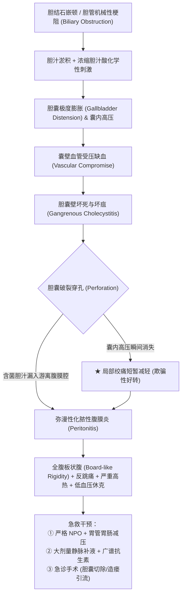
```mermaid
flowchart TD
    Stone["胆结石嵌顿 / 胆管机械性梗阻 (Biliary Obstruction)"] --> BileStasis["胆汁淤积 + 浓缩胆汁酸化学性刺激"]
    BileStasis --> Distension["胆囊极度膨胀 (Gallbladder Distension) & 囊内高压"]
    
    Distension --> Ischemia["囊壁血管受压缺血 (Vascular Compromise)"]
    Ischemia --> Gangrene["胆囊壁坏死与坏疽 (Gangrenous Cholecystitis)"]
    
    Gangrene --> Perf{"胆囊破裂穿孔 (Perforation)"}
    
    Perf -->|"囊内高压瞬间消失"| Relief["★ 局部绞痛短暂减轻 (欺骗性好转)"]
    Perf -->|"含菌胆汁漏入游离腹膜腔"| Peri["弥漫性化脓性腹膜炎 (Peritonitis)"]
    
    Relief --> Peri
    
    Peri --> Signs["全腹板状腹 (Board-like Rigidity) + 反跳痛 + 严重高热 + 低血压休克"]
    Signs --> Action["急救干预：<br>① 严格 NPO + 胃管胃肠减压<br>② 大剂量静脉补液 + 广谱抗生素<br>③ 急诊手术 (胆囊切除/造瘘引流)"]
```

---

### 典型急性胆囊炎 vs 胆囊穿孔/腹膜炎鉴别对比表 (Diagnostic Matrix)

| 临床评估维度 | 典型非穿孔性急性胆囊炎 (Uncomplicated Cholecystitis) | 胆囊坏疽穿孔并腹膜炎 (Perforation & Peritonitis) |
| :--- | :--- | :--- |
| **腹痛性质与范围** | **局限在右上腹 (RUQ)**，进食高脂餐后加重，常向**右肩或肩胛部放射 (Right shoulder pain)** | **从右上腹突发转变为全腹弥漫性剧烈剧痛**（穿孔刹那间可能有数分钟至数十分钟的短暂疼痛骤降假象） |
| **腹部体格检查** | **墨菲氏征阳性 (Murphy's sign)**（深压右上腹深吸气因剧痛猝然中断）；仅右上腹轻至中度肌紧张 | **弥漫性板状腹 (Board-like rigidity)**；全腹广泛压痛、显著**反跳痛 (Rebound tenderness)**、腹肌强直 |
| **肠鸣音** | 正常或轻度减弱 | **肠鸣音完全消失 (Absent bowel sounds)**（麻痹性肠梗阻 Paralytic ileus） |
| **生命体征 (Vital Signs)** | 轻中度发热（37.5~38.5℃）、轻度心动过速、血压稳定 | **严重高热（>38.9℃）伴寒战**、显著心动过速（HR > 120）、**低血压 (Hypotension)**、呼吸急促（脓毒症表现） |
| **实验室化验** | 白细胞计数轻至中度增高（WBC 10,000~15,000） | **白细胞极度升高（WBC > 20,000）**伴核左移；乳酸 (Lactate) 显著升高；电解质紊乱 |
| **治疗策略** | 保守抗感染对症后择期/半急诊腹腔镜手术 | **绝对外科急症 (Surgical Emergency)**：抗休克同时急诊剖腹探查切除胆囊或穿刺造瘘 |

---

### 红旗警示：NCLEX 鉴别大坑与高频误区 (Red Flag Traps)

> [!WARNING] **急腹症三大混淆鉴别 (Differential Traps)**
> 1. **胃排空受阻 / 胃幽门梗阻 (Gastric Outlet Obstruction)**：
>    - 表现为进食数小时后大量喷射性呕吐**未消化的宿食**、上腹部胃型膨隆；主要由消化性溃疡瘢痕或幽门胃癌引起，**不是胆囊炎的直接并发症**。
> 2. **肺水肿 (Pulmonary Edema)**：
>    - 表现为粉红色泡沫痰、双肺底湿啰音、严重低氧血症。
>    - **考点关联**：单纯胆囊炎不引起心源性肺水肿；但**一旦并发严重腹膜炎进展为脓毒性休克**，全身毛细血管通透性剧增，可能继发**急性呼吸窘迫综合征 (ARDS / 非心源性肺水肿)**！
> 3. **疼痛“缓解”的致命陷阱**：
>    - 患者原本在床上辗转反侧大哭喊痛，突然向护士报告“肚子右上角突然不怎么疼了”：**绝非病情自愈，必须立刻手诊腹肌并复测血压！这是空腔脏器穿孔张力释放的典型征象**！

---

### 临床急救与护理干预优先权 (Nursing Priorities)

1. **维持气道与循环灌注 (Circulation & Perfusion)**：
   - 建立两条大孔径静脉通路（16G/18G），快速静脉滴注等渗晶体液（乳酸林格氏液或生理盐水），纠正第三间隙液体丢失引起的低血容量性/感染性休克。
2. **胃肠道彻底休息与减压 (GI Rest & Decompression)**：
   - **严格禁食禁水 (NPO)**，杜绝任何脂肪食物刺激胆囊收缩素 (CCK) 释放；
   - 留置**胃管进行低位持续胃肠减压 (Low intermittent suction)**，抽出胃内容物，减轻腹胀和胆道压力。
3. **抗感染屏障构建 (IV Antibiotics)**：
   - 遵医嘱留取血培养后，立即静脉滴注广谱抗生素（覆盖革兰氏阴性杆菌及厌氧菌，如头孢曲松联合甲硝唑，或哌拉西林舒巴坦）。
4. **急诊手术术前准备**：
   - 完善凝血全套（PT/INR/aPTT）、配血交叉试验，签署急诊手术知情同意书，急请普通外科急会诊。

---

### 中英核心专业词汇表 (Bilingual Terminology)

| 英文专业术语 | 中文医学规范表达 | 考点记忆要诀 |
| :--- | :--- | :--- |
| **Acute cholecystitis** | 急性胆囊炎 | 结石或机械梗阻；右上腹绞痛向右肩放射 |
| **Biliary obstruction** | 胆道机械性梗阻 | 胆管阻塞致胆汁排泄障碍、胆囊进行性高压膨胀 |
| **Gallbladder distension** | 胆囊过度膨胀 | 囊壁血运受压缺血坏死的始动因素 |
| **Gangrene of gallbladder** | 胆囊坏疽 | 囊壁全层缺血性坏死；极易穿孔 |
| **Gallbladder perforation** | 胆囊穿孔破裂 | 急腹症外科急症；高压释放疼痛可有短暂缓解 |
| **Peritonitis** | 腹膜炎 | 胆汁细菌入腹腔；全腹板状腹 + 反跳痛 |
| **Board-like rigidity** | 板状腹（腹肌强直如木板） | 腹膜壁层受炎性化学刺激痉挛的客观绝杀体征 |
| **Rebound tenderness** | 反跳痛（压手突然抬起时剧痛） | 腹膜炎诊断核心体征 |
| **Murphy's sign** | 墨菲氏征 | 右上腹压痛深吸气骤停；胆囊炎典型体征 |
| **Cholecystectomy** | 胆囊切除术 | 胆囊穿孔与严重坏疽的根治性急诊手术 |

---

## 27. 质子泵抑制剂 (PPIs -拉唑类) 长期滥用 4 大并发症速记卡

> [!TIP] **极简规律速记卡 (Rule Card · 消化药理)**
> - 💡 **一句话秒杀核心**：质子泵抑制剂 (PPIs，后缀为 **-prazole 拉唑类**，如奥美拉唑 Omeprazole、泮托拉唑 Pantoprazole) 强效抑酸用于治疗溃疡 (PUD) 与反流 (GERD)；因非处方 (OTC) 极易获取而常被**长期滥用**，其导致胃酸屏障丧失与微量元素吸收障碍，核心必考 **4 大严重并发症：艰难梭菌腹泻 (C. diff)、骨质疏松骨折 (Fractures)、吸入性肺炎 (Pneumonia)、低镁血症 (Hypomagnesemia)**！
> - 🎯 **秒杀口诀**：**“拉唑虽好莫长服，胃酸无力四祸出：缺钙骨折缺镁抽，梭菌拉肚肺炎咳。”**

### 长期使用 PPI 的 4 大恶果与发病机制 (SATA 核心清单)

1. **肠道菌群失调 —— 艰难梭菌相关性腹泻 (C. diff Diarrhea)**：
   - **机制**：胃内酸度大幅降低，胃酸天然杀菌屏障失守，正常消化道菌群平衡被打破，耐酸的艰难梭菌大量滋生并分泌毒素；
   - **警报**：用药期间若出现频繁水样便、发热、腹部绞痛，必须**立即就医做大便毒素检测**（若确诊需接触隔离，肥皂流动水洗手，停用 PPI，口服万古霉素）。
2. **矿物质吸收不良 ① —— 骨质疏松与骨折 (Osteoporosis & Fractures)**：
   - **机制**：钙离子的溶解和游离必须依赖酸性胃液；长期强效抑酸使**肠道钙吸收显著受阻**，甲状旁腺代偿溶骨，骨密度断崖式下降；
   - **易折部位**：最常考高发于**髋部 (Hip)、脊柱 (Spine) 与腕部 (Wrist)** 骨折；长期服用者应增加钙（推荐柠檬酸钙）和维生素 D 摄入，并定期查骨密度 (DEXA scan)。
3. **呼吸道天然防线失守 —— 肺炎 (Pneumonia)**：
   - **机制**：失去胃酸杀菌环境后，胃食管上消化道内细菌大量定植，夜间平卧微量反流误吸入气道，极易诱发社区或医院获得性肺炎。
4. **矿物质吸收不良 ② —— 低镁血症与神经心律失常 (Hypomagnesemia)**：
   - **机制**：肠道主动转运镁离子障碍，导致血镁进行性消耗下降；
   - **临床表现**：神经肌肉兴奋性异常增高 —— **手足搐搦、手指震颤 (Tremors)、肌痉挛 (Muscle cramps)、惊厥癫痫发作 (Seizures)**；心电图 QT 间期延长，可诱发致死性**尖端扭转型室速 (Torsades de pointes)**。

---

### NCLEX 核心用药规则 (Nursing Priorities)

* ⏰ **服药黄金时间**：必须在**早饭前 30~60 分钟空腹口服 (Take before breakfast)**，以在进食激活胃壁细胞质子泵时精准发挥峰值抑酸效果。
* 🚫 **OTC 滥用宣教**：宣教患者禁止擅自长期（> 8~12 周）连续服用 OTC 胃药，症状改善后应在医生指导下尽早减量或停药。

---

### 精炼中英专业词汇 (Key Terms)

| 英文专业术语 | 中文医学规范表达 | 考点记忆要诀 |
| :--- | :--- | :--- |
| **Proton pump inhibitors (PPIs)** | 质子泵抑制剂（-prazole 拉唑类） | 终极强效抑酸；阻断 $H^+/K^+$ 质子泵 |
| **Clostridioides difficile (C. diff)** | 艰难梭菌 | 胃酸屏障破坏后的严重暴发性水样泻 |
| **Bone fractures (Spine, hip, wrist)** | 骨质疏松性骨折 | 缺酸致钙吸收障碍；骨质疏松易骨折 |
| **Hypomagnesemia** | 低镁血症 | 吸收障碍；肌震颤、抽搐、尖端扭转室速 |
| **Pneumonia** | 肺炎 | 胃内定植菌逆行反流吸入气道 |
| **Take before breakfast** | 早餐前空腹口服 | 质子泵激活前给药的最佳时效窗口 |

---

## 28. 致命性心律失常分诊与急救：心室颤动 (VF) vs 室速 (VT) / 房颤 (AFib) 全景抢救指南

> [!TIP] **核心速记 (TL;DR)**
> - **室颤本质 (VF)**：心室肌发生极度紊乱混乱的电风暴，心室丧失机械有效收缩，**心输出量瞬间为零 (CO = 0)** $\to$ **必定无脉搏 (Pulseless)、无意识、心跳骤停 (Cardiac Arrest)**！
> - **NCLEX 绝对第一优先权 (Top Priority)**：在所有心律失常分诊选择题中，**VF 患者永远是第一优先抢救对象**！
> - **救命黄金 4 步法**：
>   ① **评估脉搏**（触诊颈动脉 $\le 10$ 秒，确认无脉搏）；
>   ② **大声呼救**（呼叫代码呼叫支援，命人取来除颤仪/AED）；
>   ③ **立即开始胸外按压 (Start CPR)**；
>   ④ **除颤仪到达立即非同步电除颤 (Immediate Defibrillation)**！

---

### ACLS 致命心律失常抢救与分诊决策流程图 (Algorithm)

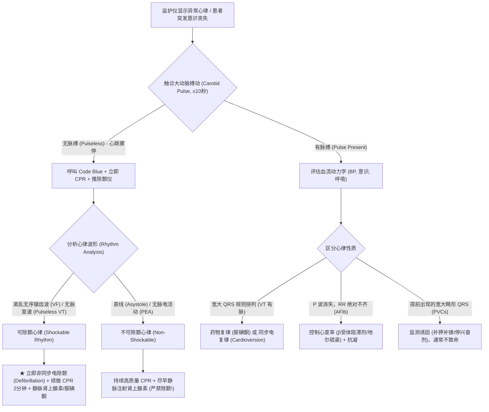
```mermaid
flowchart TD
    ECG["监护仪显示异常心律 / 患者突发意识丧失"] --> CheckPulse{"触诊大动脉搏动 (Carotid Pulse, ≤10秒)"}
    
    CheckPulse -->|"无脉搏 (Pulseless) - 心跳骤停"| Arrest["呼叫 Code Blue + 立即 CPR + 推除颤仪"]
    CheckPulse -->|"有脉搏 (Pulse Present)"| Perfusing["评估血流动力学 (BP, 意识, 呼吸)"]
    
    Arrest --> Rhythm{"分析心律波形 (Rhythm Analysis)"}
    
    Rhythm -->|"紊乱无序锯齿波 (VF) / 无脉室速 (Pulseless VT)"| Shockable["可除颤心律 (Shockable Rhythm)"]
    Rhythm -->|"直线 (Asystole) / 无脉电活动 (PEA)"| NonShockable["不可除颤心律 (Non-Shockable)"]
    
    Shockable --> Defib["★ 立即非同步电除颤 (Defibrillation) + 续做 CPR 2分钟 + 静脉肾上腺素/胺碘酮"]
    NonShockable --> CPR_Epi["持续高质量 CPR + 尽早静脉注射肾上腺素 (严禁除颤!)"]
    
    Perfusing --> CheckType{"区分心律性质"}
    CheckType -->|"宽大 QRS 规则排列 (VT 有脉)"| VT_Pulse["药物复律 (胺碘酮) 或 同步电复律 (Cardioversion)"]
    CheckType -->|"P 波消失，RR 绝对不齐 (AFib)"| AFib_Tx["控制心室率 (β受体阻滞剂/地尔硫䓬) + 抗凝"]
    CheckType -->|"提前出现的宽大畸形 QRS (PVCs)"| PVC_Tx["监测诱因 (补钾补镁/停兴奋剂)，通常不致命"]
```

---

### 4 大常见心律失常特征与分诊优先级矩阵 (Triage Comparison Matrix)

| 心律失常类型 | 心电图关键特征 (ECG Hallmark) | 脉搏状态 (Pulse) | 临床危险度与分诊优先级 | 首选紧急处理措施 |
| :--- | :--- | :--- | :--- | :--- |
| **心室颤动 (Ventricular Fibrillation, VF)** | **波形极其混乱、振幅不一、无任何可辨识的 P-QRS-T 波**（粗颤或细颤） | **绝对无脉搏 (Always Pulseless)** | **最高绝对第一优先级 (Top Priority)**（立刻致死性心脏骤停） | **立即 CPR + 尽早非同步电除颤 (Defibrillation)** |
| **室性心动过速 (Ventricular Tachycardia, VT)** | **宽大畸形的 QRS 波连续快速规则排列**（心率通常 100~250 次/分） | **可能有脉搏，也可能无脉搏** | **第二高优先级**（极易蜕变为 VF 或导致血流动力学崩溃） | • **无脉搏**：按 VF 处理（CPR+除颤）<br>• **不稳定有脉**：**同步电复律**<br>• **稳定有脉**：静脉注射**胺碘酮 (Amiodarone)** |
| **心房颤动 (Atrial Fibrillation, AFib)** | **P 波消失代之以小 f 波，QRS 正常狭窄，但 R-R 间期绝对不规则** | **有脉搏**（节律绝对不规则，短绌脉） | **中低优先级**（慢性或基础病反应，非急性心脏停搏） | 控制心室率（地尔硫䓬、美托洛尔）、抗凝（华法林、利伐沙班）预防卒中 |
| **室性期前收缩 (室性早搏, PVCs)** | **基础窦性节律中提前出现单个宽大畸形 QRS 波，代偿间歇完全** | **有脉搏**（触诊可有漏搏或间歇） | **最低优先级**（通常无直接致死风险，仅需监测） | 评估排查诱因（缺氧、低钾、低镁、咖啡因刺激），无需紧急抢救 |

---

### 红旗警示：除颤 vs 同步电复律核心界线 (NCLEX S-Tier Traps)

> [!WARNING] **除颤与电复律两大绝杀混淆考点**
> 1. **非同步电除颤 (Defibrillation) 的唯一适应证**：
>    - **只用于两种情况**：① **心室颤动 (VF)**；② **无脉性室速 (Pulseless VT)**。
>    - **原理**：此时心脏内电活动已彻底混乱（无 R 波可寻），必须用大能量电流瞬间同时去极化所有心肌细胞，让窦房结重新夺回指挥权。
> 2. **同步电复律 (Synchronized Cardioversion) 的禁忌与适应证**：
>    - **严禁用在 VF 患者身上**！因为机器在 VF 时根本找不到可同步的 R 波，按除颤按钮**机器将拒绝放电**，白白延误抢救！
>    - **同步电复律适用对象**：**有脉搏且血流动力学不稳定的快速心律失常**（如不稳定的室速 VT、阵发性室上速 PSVT、伴低血压心绞痛的快速房颤/房扑）。机器同步在 R 波降支放电，避开 T 波易损期防止诱发 VF。
> 3. **除颤安全第一红线 —— “三次 Clear 确认”**：
>    - 放电前操作者必须大声呼喊并目视环顾床周：“I clear, you clear, everybody clear!”，**确保任何人及输液架没有接触患者身体及病床**，防止电击旁人！
>    - 正在行胸外按压者必须在放电瞬间双手抬离患者胸部。

---

### 抢救用药与复苏配合核心原则 (ACLS Resuscitation Pearls)

1. **高质量 CPR 质量控制**：
   - 保证按压深度至少 **5~6 cm（2~2.4 英寸）**，频率 **100~120 次/分**；
   - 每次按压后**让胸壁完全回弹 (Allow full chest recoil)**；
   - 每 2 分钟轮换按压者一次，中断按压时间不得超过 10 秒。
2. **ACLS 核心一线抢救药物**：
   - **血管收缩剂**：**肾上腺素 (Epinephrine 1 mg IV/IO)**，每 3~5 分钟重复推注一次，增强心肌灌注压。
   - **抗心律失常药**：顽固性 VF/无脉室速经 2~3 次除颤仍未恢复者，首选静脉推注**胺碘酮 (Amiodarone)**（首剂 300 mg，必要时第二剂 150 mg）。

---

### 中英核心专业词汇表 (Bilingual Terminology)

| 英文专业术语 | 中文医学规范表达 | 考点记忆要诀 |
| :--- | :--- | :--- |
| **Ventricular fibrillation (VF)** | 心室颤动（室颤） | 无序电活动；CO为0；最高抢救优先级 |
| **Ventricular tachycardia (VT)** | 室性心动过速（室速） | 宽大QRS；分有脉与无脉；可恶化为VF |
| **Atrial fibrillation (AFib)** | 心房颤动（房颤） | 房率紊乱，RR绝对不齐；有脉搏，非急骤停搏 |
| **Premature ventricular contractions (PVCs)** | 室性期前收缩（室性早搏） | 提前出现的宽大QRS；良性常见，排查电解质 |
| **Defibrillation (Asynchronized)** | 非同步电除颤 | VF 与无脉室速的唯一根治手段 |
| **Synchronized cardioversion** | 同步电复律 | 有脉室速与房颤专用；严禁用于室颤 |
| **Pulseless** | 无脉搏的 | 心跳骤停的客观金标准；立刻 CPR |
| **Amiodarone** | 胺碘酮 | 顽固性 VF/VT 首选抗心律失常药 |
| **Epinephrine** | 肾上腺素 | 心跳骤停 ACLS 每 3-5 分钟一线推注药 |

---

## 29. 囊性纤维化 (CF) 儿科居家照护 5 大金标准速记卡

> [!TIP] **极简规律速记卡 (Rule Card · 儿科居家管理)**
> - 💡 **一句话秒杀核心**：囊性纤维化 (CF) 居家照护核心围绕 **“保持气道通畅防感染” 与 “强化高能营养促发育”** 展开；核心高频大坑是**饮食必须是高热量、高蛋白、不受限脂肪饮食 (High-calorie, high-protein, unrestricted fat)**，**绝对严禁低脂饮食**！
> - 🎯 **秒杀口诀**：**“高热高蛋不忌油，每餐胰酶拌冷酸；终身维生 ADEK，每日排痰吹风车；疫苗防流勤运动，肺畅胃纳命乃延。”**

### 囊性纤维化 (CF) 患儿家庭照护 5 大黄金法则

1. **营养与饮食法则 —— “高热高蛋不限脂，天热加盐切莫降” (Dietary Rules)**：
   - **大坑识别**：许多考生一见“脂肪泻”就误选“低脂饮食”——**绝对错误**！CF 患儿呼吸耗能极大且肠道吸收不良，若限制脂肪会导致严重营养不良与生长发育停滞 (Failure to thrive)。
   - **正确饮食**：**高蛋白质、高热量、高脂肪饮食 (Unrestricted fats)**；
   - **炎热天加盐**：汗腺氯化钠重吸收障碍，出汗多或剧烈运动时，饮食中必须**额外补充食盐/无机盐 (Extra sodium)**，预防低钠脱水。
2. **酶制剂与吸收法则 —— “正餐零食配胰酶，拌入酸冷整粒吞” (Pancrelipase Therapy)**：
   - 无论正餐 (Meals) 还是零食加餐 (Snacks)，必须**随餐或进餐即刻同服**；可拌入苹果酱等酸性偏凉食物 (pH < 4.5)，整粒吞下，**严禁咀嚼碾碎**（防止口腔溃疡）。
3. **终身维生素补充 —— “终身水溶 ADEK，防微量元素匮乏” (Fat-Soluble Vitamins)**：
   - 必须终身每日补充**水溶化配方的脂溶性维生素 A、D、E、K**，预防夜盲症、骨软化、神经病变及凝血障碍。
4. **气道清除与呼吸锻炼 —— “每日数次无论症，游戏排痰吹泡泡” (Daily Airway Clearance)**：
   - **防病重于治病**：**无论当前有无呼吸道症状，胸部物理治疗 (CPT) 与深呼吸练习必须每日定时进行数次**，切勿等咳嗽加重才做；
   - **儿科依从性技巧**：将肺部锻炼融入趣味活动，如**吹泡泡 (Bubble blowing)**、**吹大风车 (Pinwheels)**、吹玩具喇叭或派对哨子。
5. **感染预防与适度锻炼 —— “每年必打流感针，规律运动增肺活” (Infection Prevention & Exercise)**：
   - **每年必须按期接种流感疫苗 (Annual influenza vaccine)** 与肺炎疫苗，杜绝病毒性呼吸道感染诱发暴发性肺功能恶化；
   - 鼓励患儿在体力耐受范围内进行规则体育活动，借由身体运动松动气道黏液、增强骨骼肌与呼吸肌力量。

---

### 精炼中英专业词汇 (Key Terms)

| 英文专业术语 | 中文医学规范表达 | 考点记忆要诀 |
| :--- | :--- | :--- |
| **Cystic fibrosis (CF)** | 囊性纤维化 | 氯离子转运缺陷；黏稠分泌物累及肺与胰 |
| **High-calorie, high-protein diet** | 高热量、高蛋白饮食 | 克服高消耗；禁选低脂饮食 (No low-fat) |
| **Unrestricted fat intake** | 不受限的脂肪摄入 | 配合足量胰酶消化，保证充足热卡 |
| **Water-miscible ADEK vitamins** | 水溶化脂溶性维生素 | 终身必需补充剂；弥补胰酶不足吸收障碍 |
| **Chest physiotherapy (CPT)** | 胸部物理治疗（体位引流与拍背） | 无论有无症状必须每日坚持数次 |
| **Bubble blowing / Pinwheels** | 吹泡泡 / 吹风车 | 儿科气道廓清游戏化训练经典考点 |
| **Annual flu vaccination** | 每年流感疫苗接种 | 预防急性病毒性肺部感染恶化 |

---

## 30. 产科胎心监测 (FHR) 工具演进与关键孕周里程碑速记卡

> [!TIP] **极简规律速记卡 (Rule Card · 妇产科监测)**
> - 💡 **一句话秒杀核心**：胎心率 (FHR，正常基准 **110~160 次/分**) 随孕周推进探测遵循**“由内向外、由视到听、由点到图”**的递进规律：**5.5~6 周阴超“看”搏动，10~12 周多普勒“听”声音，18~20 周听筒“纯物理”听诊，28 周后电子胎监“画”连续波形图**。
> - 🎯 **秒杀口诀**：**“六周阴超看心跳，十二多普勒闻声；二十听筒贴腹部，二八胎监画波形。”**

### 胎心检测 4 大工具与孕周时间轴全景表 (Timeline & Tool Matrix)

| 检测方式 / 工具 (Method / Tool) | 最早检测时间 (Earliest Gestation) | 临床表现形式 (Clinical Manifestation) | 核心临床考点与原理 (NCLEX Pearls) |
| :--- | :--- | :--- | :--- |
| **经阴道超声 (TVUS)** | **5.5 ~ 6 周** | **视觉可见心管搏动** (Visual cardiac motion) | • 早期确认**宫内活胎 (Intrauterine pregnancy)** 的金标准<br>• **注意**：此时仅能在超声屏幕上“看见”搏动，**尚无法通过声学听见声音** |
| **手持多普勒 (Doppler)** | **10 ~ 12 周** | **最早能听到的声音** (Audible fetal heart tones) | • 产前常规门诊最常用工具<br>• 多普勒超声波频移放大原理；音色类似“飞奔的小马蹄声” |
| **胎心听筒 (Fetoscope)** | **18 ~ 20 周** | **传统声学直接听诊** (Acoustic auscultation) | • 无需电源的纯物理声学传导（钟形听诊筒）<br>• 需等待胎儿和子宫长大充分贴近腹壁后方可听清 |
| **电子胎心监护 (EFM)** | **28 周后 / 产程中** | **连续波形与图形监测** (Continuous tracing) | • 用于晚孕期**无应激试验 (NST)**、**宫缩压力试验 (CST)** 及产程全程监护<br>• 监测基线率、变异性 (Variability)、加速与减速 |

---

### NCLEX 绝杀大坑与临床陷阱 (Red Flag Traps)

1. **“10~12 周多普勒没听到声音”的处理优先级**：
   - 孕妇停经 10~12 周行多普勒检查未闻及胎心，**切忌惊慌失措宣布胎停**！
   - **高频良性原因**：母体**腹壁脂肪过厚 (Maternal obesity)**、**子宫过度后倾后屈 (Retroverted uterus)** 或 **受孕时间推迟（末次月经计算误差）**。
   - **护理行动**：安抚孕妇，协助充盈膀胱或由医生安排 B 超 (Ultrasound) 确证。
2. **基线心率与母体心率鉴别**：
   - 胎心基线正常值为 **110 ~ 160 次/分**（约为成人的 2 倍）；
   - 听诊胎心时，护士必须**同时触诊母体桡动脉脉搏**，以防将母体腹主动脉血管杂音（约 70~80 次/分）误当成胎儿心动过缓。

---

### 精炼中英专业词汇 (Key Terms)

| 英文专业术语 | 中文医学规范表达 | 考点记忆要诀 |
| :--- | :--- | :--- |
| **Fetal heart rate (FHR, 110-160 bpm)** | 胎儿心率（正常基线 110~160 次/分） | 胎儿宫内安危的生命体征 |
| **Transvaginal ultrasound (TVUS)** | 经阴道超声 | 5.5~6 周最早肉眼可见搏动 |
| **Doppler ultrasound** | 手持多普勒胎心仪 | 10~12 周最早听到声音 |
| **Fetoscope** | 胎心听筒（纯物理传导） | 18~20 周传统声学听诊 |
| **Electronic fetal monitoring (EFM)** | 电子胎心监护仪 | 28 周后连续图谱描记 |

---

## 31. 常见胰岛素制剂药代动力学全景曲线与 4 大类极简秒杀速记卡

> [!TIP] **极简规律速记卡 (Rule Card · 内分泌药理)**
> - 💡 **一句话秒杀核心**：胰岛素**达峰时间 (Peak time) 是低血糖风险最高 (Highest risk for hypoglycemia) 的危险窗口**！牢记四大核心：**速效餐前即刻打（1小时峰）；短效唯一可静脉（2~4小时峰）；中效浑浊下午防（4~12小时峰）；长效平坦无峰禁混抽（甘精24小时稳）**。
> - 🎯 **秒杀口诀**：**“食物到眼打速效，静脉降糖选短效；中效浑浊防傍晚，长效平稳禁混药；先清后浊记心头，RN 护士好抽药！”**

### 常见胰岛素制剂药代动力学参数全景对比表 (Pharmacokinetic Profiles Matrix)

| 类别 (Category) | 常见药物代表 (Generic & Brand) | 起效时间 (Onset) | 达峰时间 (Peak - 低血糖最高危) | 维持时间 (Duration) | 临床核心考点与护理规则 (NCLEX Pearls) |
| :--- | :--- | :--- | :--- | :--- | :--- |
| **速效 (Rapid-acting)** | • **Aspart** (Novolog)<br>• **Lispro** (Humalog)<br>• **Glulisine** (Apidra) | **10 ~ 15 分钟** | **0.5 ~ 1.5 小时**（约 1 小时，尖峰最高） | **3 ~ 5 小时** | • **餐前即刻给药**：见餐打药（进餐前 15 分钟内），**餐盘未到绝不可提前注射**，防餐前突发低血糖！ |
| **短效 / 正规 (Short-acting)** | • **Regular** (Humulin R, Novolin R) | **30 ~ 60 分钟** | **2 ~ 4 小时**（约 3 小时） | **5 ~ 8 小时** | • **唯一可静脉注射 (IV) 的胰岛素**：用于 DKA 急救与严重高钾血症（促钾内流）；<br>• 餐前 30 分钟皮下注射。 |
| **中效 (Intermediate)** | • **NPH** (Humulin N, Novolin N) | **1 ~ 2 小时** | **4 ~ 12 小时**（平均 6~8 小时） | **14 ~ 24 小时** | • **唯一外观浑浊 (Cloudy) 的胰岛素**；<br>• 早晨注射者在**下午四五点易发低血糖**，晚餐/睡前必须加餐 (Snack) 预防。 |
| **长效 (Long-acting)** | • **Glargine** (Lantus)<br>• **Detemir** (Levemir) | **1 ~ 2 小时** | **无明显峰值 (Peakless / 极扁平)** | **24 小时** (Detemir 12~24h) | • 提供 24 小时平稳的基础血糖控制 (Basal insulin)；<br>• **绝对禁忌：严禁与任何其他胰岛素混合抽吸 (Never mix)**！ |

---

### 胰岛素 4 大绝杀临床规律与大坑防范 (Red Flag Traps)

1. **混抽注射器顺序法则 —— “先清后浊，RN 护士” (Clear before Cloudy)**：
   - 当需要同时皮下注射 Regular（清亮 Clear）和 NPH（浑浊 Cloudy）时：
     - **注气顺序**：先给 NPH 瓶内注入等量空气，再给 Regular 瓶内注入等量空气；
     - **抽药顺序**：**先抽 Regular（清），再抽 NPH（浊）**！
     - **口诀**：**RN (Registered Nurse) $\to$ R 在前，N 在后**！严防浑浊的 NPH 污染清亮的 Regular 药瓶。
2. **长效胰岛素“独立法则” —— “孤王甘精，不与人谋” (Do NOT Mix Glargine)**：
   - 甘精胰岛素 (Glargine) 的酸性微晶体释放机制要求其保持独立，**绝不能与短效或中效混在同一注射器中**，否则药效崩解引发无法预料的致死性低血糖。
3. **未开封与已开封保存法则 (Storage Rules)**：
   - 未开封的备用胰岛素：放冰箱 **冷藏 (2~8℃)**，严禁冷冻结冰；
   - **已开封正在使用的药瓶/胰岛素笔**：可放在**室温下（<30℃）保存 28 天（4 周）**，常温注射可减少局部刺痛与组织刺激；避免阳光直射和高温车厢。
4. **注射部位轮换法则 (Rotation of Injection Sites)**：
   - 腹部吸收最快最稳定（避开肚脐周围 2 英寸），其次为大臂外侧、大腿前外侧；
   - **必须在同一解剖区域内轮换注射点（间隔 1 英寸）**，严禁长期在同一个点注射，防止引发**脂肪营养不良 (Lipodystrophy) 导致药物吸收忽快忽慢**。

---

### 精炼中英专业词汇 (Key Terms)

| 英文专业术语 | 中文医学规范表达 | 考点记忆要诀 |
| :--- | :--- | :--- |
| **Rapid-acting (Lispro, Aspart)** | 速效胰岛素（赖脯/门冬） | 10~15分起效，1小时峰；见饭才打 |
| **Regular insulin (Humulin R)** | 短效/正规胰岛素 | 2~4小时峰；唯一可走静脉 (IV) 的胰岛素 |
| **NPH (Isophane insulin)** | 中效胰岛素（低精蛋白锌胰岛素） | 唯一浑浊 (Cloudy)；4~12小时傍晚易低血糖 |
| **Glargine (Lantus)** | 甘精胰岛素（长效） | 无峰值 (Peakless)；维持24小时；严禁混抽 |
| **Clear before cloudy** | 先清后浊（混抽黄金原则） | 先抽短效 Regular，后抽中效 NPH (RN) |
| **Hypoglycemia risk at peak** | 达峰期低血糖风险最高 | 出现冷汗、心悸、手抖、头晕时测指血 |
| **Lipodystrophy** | 脂肪增生与萎缩（脂肪营养不良） | 部位轮换不当导致；影响吸收速度 |

---

## 32. 促红细胞生成素 (EPO / Epoetin alfa) 临床给药 4 大黄金法则速记卡

> [!TIP] **极简规律速记卡 (Rule Card · 肾病/血液药理)**
> - 💡 **一句话秒杀核心**：重组人促红细胞生成素 (Epoetin alfa / EPO) 用于治疗**慢性肾脏病 (CKD) 肾性贫血**；因红细胞剧增致血液黏滞，给药**首要必须监测血压（未控高血压为绝对禁忌）**，且当 **Hgb > 11 g/dL 时必须暂停给药 (Hold)**，以规避致死性心脑血管血栓事件！
> - 🎯 **秒杀口诀**：**“肾衰贫血打促红，给药之前先测压；高压未控绝对禁，血红十一速停药；仅走静脉与皮下，同补铁剂血方成。”**

### 促红素临床安全给药 4 大黄金法则

1. **首要生命体征评估 —— “测血压第一，未控高血压是绝对禁忌” (Check BP First)**：
   - **机制与风险**：骨髓大量生成红细胞，循环阻力与血液黏稠度急剧上升，极易诱发或恶化恶性高血压、心肌梗死、中风与脑病；
   - **绝杀禁忌**：**未控制的高血压 (Uncontrolled hypertension)** 为绝对用药禁忌！给药前必须常规测量并确认血压平稳，若血压显著升高必须暂停注射并立刻报告医生。
2. **实验室化验停药指征 —— “Hgb > 11 g/dL 必须暂停 (Hold)” (Stop at 11 g/dL)**：
   - **考点大坑**：不要以为要把血红蛋白补到常人水平（12~14 g/dL）！
   - **安全红线**：**当血红蛋白 Hgb > 11 g/dL (110 g/L) 时，必须暂停给药 (Hold medication) 并联系医生**！临床试验证实超过 11 g/dL 会导致深静脉血栓 (VTE)、肺栓塞及透析患者动静脉内瘘 (AV fistula) 血栓闭塞风险大幅攀升。
3. **给药途径安全红线 —— “仅限皮下与静脉，严禁肌内注射” (SubQ or IV Only)**：
   - 血液透析患者通常在透析结束时经静脉通路 (IV) 给药，非透析患者以皮下注射 (SubQ) 为主；
   - **严格禁忌**：**严禁肌肉注射 (IM is strictly contraindicated)**！
4. **必需协同用药 —— “骨髓巧妇难为无米之炊，促红必须同补铁” (Iron Co-administration)**：
   - 促红素仅负责向骨髓下达“加速造血指令”，但红细胞成熟必须依赖充足的铁原料；
   - 临床常**同时联合使用铁剂（如静脉蔗糖铁 Iron sucrose、葡萄糖酸铁）**以及叶酸、维生素 B12，属于预期的合理联合处方，切勿当作配伍禁忌。

---

### 精炼中英专业词汇 (Key Terms)

| 英文专业术语 | 中文医学规范表达 | 考点记忆要诀 |
| :--- | :--- | :--- |
| **Erythropoietin (Epoetin alfa)** | 重组人促红细胞生成素（EPO） | 刺激骨髓造血干细胞；治疗肾性贫血 |
| **Chronic kidney disease (CKD) anemia** | 慢性肾脏病肾性贫血 | 肾脏合成分泌 EPO 减少是原发病因 |
| **Uncontrolled hypertension** | 未控制的高血压 | 促红素绝对禁忌；给药前必查血压 |
| **Hold if Hgb > 11 g/dL** | 血红蛋白 > 11 g/dL 停药红线 | 规避血液高黏滞度致死性心脑血栓 |
| **SubQ or IV only (No IM)** | 仅限皮下或静脉给药 | 严禁肌注 |
| **Iron sucrose** | 蔗糖铁（静脉铁剂） | 促红素必需协同处方；保证铁储备充足 |

---

## 33. 精神心理：广泛性焦虑 (GAD)、社交焦虑、场所恐惧症 (Agoraphobia) 与恐高症核心鉴别矩阵

> [!TIP] **核心速记 (Psychiatry Rule Card —— 焦虑障碍与恐惧症精准鉴别)**
> - 💡 **一句话秒杀**：**场所恐惧 (Agoraphobia)** 怕的是**“逃不掉/突发恐慌没人救”**（Escape difficult / Help unavailable）；**社交焦虑 (Social Anxiety)** 怕的是**“被他人注视审视与出丑”**（Scrutiny / Negative evaluation）；**广泛性焦虑 (GAD)** 是弥漫性、无固定对象的**“多生活事件全方位过度担忧 $\ge 6$ 个月”**；**恐高症 (Acrophobia)** 是对**“高处”**的单一特异性恐惧！
> - 🎯 **秒杀口诀**：“**逃脱无门场所惧，遭人审视社交虚；凡事担忧 GAD，唯有高处恐高急**。”

---

### 1. Mermaid 快速鉴别决策流程图 (NCLEX Differential Tree)

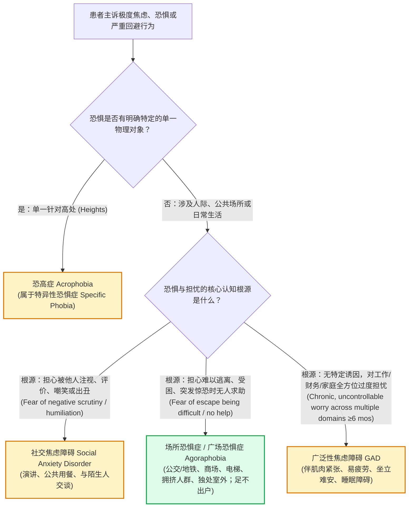
```mermaid
flowchart TD
    Start["患者主诉极度焦虑、恐惧或严重回避行为"] --> Q1{"恐惧是否有明确特定的单一物理对象？"}
    
    Q1 -- "是：单一针对高处 (Heights)" --> Acro["恐高症 Acrophobia<br>(属于特异性恐惧症 Specific Phobia)"]
    Q1 -- "否：涉及人际、公共场所或日常生活" --> Q2{"恐惧与担忧的核心认知根源是什么？"}
    
    Q2 -- "根源：担心被他人注视、评价、嘲笑或出丑<br>(Fear of negative scrutiny / humiliation)" --> Social["社交焦虑障碍 Social Anxiety Disorder<br>(演讲、公共用餐、与陌生人交谈)"]
    
    Q2 -- "根源：担心难以逃离、受困、突发惊恐时无人求助<br>(Fear of escape being difficult / no help)" --> Agora["场所恐惧症 / 广场恐惧症 Agoraphobia<br>(公交/地铁、商场、电梯、拥挤人群、独处室外；足不出户)"]
    
    Q2 -- "根源：无特定诱因，对工作/财务/家庭全方位过度担忧<br>(Chronic, uncontrollable worry across multiple domains ≥6 mos)" --> GAD["广泛性焦虑障碍 GAD<br>(伴肌肉紧张、易疲劳、坐立难安、睡眠障碍)"]

    classDef highlight fill:#fef3c7,stroke:#d97706,stroke-width:2px;
    classDef answer fill:#dcfce7,stroke:#16a34a,stroke-width:2px;
    class Agora answer;
    class Acro,Social,GAD highlight;
```

---

### 2. 4 大焦虑与恐惧障碍横向鉴别全景矩阵表 (Comparison Matrix)

| 疾病诊断 (Disorder) | 核心恐惧根源 (Core Trigger / Fear) | 典型触发情境 (Classic Scenarios) | 典型临床行为与体征 (Behavior & Signs) | NCLEX 经典题眼关键词 (Buzzwords) |
| :--- | :--- | :--- | :--- | :--- |
| **场所恐惧症 (Agoraphobia)**<br>*(正确率 63%)* | **“逃脱困难”或“突发恐慌时无法获得救助”** (Escape might be difficult; Help unavailable) | ① 公共交通 (公交/飞机/地铁)<br>② 开阔空地 (停车场/桥梁)<br>③ 密闭空间 (商场/电影院/电梯)<br>④ 排队或拥挤人群<br>⑤ 独自离家外出 | **足不出户 (Housebound)**；外出必须由亲友陪同 (Requires companion)；极度回避上述 2 种及以上场所；常继发于惊恐发作 (Panic attacks) | `Fear of being trapped`, `Escape difficult`, `Panic symptoms with no help`, `Unable to leave home alone`, `Public transit / crowds` |
| **社交焦虑障碍 (Social Anxiety Disorder / Social Phobia)**<br>*(正确率 6%)* | **“被他人注视、审视、否定评价或当众出丑”** (Fear of scrutiny, embarrassment, or negative evaluation) | 公开演讲 (Public speaking)、在公共场合进食/饮水、与陌生人聚会、在他人注视下签名或工作 | 回避社交互动；与人眼神接触少；社交场合面红、出汗、心悸；极度害羞畏缩 | `Negative evaluation`, `Embarrassment`, `Scrutiny by others`, `Public speaking`, `Eating in public` |
| **广泛性焦虑障碍 (Generalized Anxiety Disorder, GAD)**<br>*(正确率 16%)* | **弥漫性、全方位的持续过度担忧，无单一明确场景** (Chronic, uncontrollable, pervasive worry about everyday events) | 工作表现、经济财务、家庭健康、日常生活琐事 (覆盖生活的方方面面，持续 $\ge 6$ 个月) | 躯体化症状显著：**肌肉紧张 (Muscle tension)**、易疲劳、坐立难安 (Restlessness)、易激惹、难以集中注意力、入睡困难 | `Excessive worry ≥ 6 months`, `Multiple life domains`, `Muscle tension`, `Restlessness`, `Uncontrollable anxiety` |
| **恐高症 (Acrophobia)**<br>*(正确率 14%)* | **单一特异性刺激源：高处** (Irrational, intense fear of heights) | 高层建筑、阳台、悬崖、桥梁高处、梯子、攀爬高处 | 处于高处时眩晕、惊恐、肢体瘫软、极度回避登高；地面上完全正常 | `Specific phobia`, `Fear of heights`, `High buildings / balconies`, `Extreme avoidance of elevation` |

---

### 3. NCLEX 高频题干“同场景不同动机”秒杀解析 (Scenario-Based Dissection)

> **同一个人“害怕去大型超市/商场”，究竟选哪种障碍？看背后的【认知恐惧根源】：**

* **场景 A**：“患者不敢去大超市，因为害怕万一突然心脏病发作或恐慌发作，自己被困在人群或排队长队里**没办法及时逃跑，也没人能救自己**”  
  👉 **必选【Agoraphobia 场所恐惧症】**！
* **场景 B**：“患者不敢去大超市，因为害怕结账时手抖被收银员嘲笑，或者害怕遇到熟人打招呼**觉得自己举止滑稽可笑而当众出丑**”  
  👉 **必选【Social Anxiety Disorder 社交焦虑障碍】**！
* **场景 C**：“患者去不去超市都整天坐立难安，成天过度焦虑买菜的物价、自己的工作会不会丢、家人会不会生病，伴随严重肩颈肌肉紧绷”  
  👉 **必选【GAD 广泛性焦虑障碍】**！
* **场景 D**：“患者完全不害怕去平层超市，但坚决拒绝走商场内的高空透明观光天桥和悬空滚梯”  
  👉 **必选【Acrophobia 恐高症】**！

---

### 4. ⚠️ 绝杀大坑与考试陷阱 (NCLEX Red Flag Traps)

1. **命名误区（Agora 并非只针对“广场/开阔地”）**：
   - 很多考生望文生义以为 Agoraphobia 只是“怕开阔广场”。
   - **NCLEX 考点**：密闭空间（如电影院、电梯、超市货架深处）、排队、乘坐地铁均属于典型场所恐惧！核心衡量标尺是 **“Escape is difficult”（逃离困难）**。
2. **居家不出门（Housebound）的最高危特征**：
   - 题干中若出现“**Client has not left home for 6 months**”（患者 6 个月没迈出家门）或“**Requires their spouse to accompany them anywhere outside**”（离开家必须配偶陪同），为 **Agoraphobia** 的教科书级经典表现。
3. **一线药物与护理干预**：
   - **药物治疗**：SSRI 类抗抑郁药（如 Sertraline, Escitalopram）为一线长效基石药物；急性重度恐慌发作可短期辅助苯二氮䓬类（Benzodiazepines，需警惕依赖与镇静）。
   - **心理治疗**：认知行为疗法（CBT）+ 系统脱敏/暴露疗法（Systematic desensitization / Exposure therapy）。

---

### 5. 精炼中英专业词汇 (Key Terms)

| 英文专业术语 | 中文医学规范表达 | 题干核心考点关联 |
| :--- | :--- | :--- |
| **Agoraphobia** | 场所恐惧症 / 广场恐惧症 | 恐惧逃跑受阻或求助无门；回避公共交通/密闭/拥挤；常闭门不出 |
| **Social anxiety disorder** | 社交焦虑障碍 / 社交恐惧症 | 恐惧被审视 (Scrutiny)、被负面评价与公开出丑 |
| **Generalized anxiety disorder (GAD)** | 广泛性焦虑障碍 | 弥漫性日常过度担忧持续 $\ge 6$ 个月；显著肌肉紧张 |
| **Acrophobia** | 恐高症 | 单一特异性恐惧（高处 Heights） |
| **Exposure therapy / Systematic desensitization** | 暴露疗法 / 系统脱敏法 | 恐惧症金标准非药物疗法（循序渐进暴露于恐惧刺激源） |

---

## 34. 实验室速记 (Lab Value)

- **Elevated B-type natriuretic peptide = BNP = heart failure**

---

## 35. 丁螺环酮 (Buspirone) 抗焦虑核心速记 (简单方案)

- **药物定位**：**Buspirone (丁螺环酮)** = **Non-benzodiazepine anxiolytic (非苯二氮䓬类抗焦虑药)**
- **四大无害特性 (No CNS Depression)**：
  - 无中枢抑制 $\to$ **无依赖成瘾、无耐药耐受、无嗜睡迟钝、无戒断反应**
  - *(NO dependence, NO tolerance, NO psychomotor slowing, NO withdrawal symptoms)*
- **起效时间 (Onset)**：
  - **起效慢，需 2 ~ 4 周才达完全疗效**（用于维持治疗，**严禁用于急性恐慌发作抢救**）
  - *(Takes 2–4 weeks for full therapeutic effect; NOT for acute attacks)*

---

## 36. 产科宫底高度 (Fundal Height) 与麦克唐纳法则 (McDonald's Rule) 速查卡 (简单方案)

### 1. 人体解剖“阶梯式”视觉速览 (Anatomical Ladder)

```text
       [ 36 周 ]  ──  剑突水平 (Xiphoid Process) ── 最高点 (膈肌压迫/气促)
                          ▲
       [38-40周]  ──  宫底略降 (Drops due to Lightening) ── 胎儿入盆
                          │
       [20-22周]  ──  肚脐水平 (Umbilicus) ── 黄金基准线 (宫高 ≈ 孕周)
                          │
       [ 16 周 ]  ──  耻骨联合与肚脐中点 (Halfway)
                          │
       [ 12 周 ]  ──  耻骨联合上方 (Just above Symphysis Pubis) ── 刚出真骨盆
```

---

### 2. 核心里程碑速查表 (Key Milestones Table)

| 孕周 (Weeks) | 宫底解剖标志 (Anatomical Landmark) | 临床核心特征与考点 (Clinical Highlights) |
| :--- | :--- | :--- |
| **12 周** | **耻骨联合上方** *(Just above symphysis pubis)* | 子宫增大刚**移出真骨盆**，腹部体表首次可触及 |
| **16 周** | **耻骨联合与肚脐中点** *(Halfway between pubic symphysis & umbilicus)* | 位于下腹部平坦处正中 |
| **20–22 周** | **肚脐水平** *(At the umbilicus)* | 🌟 **黄金基准点**：此时宫高 $(\text{cm}) \approx$ 孕周数 |
| **36 周** | **剑突水平** *(At the xiphoid process)* | 达到解剖**最高点**；膈肌压迫最重（易胸闷、气促） |
| **38–40 周** | **宫底略下降** *(Drops due to Lightening)* | **胎儿入盆 (Lightening)**；呼吸转为轻松，但膀胱压迫/尿频增加 |

---

### 3. 麦克唐纳法则 (McDonald's Rule) 极简公式

> 💡 **一句话公式**：$$\mathbf{\text{宫底高度 (Fundal Height, cm)} \approx \text{孕周数 (Weeks)} \ (\pm 2\text{ cm})}$$

* **适用区间**：**孕 18–20 周 $\sim$ 34–36 周**。
* **测量方法**：孕妇排空膀胱后仰卧，软尺从**耻骨联合上缘**量至**子宫底**最高弧度处。
* **典型速算对应**：
  * **20 周**：到达肚脐，正常范围为 **$18 \sim 22\text{ cm}$**（中位数 $20\text{ cm}$）。
  * **24 周**：正常范围为 **$22 \sim 26\text{ cm}$**（中位数 $24\text{ cm}$）。
  * **30 周**：正常范围为 **$28 \sim 32\text{ cm}$**（中位数 $30\text{ cm}$）。
* ⚠️ **异常红旗 (误差 $> 2\text{ cm}$ 需进一步超声排查)**：
  * **测量偏小 ($< \text{孕周} - 2\text{ cm}$)**：警惕胎儿生长受限 (IUGR)、羊水过少 (Oligohydramnios)。
  * **测量偏大 ($> \text{孕周} + 2\text{ cm}$)**：警惕多胎妊娠 (Multiple gestation)、巨大儿 (Macrosomia)、羊水过多 (Polyhydramnios)。

---

## 37. 女性留置导尿术：无菌铺单与气囊充气标准 (简单方案)

- **无菌铺单时机与手法 (Drape Placement —— 正确)**：
  - **操作顺序**：手卫生 $\to$ 打开无菌包外层 $\to$ **先戴无菌手套** $\to$ 取出并铺垫单 (Drape)。
  - **防污染手法**：双手反折垫单边缘包裹遮盖手套（Cuffing the drape over gloves），仅触碰垫单无菌面，协助滑入臀下，严禁触碰未消毒皮肤或普通床单。
- **插管深度与气囊充气时机 (Insertion & Balloon Inflation —— 高频必考坑)**：
  - **第一步（初推进）**：推进 **$2 \sim 3\text{ inches}$ ($5 \sim 7.5\text{ cm}$)** 直至**肉眼见到尿液流出**。
  - **第二步（关键推进）**：🌟 **见尿后，必须再继续推进 $1 \sim 2\text{ inches}$ ($2.5 \sim 5\text{ cm}$)**，确保整个气囊已完全进入膀胱腔内！
  - **第三步（充气固定）**：确认入膀胱后，方可注入无菌水充盈气囊。
  - ⚠️ **严禁陷阱**：未见尿或见尿未加深即充气 $\to$ 气囊在狭窄尿道内强行膨胀 $\to$ **尿道严重撕裂、出血与剧痛 (Urethral trauma/tear)**！

---

## 38. NCLEX 高频药理与护理秒杀考点 4 则 (简单方案)

1. **华法林妊娠绝对禁忌 (Warfarin in Pregnancy)**：
   - 华法林具有明确致畸性（Teratogenic），**孕妇绝对禁用 (Contraindicated)**；孕期抗凝首选**低分子肝素 (LMWH / Enoxaparin)** 或普通肝素（不通过胎盘）。
2. **婴儿肌内注射首选部位 (IM Site in Infants <7 Months)**：
   - 月龄 $< 7$ 个月婴儿（乃至 1 岁内婴幼儿）肌注**唯一推荐部位为股外侧肌 (Vastus lateralis)**；严禁使用臀大肌 (Dorsogluteal，避免损伤坐骨神经)。
3. **青霉素与头孢菌素交叉过敏 (Cross-Sensitivity)**：
   - **Penicillins 与 Cephalosporins 具交叉过敏风险**；若患者对青霉素有**严重过敏史 (Anaphylaxis: 喉水肿、喘鸣、血管神经性水肿、休克)**，**绝对禁用头孢类**！
4. **阿片类药物诱发瘙痒非真过敏 (Narcotic-Induced Pruritus)**：
   - 阿片类（如吗啡 Morphine）引起的皮肤瘙痒为**组胺释放的预期不良反应 (Common adverse effect)**，**并非真正的药物过敏 (NOT a true allergy)**，不必盲目停药，可对症使用抗组胺药。

---

## 39. 妊娠剧吐 (Hyperemesis Gravidarum) 核心临床与实验室速记卡 (简单方案)

> 💡 **核心秒杀**：**严重剧吐 $\to$ 深度脱水 + 饥饿消耗 + 胃酸大量丢失**（体重大降、尿酮阳性、低钾低钠、代谢性碱中毒）。

### 1. 临床特征 (Clinical Features —— 严重脱水消耗)
- **体重明显下降 (Weight loss)**：体重下降通常 $\ge 5\%$ 孕前体重。
- **脱水体征 (Dehydration)**：**皮肤弹性差 (Poor skin turgor)**、**口腔黏膜干燥 (Dry mucous membranes)**。
- **血流动力学紊乱 (Hemodynamics)**：**低血压 (Hypotension)**、代偿性**心动过速 (Tachycardia)**。

---

### 2. 实验室 5 大特征性异常 (Laboratory Abnormalities)
- **低钾血症 / 低钠血症 (Hypokalemia / Hyponatremia)**：剧烈呕吐大量丢失胃液及电解质。
- **尿酮体阳性 (Ketonuria)**：重度恶心禁食，机体被迫**分解脂肪供能产生酮体**（饥饿性酮症）。
- **尿比重增高 (Increased urine specific gravity)**：血容量不足，肾脏代偿浓缩尿液（$> 1.030$）。
- **血液浓缩 (Hemoconcentration)**：血浆有效容积减少，致红细胞比容 (Hct) 与尿素氮 (BUN) 假性升高。
- **代谢性碱中毒 (Metabolic alkalosis)**：大量呕吐导致胃酸盐酸 ($\text{H}^+$ / $\text{Cl}^-$) 严重流失。

---

## 40. 好撒玛利亚人法 (Good Samaritan Laws) 免责三大黄金法则 (简单方案)

> 💡 **核心秒杀**：护士在院外事故现场志愿施救可豁免民事诉讼（Civil liability），但**必须严格同时满足三大法定前提**：**执业范围内施救、持续看护至交接、分文不取！**

* **三大法定免责前提 (3 Golden Prerequisites)**：
  1. **胜任与合理照护 (Act competently)**：在护士执业范围（Scope of practice）内提供合理照护，不得有重大过失或鲁莽操作（Gross negligence）。
  2. **持续施救直至交接 (Continue care until handover)**：必须留守现场持续提供照护，直至同级或更高级专业救护人员（如 EMT/Paramedics）正式接手；**中途擅自离开视同遗弃 (Abandonment)**。
  3. **分文不取无偿施救 (No financial compensation)**：必须为纯自愿无偿救助，**接受任何金钱或酬劳将立即丧失免责保护**。

---

## 41. 胸穿并发气胸 / 张力性气胸急救与 ARDS 病理机制全景深度解析 (Med-Surg 深度版)

> [!TIP] **核心速记 (TL;DR —— 胸穿并发症与呼吸急重症)**
> - **胸穿刺并发气胸 (Pneumothorax)**：胸穿针刺穿胸壁或误伤肺脏 $\to$ 空气入胸膜腔破环生理负压 $\to$ **肺萎陷 (Lung collapse)**。典型三联征：**突发患侧胸膜性刺痛、突发气促/呼吸困难、患侧呼吸音减弱或消失**。
> - **张力性气胸 (Tension Pneumothorax)**：气体只进不出形成高正压 $\to$ 压迫纵隔大血管致心输出量骤降（休克）+ **气管与纵隔向【健侧/对侧】偏移 (Tracheal deviation)**。
> - **急救金标准**：协助患者取**直立/半坐卧位 (Upright)**，立即准备**胸腔闭式引流术 (Chest tube insertion)**，依靠水封瓶重建胸腔负压并排出积气。
> - **绝杀大坑**：**严禁贸然插管正压通气**（正压会急剧加重气胸并诱发致死性张力性气胸！）；穿刺点必须保留**密闭敷料 (Occlusive dressing)** 严禁随意揭开。
> - **ARDS 核心病理**：重症肺炎/脓毒症诱发**肺毛细血管通透性剧增** $\to$ 液体蛋白浸泡肺泡腔致顽固性缺氧 $\to$ 晚期**不可逆肺纤维化瘢痕 (Fibrotic scars)**。

---

### 1. Mermaid 病理恶化与急救决策全景流程图

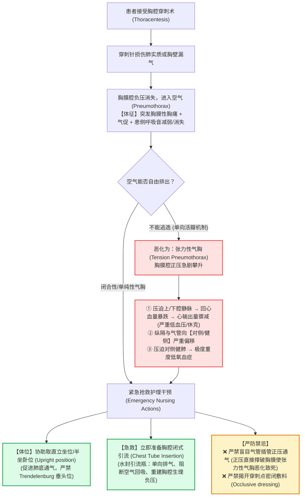
```mermaid
flowchart TD
    Start["患者接受胸腔穿刺术 (Thoracentesis)"] --> Injury["穿刺针损伤肺实质或胸壁漏气"]
    Injury --> Pneumo["胸膜腔负压消失，进入空气 (Pneumothorax)<br>【体征】突发胸膜性胸痛 + 气促 + 患侧呼吸音减弱/消失"]
    
    Pneumo --> Decision{"空气能否自由排出？"}
    
    Decision -- "不能逃逸 (单向活瓣机制)" --> Tension["恶化为：张力性气胸 (Tension Pneumothorax)<br>胸膜腔正压急剧攀升"]
    Tension --> Cascade["① 压迫上/下腔静脉 → 回心血量暴跌 → 心输出量骤减 (严重低血压/休克)<br>② 纵隔与气管向【对侧/健侧】严重偏移<br>③ 压迫对侧健肺 → 极度重度低氧血症"]
    
    Decision -- "闭合性/单纯性气胸" --> Intervene
    Cascade --> Intervene["紧急抢救护理干预 (Emergency Nursing Actions)"]
    
    Intervene --> Step1["【体位】协助取直立坐位/半坐卧位 (Upright position)<br>(促进肺底通气，严禁 Trendelenburg 垂头位)"]
    Intervene --> Step2["【急救】立即准备胸腔闭式引流 (Chest Tube Insertion)<br>(水封引流瓶：单向排气、阻断空气回吸、重建胸腔生理负压)"]
    Intervene --> Trap["【严防禁忌】<br>❌ 严禁盲目气管插管正压通气 (正压直接撑破胸膜使张力性气胸恶化致死)<br>❌ 严禁揭开穿刺点密闭敷料 (Occlusive dressing)"]

    classDef danger fill:#fee2e2,stroke:#ef4444,stroke-width:2px;
    classDef action fill:#dcfce7,stroke:#16a34a,stroke-width:2px;
    classDef warning fill:#fef3c7,stroke:#d97706,stroke-width:2px;
    class Tension,Cascade danger;
    class Step1,Step2 action;
    class Trap warning;
```

---

### 2. 单纯性气胸 vs 张力性气胸 vs ARDS 鉴别与干预矩阵

| 临床病症 | 核心病理机制 (Pathophysiology) | 典型症状与特征性体征 (Signs & Symptoms) | 优先护理与急救干预 (Priority Actions) | 典型 NCLEX 题眼考点 (Buzzwords) |
| :--- | :--- | :--- | :--- | :--- |
| **胸穿并发单纯气胸 (Pneumothorax)** | 穿刺针误刺肺泡/胸壁，破坏胸膜腔生理负压，导致患侧肺部分萎陷 | • **突发胸膜性锐痛 (Sudden pleuritic pain)**<br>• 呼吸困难、呼吸急促 (Dyspnea, Tachypnea)<br>• **患侧呼吸音减弱或完全消失**<br>• 患侧叩诊呈过度叩响 (Hyperresonance) | • 协助取**半卧位/直立坐位 (Upright position)**<br>• 穿刺点维持**密闭凡士林油纱敷料 (Occlusive dressing)**<br>• 密切监测血氧饱和度并给予氧疗<br>• **准备行胸腔闭式引流置管 (Chest tube insertion)** | `Following thoracentesis`, `Absent breath sounds on affected side`, `Sudden pleuritic chest pain`, `Prepare chest tube` |
| **张力性气胸 (Tension Pneumothorax)**<br>*(致死性急症)* | 胸膜穿口呈**单向活瓣 (One-way valve)**，吸气入气、呼气漏不出；胸腔内正压进行性积聚，压迫纵隔大血管与健侧肺 | • **气管向健侧/对侧明显偏移 (Tracheal deviation)**<br>• 颈静脉怒张 (JVD)<br>• 心输出量暴跌导致的**极度低血压与休克 (Hypotension)**<br>• 患侧胸廓膨隆饱满，呼吸运动消失 | • **时间就是生命**：立即通知医生行**粗针胸膜腔穿刺减压 (Needle decompression)**（第 2 肋间锁骨中线）<br>• 随后立即行胸腔闭式引流术置入胸管<br>• 给予高流量吸氧 | `Tracheal deviation to opposite side`, `JVD`, `Severe hypotension`, `Medical emergency`, `One-way valve` |
| **急性呼吸窘迫综合征 (ARDS)** | 脓毒症/重症肺炎引发失控性全身炎症反应，**肺泡-毛细血管膜通透性剧增**，大量水肿液富含蛋白质渗入肺泡；晚期形成**肺纤维化瘢痕** | • **顽固性严重低氧血症 (Refractory hypoxemia)**，高浓度给氧无法纠正<br>• 呼吸极度窘迫、三凹征、发绀<br>• 双肺弥漫性湿啰音<br>• 典型胸片：双肺弥漫性“白肺”磨玻璃浸润影 | • 机械通气采用**低潮气量 (Low tidal volume)** 与**呼气末正压 (PEEP)**<br>• 严格控制液体入量 (Conservative fluid management)<br>• **俯卧位通气 (Prone positioning)** 改善背侧肺泡通气血流比 | `Sepsis/Pneumonia`, `Increased capillary permeability`, `Fluid and protein in alveoli`, `Refractory hypoxemia`, `Fibrotic scars` |

---

### 3. NCLEX 选项深度剖析与必杀大坑 (Option Dissection & Red Flag Traps)

* ❌ **错误选项 1：取 Trendelenburg 体位（垂头仰卧位）**
  - **错因解析**：Trendelenburg 体位常用于严重低血容量性休克或中央静脉穿刺；对于**肺部病变合并气胸患者，垂头位使腹腔脏器上移压迫膈肌，极度加重通气受限与缺氧**！正确体位必须是**直立/半卧位 (Upright / High-Fowler position)**。
* ✅ **正确选项 2：准备行胸腔闭式引流置管 (Prepare for chest tube insertion)**
  - **机制解析**：胸穿并发气胸后，**水封胸腔引流系统 (Water seal drainage system)** 具有不可替代的三大生理功能：
    1. 阻断外界空气经胸壁穿刺点倒吸入胸膜腔；
    2. 利用水封单向阀机制，让胸膜腔内积聚的气体在呼气时排出；
    3. 逐步**重建胸膜腔生理负压 (Reestablishment of negative pressure)**，促使萎陷的肺组织重新复张 (Lung reexpansion)。
* ❌ **错误选项 3：立即进行气管插管并开始机械通气 (Intubation & Mechanical ventilation)**
  - **绝杀大坑**：胸管置入成功排出积气后，患者的低血压与缺氧常迅速逆转，无需常规气管插管；更致命的是，**未行胸腔减压前盲目施加机械通气正压（Positive pressure），会通过撕裂的肺泡向胸膜腔灌注更多高压气体，瞬间诱发或加剧致命的张力性气胸**！
* ❌ **错误选项 4：撕开并更换穿刺点的敷料 (Remove the dressing over puncture site)**
  - **错因解析**：胸穿术后覆盖在穿刺点的**密闭性敷料 (Occlusive dressing，如凡士林纱布)** 能够严密封闭外部通道；随意揭开或撕除敷料，会直接让大气中的空气经穿刺孔涌入胸膜腔，引发或加剧气胸。

---

### 4. 完整中英医学专业词汇对照表 (Key Terms)

| 英文专业术语 | 中文医学规范表达 | 题干核心考点及机制关联 |
| :--- | :--- | :--- |
| **Thoracentesis** | 胸腔穿刺术 | 术中/术后高危并发症：气胸 (Pneumothorax) 与血胸 |
| **Pneumothorax** | 气胸 | 胸膜腔积气，负压丧失致肺萎陷；患侧呼吸音消失 |
| **Tension pneumothorax** | 张力性气胸 | 单向活瓣正压积聚；气管对侧偏移、低血压休克 |
| **Tracheal deviation** | 气管偏斜 | 张力性气胸标志性体征；**永远偏向健侧（对侧）** |
| **Water seal drainage system** | 水封胸腔闭式引流系统 | 阻止空气倒流、单向排气、重建生理负压促肺复张 |
| **Occlusive dressing** | 密闭敷料（油纱） | 胸穿后覆盖穿刺点；隔绝空气进入胸膜腔 |
| **Upright position** | 直立坐位 / 半卧位 | 气胸与呼吸困难患者首选体位；利于膈肌下沉通气 |
| **Acute respiratory distress syndrome (ARDS)** | 急性呼吸窘迫综合征 | 肺毛细血管通透性剧增致肺泡积水浸泡；晚期广泛纤维化瘢痕 |
| **Refractory hypoxemia** | 顽固性低氧血症 | ARDS 经典特征；吸氧无法有效提升 $\text{PaO}_2$ |
| **Fibrotic scars** | 纤维化瘢痕 | ARDS 晚期病理改变；肺实质丧失气体交换功能 |

---

## 42. 脉搏血氧仪容积波形异常与伪差处理 (简单方案)

> 💡 **核心秒杀**：**血氧波形杂乱先查探头设备，切忌盲目过度干预！**

* **波形异常与诱因 (Irregular Pleth Waveform & Causes)**：
  - 脉搏容积波形（Plethysmographic waveform）不规则或杂乱跳动（Erratic），通常是**伪差 (Artifact)** 所致。
  - **常见诱因**：探头松动 (Loose)、粘贴位置不当 (Misapplied)、探头破损 (Damaged) 或患者肢体活动 (Client movement)。
* **护理首选行动 (Priority Nursing Action)**：
  - 🌟 **先核实设备与探头 (Verify sensor position & integrity first)**：在启动任何额外医疗干预（如盲目给氧、呼叫医生）前，**必须首先确认探头佩戴位置是否正确及其设备完整性**。

---

## 43. 产科孕产史 GTPAL 记录系统速记卡 (Obstetric History)

> [!TIP] **核心速记 (Rule Card —— 妇产科 GTPAL 系统)**
> - 💡 **一句话秒杀**：**G (怀过几次，含本次)**、**T (≥37周足月产)**、**P (20~36周早产)**、**A (<20周流产)**、**L (现有存活几个)**！
> - 🎯 **双胞胎绝杀口诀**：“**怀几次生几次看母体 (G/T/P/A 算 1 次)，生几个看娃娃 (L 算 2 个)！**”

---

### 1. GTPAL 字母定义与判定标准速查表

| 字母 | 英文全称 (Term) | 孕周界限 (Gestation Cutoff) | 核心定义与判定要点 (Clinical Definition) |
| :---: | :--- | :--- | :--- |
| **G** | **Gravidity** (总孕次) | 不限孕周与结局 | 母亲**怀孕的总次数**（无论活产、死胎、流产，**必须包含当前正在怀的这一胎**） |
| **T** | **Term** (足月产) | **$\ge 37$ 周 0 天** | 达到或超过 37 周的分娩次数（**单胎/多胎均只计 1 次分娩事件**） |
| **P** | **Preterm** (早产) | **20 周 0 天 $\sim$ 36 周 6 天** | 在此孕周区间内的分娩次数（无论婴儿存活与否，均计为早产分娩） |
| **A** | **Abortions** (流产) | **$< 20$ 周 0 天** | 在 20 周前终止的妊娠总数（包括**自然流产/胎停 Miscarriage** 和**人工流产 Induced abortion**） |
| **L** | **Living** (现存子女数) | 出生后至今 | **目前真实存活在世**的孩子数量（多胎如双胞胎按实际存活人数累加：双胞胎算 2 个） |

---

### 2. 经典题型拆解示例 ($G_5T_1P_2A_1L_2$)

> **题干情境**：某孕妇记录为 **$G_5T_1P_2A_1L_2$**
- **$G_5$**：总共怀孕过 **5 次**（含当前孕期）。
- **$T_1$**：有过 **1 次** $\ge 37$ 周足月产。
- **$P_2$**：有过 **2 次** 20~36 周早产。
- **$A_1$**：有过 **1 次** $<20$ 周流产（自然或人流）。
- **$L_2$**：目前有 **2 个** 存活在世的子女。

---

### 3. ⚠️ NCLEX 绝杀大坑与常考陷阱 (Red Flag Traps)

1. **当前妊娠算不算进 G？**
   - 🌟 **必考坑**：只要患者**目前正在怀孕**，**G 必须立即 $+1$**！但当前孕期尚未分娩，所以 **T/P/A/L 均保持不变**。
2. **多胎妊娠（双胞胎/三胞胎 Twins/Triplets）如何计入？**
   - 🌟 **顶级大坑**：
     - **T 和 P 计算的是“分娩事件（Birth events）”**：双胞胎在 38 周分娩 $\to$ **$T$ 只加 1，不加 2**！
     - **L 计算的是“活着的婴儿个体数（Living individuals）”**：生下一对健康的双胞胎 $\to$ **$L$ 加 2**！
3. **20 周分水岭（The 20-Week Line）**：
   - 妊娠在 **19 周 6 天** 终止 $\to$ 计入 **A (Abortion)**；
   - 妊娠在 **20 周 0 天** 死产 (Stillbirth) $\to$ 计入 **P (Preterm)**，绝不可计入 A！

---

### 4. 精炼中英专业词汇 (Key Terms)

| 英文专业术语 | 中文医学规范表达 | 考点记忆要诀 |
| :--- | :--- | :--- |
| **Gravidity (G)** | 妊娠总次数 | 包含当前妊娠；不看胎数 |
| **Term birth (T)** | 足月分娩次数 | $\ge 37$ 周；算分娩事件 |
| **Preterm birth (P)** | 早产分娩次数 | 20 周 0 天 $\sim$ 36 周 6 天 |
| **Abortion (A)** | 流产次数 | $< 20$ 周终止（自然/人工） |
| **Living children (L)** | 现存子女总数 | 实际存活人数（双胞胎计 2） |

---

## 44. 聚苯乙烯磺酸钠 (Kayexalate / Sodium Polystyrene Sulfonate) 降钾核心速记卡

> [!TIP] **核心速记 (Rule Card —— 肾病药理与高钾血症治疗)**
> - 💡 **一句话秒杀**：**在肠道“以钠换钾随大便排出”；起效需数小时不能用于猝死级急救；给药前必查肠道功能（肠梗阻/无肠鸣音绝对禁用，防致死性肠坏死）！**
> - 🎯 **秒杀口诀**：“**肠道排钾树脂慢，换出钠盐水肿看；用前先听肠鸣音，麻痹梗阻命难留。**”

---

### 1. 作用机制与代谢特点 (Mechanism & Onset)

* **排钾机制 (Cation-Exchange Resin)**：
  - 本品为阳离子交换树脂，在胃肠道（主要在结肠）通过**释放结合的钠离子，吸收置换出管腔内的钾离子**，随粪便排出体外（Excretes potassium through stool）。
* **起效时间定位 (Slow Onset)**：
  - **起效需数小时至数天**，主要用于亚急性或慢性高钾血症的维持清除。
  - ⚠️ **急救避坑**：心电图出现高尖 T 波的**急性致命性高钾血症**，首选**静脉注射葡萄糖酸钙 (Calcium gluconate)** 稳定心肌细胞膜，绝非依靠本药急救！

---

### 2. 核心护理评估与用药法则 (Golden Rules)

1. **第一优先评估：肠道功能 (Assess Bowel Sounds First)**：
   - 必须确认患者有活跃的肠鸣音、近期有排便、无严重便秘或腹胀。
2. **监测水钠潴留与心血管负荷 (Monitor for Fluid Overload)**：
   - 机制：每排出 1 个钾离子，机体吸收相应的钠离子。
   - 风险：易诱发**高钠血症、体液潴留**，对于合并心力衰竭或严重高血压的慢性肾病 (CKD) 患者尤为高危。
3. **给药途径 (Routes)**：
   - 可**口服 (Oral)** 或经直肠行**保留灌肠 (Retention enema)**。

---

### 3. ⚠️ NCLEX 绝杀大坑与绝对禁忌 (Red Flag Traps)

* ❌ **最致命并发症：肠坏死 (Intestinal / Bowel Necrosis)**
  - **机制**：树脂沉积可能损伤肠黏膜缺血坏死，甚至穿孔腹膜炎。
  - **绝对禁忌证 (Absolute Contraindication)**：
    - **麻痹性肠梗阻 (Paralytic ileus)**
    - **肠鸣音消失或减弱 (Absent or hypoactive bowel sounds)**
    - 腹部大手术后胃肠蠕动未恢复
  - 🌟 **NCLEX 考题**：护士给药前发现病人无肠鸣音或诉重度便秘，**第一护理行动是暂停给药 (Hold medication) 并立即报告医生**！

---

### 4. 精炼中英专业词汇 (Key Terms)

| 英文专业术语 | 中文医学规范表达 | 考点记忆要诀 |
| :--- | :--- | :--- |
| **Sodium polystyrene sulfonate (Kayexalate)** | 聚苯乙烯磺酸钠 | 肠道阳离子交换树脂；降血钾 |
| **Hyperkalemia** | 高钾血症 | 常见于慢性肾病 (CKD)；易诱发心律失常 |
| **Exchange sodium for potassium** | 以钠置换钾 | 胃肠道结肠内结合并随粪便排出 |
| **Intestinal necrosis** | 肠坏死 | 本药最危险并发症；肠梗阻患者禁用 |
| **Assess bowel sounds** | 评估肠鸣音 | 给药前首要护理评估项（无蠕动禁给） |
| **Calcium gluconate** | 葡萄糖酸钙 | 急性严重高钾首选用药（稳定心肌，非排钾） |

---

## 45. 急性感染后肾小球肾炎 (APGN) 致死性并发症与鉴别诊断全景解析 (Med-Surg 深度版)

> [!TIP] **核心速记 (TL;DR —— APGN 机制与致死并发症)**
> - **病理发病链**：A 组 $\beta$ 溶血性链球菌感染（如咽峡炎、皮肤脓疱疮）后 $1 \sim 3$ 周 $\to$ 免疫复合物沉积于肾小球毛细血管基底膜 $\to$ **肾小球滤过率 (GFR) 暴跌 $\to$ 全身水钠严重潴留 + 急性肾损伤 (AKI)**。
> - **经典三联征**：**茶色/可乐色尿 (Tea-colored / Cola-colored urine)**、**晨起眼睑浮肿 (Periorbital edema)**、**严重高血压 (Hypertension)**。
> - **两大最致命并发症 (Most at risk for)**：
>   1. **肺水肿 (Pulmonary edema)**：体液过载回流受阻，肺毛细血管静水压骤升 $\to$ 肺泡渗出，呼吸极度窘迫、肺底湿啰音、咳粉红色泡沫样痰。
>   2. **高血压脑病致脑水肿 (Hypertensive encephalopathy / Cerebral edema)**：恶性高血压突破脑血流自身调节阈值 $\to$ 脑充血水肿，剧烈头痛、喷射性呕吐、视物模糊、惊厥抽搐 (Seizures)、昏迷。
> - **核心护理干预**：**严密监测血压**、**每日测体重 (Daily weight)**、**严格限制水钠入量 (Fluid & sodium restriction)**、预防惊厥安全措施。

---

### 1. Mermaid 病理恶化与两大致死靶器官受损流程图

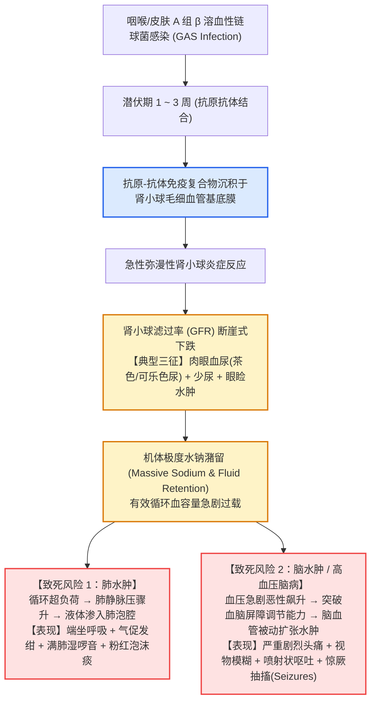
```mermaid
flowchart TD
    Infection["咽喉/皮肤 A 组 β 溶血性链球菌感染 (GAS Infection)"] --> Latent["潜伏期 1 ~ 3 周 (抗原抗体结合)"]
    Latent --> Complex["抗原-抗体免疫复合物沉积于肾小球毛细血管基底膜"]
    Complex --> Inflam["急性弥漫性肾小球炎症反应"]
    Inflam --> GFR["肾小球滤过率 (GFR) 断崖式下跌<br>【典型三征】肉眼血尿(茶色/可乐色尿) + 少尿 + 眼睑水肿"]
    
    GFR --> Retention["机体极度水钠潴留 (Massive Sodium & Fluid Retention)<br>有效循环血容量急剧过载"]
    
    Retention --> Path1["【致死风险 1：肺水肿】<br>循环超负荷 → 肺静脉压骤升 → 液体渗入肺泡腔<br>【表现】端坐呼吸 + 气促发绀 + 满肺湿啰音 + 粉红泡沫痰"]
    Retention --> Path2["【致死风险 2：脑水肿 / 高血压脑病】<br>血压急剧恶性飙升 → 突破血脑屏障调节能力 → 脑血管被动扩张水肿<br>【表现】严重剧烈头痛 + 视物模糊 + 喷射状呕吐 + 惊厥抽搐(Seizures)"]

    classDef danger fill:#fee2e2,stroke:#ef4444,stroke-width:2px;
    classDef warning fill:#fef3c7,stroke:#d97706,stroke-width:2px;
    classDef highlight fill:#dbeafe,stroke:#2563eb,stroke-width:2px;
    class Path1,Path2 danger;
    class GFR,Retention warning;
    class Complex highlight;
```

---

### 2. 泌尿肾脏 4 大高频混淆疾病横向鉴别矩阵 (Differential Matrix)

| 疾病诊断 (Disorder) | 病因与病变解剖部位 | 典型临床主征与尿液特征 | 核心危险并发症 | NCLEX 典型题眼关键词 (Buzzwords) |
| :--- | :--- | :--- | :--- | :--- |
| **急性感染后肾小球肾炎 (APGN)**<br>*(正确本题考点)* | **链球菌感染后免疫复合物损伤**；病在**肾小球** | • **茶色/可乐色血尿** (RBC/红细胞管型)<br>• **晨起眼睑浮肿** (Periorbital edema)<br>• 严重高血压、少尿、轻中度蛋白尿 | **脑水肿 (Cerebral edema)**<br>**肺水肿 (Pulmonary edema)**<br>急性肾损伤 (AKI) | `Prior strep infection (pharyngitis/impetigo)`, `Tea-colored/cloudy urine`, `Periorbital edema`, `Hypertension`, `Cerebral edema` |
| **急性肾盂肾炎 (Pyelonephritis)**<br>*(错误干扰项)* | 大肠埃希菌等下尿路细菌**逆行上行感染**；病在**肾实质与肾盂** | • **全身急性化脓中毒症状**：高热、寒战、恶心<br>• **肋脊角叩痛 (CVA tenderness)**、单/双侧腰痛<br>• 尿频/尿急/尿痛；尿检白细胞管型 (WBC casts) | 脓毒症 (Urosepsis)、肾脓肿、脓毒性休克 | `Ascending UTI`, `Costovertebral angle (CVA) tenderness`, `High fever/chills`, `Flank pain`, `WBC casts` |
| **出血性膀胱炎 (Hemorrhagic Cystitis)**<br>*(错误干扰项)* | **化学毒性刺激**（如化疗药**环磷酰胺 Cyclophosphamide**）或放疗；病在**膀胱黏膜** | • 突发弥漫性**肉眼血尿 (Gross hematuria)**<br>• 显著膀胱刺激征：排尿灼痛、排尿困难、尿频<br>• **无全身水肿、无高血压、肾功能通常正常** | 尿道血块梗阻导致急性尿潴留、失血性贫血 | `Chemotherapy`, `Cyclophosphamide / Ifosfamide`, `Mesna protection`, `Bladder burning/bleeding`, `Normal BP` |
| **肾病综合征 (Nephrotic Syndrome)**<br>*(常考对比项)* | 肾小球足突细胞损伤致通透性剧增；病在**肾小球** | • **“三高一低”**：大量蛋白尿 ($> 3.5\text{ g/d}$)、**重度低白蛋白血症**、**全身凹陷性重度浮肿**、高脂血症<br>• 泡沫尿；常**无肉眼血尿、血压多正常** | 重度感染（腹膜炎）、静脉血栓形成 (VTE) | `Massive proteinuria`, `Frothy urine`, `Hypoalbuminemia`, `Generalized edema / ascites`, `Normal blood pressure` |

---

### 3. NCLEX 错因深度反思与核心考点解剖 (Option Breakdown & Traps)

1. **为什么 APGN 必然面临【肺水肿】与【脑水肿】双重致命威胁？**
   - **机制链条**：肾小球滤过面积被免疫复合物堵塞 $\to$ GFR 严重受挫 $\to$ 肾脏排不出水和钠 $\to$ **循环超负荷 (Volume overload)**。
   - **肺水肿通路**：左心前负荷爆满，过量水分倒灌浸泡肺泡腔 $\to$ 急性肺水肿。
   - **脑水肿通路**：容量过大刺激外周血管阻力，引发**进行性恶性高血压**；当平均动脉压突破脑血管自我收缩调节上限时，脑毛细血管被迫灌注扩张，液体渗入脑实质间质 $\to$ 脑水肿、颅内压增高与抽搐。
2. **为什么误选【肾盂肾炎 (Pyelonephritis)】和【出血性膀胱炎 (Hemorrhagic cystitis)】是严重错位？**
   - **错因 1**：肾盂肾炎是**细菌活菌上行化脓感染**，典型表现是“发热+腰痛+CVA叩痛”，患者肾小球基底膜并未受损，水钠排泄正常，**不会引起全身体液超负荷与脑/肺水肿**。
   - **错因 2**：出血性膀胱炎局限于**膀胱黏膜受损流血**，多由环磷酰胺代谢物刺激所致（需用美司钠 Mesna 预防保护），病变根本不在肾脏，更不会导致 GFR 下降或全身水肿。

---

### 4. 关键护理评估与急救优先级 (Priority Nursing Care)

* **最优先监测指标**：
  - **严重警报：头痛、视物模糊、烦躁、恶心呕吐** $\to$ 高血压脑病/脑水肿前兆，必须立即测血压并报告医生！
  - **心肺警报：气促、咳嗽、听诊双肺底湿啰音 (Crackles)** $\to$ 提示肺水肿发生，协助半坐卧位并高流量吸氧。
* **护理管理金标准**：
  - **精确称体重 (Daily weight)**：评估水钠潴留和利尿效果的最客观黄金指标（同一时间、同一磅秤、同等衣物）。
  - **严密记录出入量 (Strict I&O)**：记录每次排尿量，密切关注少尿（Oliguria）演变。
  - **严格限盐限水 (Fluid and sodium restriction)**：限制饮食中纳摄入（避免咸菜、加工食品），根据前日尿量限制补液。
  - **保护性防抽搐准备 (Seizure precautions)**：床旁常备护栏软垫、吸痰管、氧气面罩，应对高血压脑病诱发的惊厥。

---

### 5. 完整中英医学专业词汇对照表 (Key Terms)

| 英文专业术语 | 中文医学规范表达 | 题干核心考点及临床联系 |
| :--- | :--- | :--- |
| **Acute postinfectious glomerulonephritis (APGN)** | 急性感染后肾小球肾炎 | 链球菌感染后免疫介导；少尿、血尿、高血压 |
| **Cerebral edema / Hypertensive encephalopathy** | 脑水肿 / 高血压脑病 | APGN 致死急症；恶性高血压致剧烈头痛、呕吐、惊厥 |
| **Pulmonary edema** | 肺水肿 | APGN 水钠潴留容量超负荷所致；湿啰音、粉红泡沫痰 |
| **Tea-colored / Cola-colored urine** | 茶色 / 可乐色尿 | 肾小球受损红细胞破坏释放血红蛋白的特征表现 |
| **Periorbital edema** | 眼睑眶周浮肿 | APGN 典型早期水肿分布特征（尤其清晨最重） |
| **Decreased glomerular filtration rate (GFR)** | 肾小球滤过率下降 | APGN 水钠潴留与少尿的病理始动环节 |
| **Seizure precautions** | 防抽搐/惊厥预防护理 | 针对脑水肿高血压脑病患者的床旁强制安全措施 |
| **Pyelonephritis** | 急性肾盂肾炎 | 细菌逆行上行化脓性感染；发热+肋脊角叩痛 (CVA tenderness) |
| **Hemorrhagic cystitis** | 出血性膀胱炎 | 环磷酰胺化疗毒性致膀胱排尿剧痛肉眼血尿；非肾脏病 |

---

## 46. 结核菌素皮试 (TST / PPD) 阳性判定与鉴别诊断 (简单方案)

> 💡 **核心秒杀**：**皮试硬结 $> 15\text{ mm}$ 仅能诊断“有结核感染 (TB Infection)”，绝不等同于“活动性结核病 (Active TB)”！**

* **皮试硬结阳性判定 (Induration $> 15\text{ mm}$)**：
  - 测量标准：仅测量触诊隆起的**硬结直径 (Induration)**，切勿测量单纯红晕 (Erythema)。
  - 临床意义：无危险因素健康人群硬结 $> 15\text{ mm}$ 即为阳性，证明体内存在**结核感染 (Has a TB infection)**（已产生特异性致敏淋巴细胞）。
* **下一步必须鉴别：潜伏感染 vs 活动性结核**：
  - 🌟 **下一步黄金组合**：**胸部 X 线 (Chest X-ray)** + **痰抗酸杆菌涂片与培养 (Sputum AFB smear & culture)**。
  - **潜伏性结核感染 (LTBI)**：无任何症状、胸片正常、痰检阴性、**不具传染性**。
  - **活动性结核病 (Active TB)**：有症状（低热、盗汗、咳嗽、咯血）、胸片见浸润/空洞、**痰检阳性（金标准）**、**具空气飞沫传染性 (Airborne)**。

---

## 47. 儿科各年龄段对“死亡”认知特征速查卡 (简单方案)

> 💡 **核心秒杀**：
> - **$\le$ 2 岁**：**无认知**，只认作息与分离焦虑；
> - **3 ~ 5 岁**：**死亡可逆 (Reversible)** + **魔法思维 (Magical thinking)**，常自责内疚；
> - **6 ~ 9 岁**：**理解不可逆终局 (Finality)**，但**不觉自己会死**，关注解剖与埋葬细节；
> - **10 ~ 12 岁**：理解**人人皆有一死**，关注对自己的**实际生活影响**；
> - **青少年期**：**成人级成熟认知**，具备哲学、宗教与灵性深度思考。

---

### 5 大年龄阶段速查表 (Children's Beliefs About Death)

| 年龄阶段 (Age) | 死亡认知核心 (Core Belief) | 典型临床特征与 NCLEX 题眼 (Clinical Clues) |
| :--- | :--- | :--- |
| **出生 ~ 2 岁**<br>*(Infancy to 2)* | **完全无概念** (No understanding) | 对**分离与失去**高度敏感；环境改变、照护者更换或日常作息打乱时极易焦虑哭闹 |
| **3 ~ 5 岁**<br>*(Preschool)* | 🌟 **认为死亡可逆** (Reversible)<br>充斥**魔法思维与幻想** (Magical thinking) | 以为死亡像睡觉一样还会醒来；认为自己的坏念头导致他人死亡，易产生**极度内疚与自责 (Guilt)** |
| **6 ~ 9 岁**<br>*(Early School-age)* | 🌟 **理解死亡是终局/不可逆** (Finality)<br>但**难以想象自己也会死亡** | 过分关注死亡的**躯体生物学与医疗过程**（如棺材、骨骼、疼痛、埋葬仪式等具体细节） |
| **10 ~ 12 岁**<br>*(Late School-age)* | 理解死亡**不可逆且终将影响所有人** | 强烈关注亲人死亡对自己生活的**切身现实影响**（如“谁来照顾我？我的生活会变成怎样？”） |
| **青少年期**<br>*(Adolescence)* | **达到成年人理解水平** (Adult level) | 理解死亡不可避免（但潜意识常觉得自己无敌）；能深入思考死亡的**哲学、宗教与灵性层面** |

---

## 48. NCLEX 高频草本药物 (Herbal Supplements) 用途与风险速查表 (简单方案)

> 💡 **核心秒杀**：
> - **促出血 (Bleeding)**：**银杏 (Ginkgo)**、**人参 (Ginseng)**（术前必停，禁与抗凝药合用）；
> - **严重肝毒性 (Liver injury)**：**卡瓦 (Kava)**、**黑升麻 (Black cohosh)**；
> - **相互作用之王 (Interactions)**：**圣约翰草 (St. John's wort)**（合用抗抑郁药致 5-HT 综合征；降低避孕药/华法林/地高辛疗效）；
> - **升压与心血管猝死 (Cardiovascular risks)**：**麻黄 (Ephedra)**（高血压、心律失常、心梗、猝死）、**甘草 (Licorice)**（高血压、低钾血症）。

---

### 常见 9 大草本药物速查表 (Risks of Herbal Medications)

| 草本补充剂 (Herbal Supplement) | 临床常见用途 (Common Uses) | 核心不良反应与药物相互作用 (Adverse Effects & Interactions) |
| :--- | :--- | :--- |
| **Ginkgo biloba** (银杏) | 增强记忆、改善认知 | 🩸 **增加出血风险 (Increased bleeding risk)** |
| **Ginseng** (人参) | 提高精力、改善脑力表现 | 🩸 **增加出血风险 (Increased bleeding risk)** |
| **Saw palmetto** (锯棕榈) | 良性前列腺增生 (BPH) | 轻微胃部不适 (Mild stomach discomfort) |
| **Black cohosh** (黑升麻) | 更年期症状（潮热 Hot flashes、阴道干涩） | ⚠️ **肝损伤 (Hepatic injury)** |
| **St. John's wort** (圣约翰草) | 治疗抑郁 (Depression)、失眠 | 🌟 **严重药物相互作用**：<br>• 与抗抑郁药合用 $\to$ **5-羟色胺综合征 (Serotonin syndrome)**<br>• 降低口服避孕药 (OCs) 疗效 $\to$ 意外受孕<br>• 降低抗凝药疗效 $\to$ **$\downarrow$ INR (血栓风险)**<br>• 降低地高辛 (Digoxin) 血药浓度<br>• 高血压危象 (Hypertensive crisis) |
| **Kava** (卡瓦) | 抗焦虑、镇静改善失眠 | ⚠️ **严重肝脏损害 (Severe liver damage)** |
| **Licorice** (甘草) | 胃溃疡、支气管炎/上感 | ⚡ **高血压 (Hypertension)** + **低钾血症 (Hypokalemia)** |
| **Echinacea** (紫锥菊) | 预防与辅助治疗感冒/流感 | 过敏反应 (Allergic reactions)、消化不良 (Dyspepsia) |
| **Ephedra** (麻黄) | 减肥、提高运动表现、感冒 | 💥 **高血压 (Hypertension)**、**恶性心律失常/心肌梗死/猝死 (Arrhythmia/MI/Sudden death)**、脑卒中 (Stroke)、惊厥发作 (Seizure) |

---

## 49. 他汀类疗效指标、血脂正常值与方向速记卡 (简单方案)

> 💡 **核心秒杀口诀**：
> - **“H 好心肠 (HDL)，越高越好 ($\uparrow$)；L 坏家伙 (LDL)，越低越好 ($\downarrow$)！”**
> - **血脂 4 项中，唯有 HDL 是“越高越好”，其余 3 项全部是“越低越好”！**

---

### 1. 血脂 4 大指标参考值与升降方向速查表

| 血脂指标 (Lipid Marker) | 中文名称 | NCLEX 黄金正常参考值 | 治疗目标方向 | 记忆技巧与临床定位 |
| :--- | :--- | :--- | :---: | :--- |
| **HDL** *(High-Density Lipoprotein)* | 高密度脂蛋白 | **$> 40 \sim 50\text{ mg/dL}$**<br>*(男 $>40$, 女 $>50$)* | 🌟 **越高越好**<br>($\uparrow$) | **H = Healthy / High**（“血管清道夫”，**唯一越高越好的指标**） |
| **LDL** *(Low-Density Lipoprotein)* | 低密度脂蛋白 | **$< 100\text{ mg/dL}$**<br>*(CAD高危人群 $<70$)* | 🔻 **越低越好**<br>($\downarrow$) | **L = Lousy**（“坏胆固醇”，动脉粥样硬化与斑块元凶） |
| **Total Cholesterol** | 总胆固醇 | **$< 200\text{ mg/dL}$** | 🔻 **越低越好**<br>($\downarrow$) | 整体心血管负荷总指标 |
| **Triglycerides** | 甘油三酯 | **$< 150\text{ mg/dL}$** | 🔻 **越低越好**<br>($\downarrow$) | 饮食脂肪代谢指标；过高（$>500$）易诱发急性胰腺炎 |

---

### 2. 他汀类药物 (Statins —— 如阿托伐他汀) 药理速记

* **治疗达标反应 (Therapeutic Response)**：
  * **三降一升**：$\downarrow$ **LDL**、$\downarrow$ **Total Cholesterol**、$\downarrow$ **Triglycerides**；同时 $\uparrow$ **HDL**。
* ⚠️ **两大必考毒性 (Adverse Effects & Red Flags)**：
  1. **肝功能损害 (Hepatic dysfunction)**：用药前后必须监测肝功能酶（ALT、AST）。
  2. **肌肉损伤 / 横纹肌溶解 (Muscle injury / Rhabdomyolysis)**：患者报告**肌肉酸痛 (Myalgia)**、乏力或出现**茶色尿**时，必须**立即停药 (Discontinue)** 并检测**肌酸激酶 (Creatine kinase, CK)**。

---

## 50. 膝上截肢术 (AKA) 术后护理与防挛缩黄金法则 (简单方案)

> 💡 **核心秒杀口诀**：
> - **“8 字绷带促塑形，环形缠扎坏死凝；垫枕不过一天整（24小时），每天俯卧三四巡（防髋屈曲挛缩）！”**

---

### 1. 核心考点速记表 (AKA Nursing Do's & Don'ts)

| 护理项目 (Nursing Item) | 正确规范做法 (Do's ✅) | 绝对错误禁忌 (Don'ts ❌) | 机制与 NCLEX 考点依据 (Rationale) |
| :--- | :--- | :--- | :--- |
| **水肿与塑形管理** *(Edema Management)* | 佩戴 **8 字形绷带 (Figure-eight bandage)** 或专用残肢收缩套 (Shrinker sock) | 严禁**环形缠扎绷带** *(Circular wrapping)* | 8 字法由远向近递减受压促进回流与假肢塑形；环形缠绕形成止血带效应，截断血供致缺血坏死 |
| **残肢抬高时限** *(Limb Elevation)* | **仅限术后前 24 小时内**短暂垫高残肢或抬高床尾消肿 | 术后 **24 小时后严禁用枕头垫高残肢** | 持续垫高残肢使髋关节处于屈曲状态，诱发极难矫正的**髋关节屈曲挛缩 (Hip flexion contracture)** |
| **防挛缩体位管理** *(Contracture Prevention)* | 协助取**俯卧位 (Prone position)**，每天 3~4 次，每次 30 分钟 | 严禁**持续坐轮椅/椅子超过 1 小时** | 俯卧位迫使髋关节处于完全伸展状态 (Hip extension)；长期坐位保持屈髋，导致无法安装义肢直立行走 |

---

### 2. 精炼中英专业词汇 (Key Terms)

| 英文专业术语 | 中文规范表达 | 核心考点关联 |
| :--- | :--- | :--- |
| **Above-the-knee amputation (AKA)** | 膝上截肢术 | 术后核心目标是预防水肿与髋关节挛缩 |
| **Figure-eight bandage** | 8 字形绷带 | 残端塑形与消除水肿的标准包扎手法（禁环形） |
| **Hip flexion contracture** | 髋关节屈曲挛缩 | 术后最顽固畸形；24小时后禁枕头垫高残端 |
| **Prone position (3-4 times/day, 30 min)** | 俯卧位伸髋 | 强制拉伸后展髋关节的金标准体位 |

---

## 51. 肿瘤触诊红旗体征：良恶性淋巴结鉴别与炎性乳腺癌 (IBC) 橘皮样变全景解析 (Med-Surg 深度版)

> [!TIP] **核心速记 (TL;DR —— 肿瘤外科两大致死性触诊红旗)**
> - **淋巴结良恶性鉴别秒杀口诀**：**“炎症良性三联征：痛、软、滑（可移动）；肿瘤恶性三联征：硬、粘（固定）、不痛！”**
> - **炎性乳腺癌 (IBC) 标志性体征**：乳房突发红肿、皮温升高，表面出现细小凹陷凹坑 —— **“橘皮样变 (Peau d'orange)”**。
> - **致死机制与分诊优先级**：由**侵袭性癌细胞迅速堵塞真皮下淋巴管**导致局部严重淋巴水肿，恶性度极高、进展迅猛；NCLEX 分诊题中属于**最高优先级回电/立即转诊 (Highest Priority Triage)**！

---

### 1. Mermaid 肿瘤红旗体征分诊与决策流程图

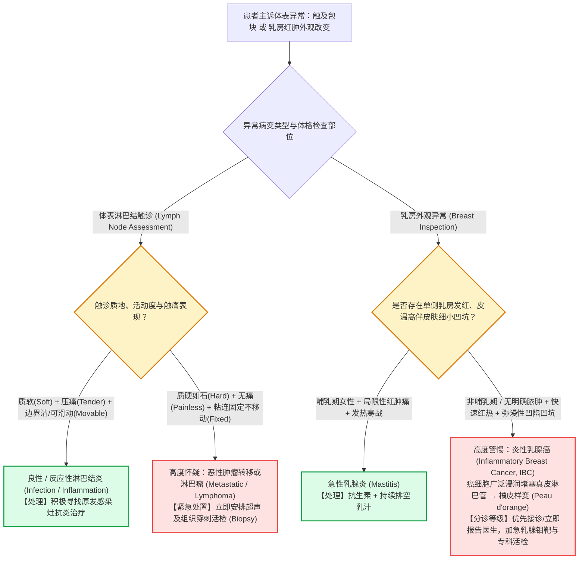
```mermaid
flowchart TD
    Start["患者主诉体表异常：触及包块 或 乳房红肿外观改变"] --> Choice{"异常病变类型与体格检查部位"}
    
    Choice -- "体表淋巴结触诊 (Lymph Node Assessment)" --> LN{"触诊质地、活动度与触痛表现？"}
    LN -- "质软(Soft) + 压痛(Tender) + 边界清/可滑动(Movable)" --> BenignLN["良性 / 反应性淋巴结炎 (Infection / Inflammation)<br>【处理】积极寻找原发感染灶抗炎治疗"]
    LN -- "质硬如石(Hard) + 无痛(Painless) + 粘连固定不移动(Fixed)" --> MalignLN["高度怀疑：恶性肿瘤转移或淋巴瘤 (Metastatic / Lymphoma)<br>【紧急处置】立即安排超声及组织穿刺活检 (Biopsy)"]
    
    Choice -- "乳房外观异常 (Breast Inspection)" --> Breast{"是否存在单侧乳房发红、皮温高伴皮肤细小凹坑？"}
    Breast -- "哺乳期女性 + 局限性红肿痛 + 发热寒战" --> Mastitis["急性乳腺炎 (Mastitis)<br>【处理】抗生素 + 持续排空乳汁"]
    Breast -- "非哺乳期 / 无明确脓肿 + 快速红热 + 弥漫性凹陷凹坑" --> IBC["高度警惕：炎性乳腺癌 (Inflammatory Breast Cancer, IBC)<br>癌细胞广泛浸润堵塞真皮淋巴管 → 橘皮样变 (Peau d'orange)<br>【分诊等级】优先接诊/立即报告医生，加急乳腺钼靶与专科活检"]

    classDef danger fill:#fee2e2,stroke:#ef4444,stroke-width:2px;
    classDef warning fill:#fef3c7,stroke:#d97706,stroke-width:2px;
    classDef safe fill:#dcfce7,stroke:#16a34a,stroke-width:2px;
    class MalignLN,IBC danger;
    class LN,Breast warning;
    class BenignLN,Mastitis safe;
```

---

### 2. 核心鉴别矩阵 (Differential Matrix)

#### 表 1：良性反应性淋巴结 vs 恶性转移性淋巴结横向鉴别

| 触诊评估维度 | 良性 / 感染反应性淋巴结 (Benign/Infectious) | 恶性 / 肿瘤转移与淋巴瘤 (Malignant/Metastatic) |
| :--- | :--- | :--- |
| **触痛感 (Tenderness)** | 🌟 **触痛明显 (Tender / Painful)**（炎症充血水肿张力高） | ⚠️ **无痛性肿大 (Painless)**（最容易麻痹忽视的恶性征象） |
| **质地硬度 (Consistency)** | **质软 (Soft)** 或中等韧度，有弹性 | ⚠️ **坚硬如石 (Hard / Stony)**，缺乏弹性 |
| **活动度 (Mobility)** | **可活动、界限清楚 (Movable / Mobile)** | ⚠️ **粘连固定、浸润周围组织 (Fixed / Matted)** |
| **大小与对称性** | 多呈暂时性、急性增大，抗炎后消退 | 进行性增大、常不规则聚合成团块（融合结） |
| **处理与下一步检查** | 寻找头面部/局部感染灶，抗炎对症观察 | **绝对红旗**：立即安排超声引导下**穿刺活检 (Biopsy)** |

---

#### 表 2：急性乳腺炎 vs 炎性乳腺癌 (IBC) 关键鉴别

| 疾病类型 | 好发人群与病因机制 | 皮肤与外观特征 | 全身伴随症状 | 护理分诊与急迫性 |
| :--- | :--- | :--- | :--- | :--- |
| **急性乳腺炎 (Mastitis)** | 绝大多数为**哺乳期初产妇**；乳头破损伴金葡菌逆行感染 | 局限性红、肿、热、痛，可触及硬结或波动性脓肿 | **全身高热、寒战、全身乏力酸痛** | 门诊常规就诊；给予抗生素，**指导产妇继续哺乳或吸出乳汁排空** |
| **炎性乳腺癌 (IBC)**<br>*(高危恶性肿瘤)* | **非哺乳期为主**；高度浸润性癌细胞迅速堵塞真皮毛细淋巴管 | 弥漫性发红、皮温升高，毛囊深陷呈典型的**“橘皮样变 (Peau d'orange)”** | 常无全身高热；可触及腋窝无痛性坚硬固定淋巴结 | **最高优先急诊回电 (Priority)**；恶性度极高、进展迅猛，加急活检排查 |

---

### 3. NCLEX 选项剖析与临床分诊陷阱 (Triage Traps)

1. **“无痛（Painless）”往往比“剧痛（Painful）”更危险**：
   - NCLEX 考题中，许多考生误以为“痛得厉害才要优先处理”。
   - **临床真理**：炎症伴剧痛虽然痛苦，但通常不致命；相反，**无痛性、进行性坚硬固定肿块（Painless, hard, fixed nodule）**是恶性肿瘤与淋巴瘤的标志，必须享有高度优先级排查。
2. **橘皮样变 (Peau d'orange) 的本质考点**：
   - 橘皮样外观并非简单的皮肤红斑，其真正病理成因是：**真皮淋巴水肿导致皮肤肿胀，而毛囊孔和韧带锚定在深层筋膜无法膨出，从而形成类似橘子皮的小凹坑**。
   - 看到题干描述：*“indented areas on the skin”*、*“orange peel appearance”*、*“red, warm, thickened skin”*，必须秒选 **炎性乳腺癌 (Inflammatory breast cancer)** 并立即转诊！

---

### 4. 完整中英医学专业词汇对照表 (Key Terms)

| 英文专业术语 | 中文医学规范表达 | 题干核心考点及机制关联 |
| :--- | :--- | :--- |
| **Peau d'orange** | 橘皮样改变 | 炎性乳腺癌典型外观；真皮淋巴管受浸润阻塞 |
| **Inflammatory breast cancer (IBC)** | 炎性乳腺癌 | 进展极快、侵袭性极强；红热肿凹陷；高危分诊 |
| **Painless, hard, and fixed** | 无痛、质硬、固定不活动 | 恶性肿瘤/淋巴瘤典型触诊三联征；活检指征 |
| **Tender, soft, and movable** | 触痛、质软、可滑动活动 | 良性/炎症反应性淋巴结肿大经典特征 |
| **Biopsy** | 组织穿刺活检 | 恶性淋巴结与乳腺癌确诊不可替代的金标准 |
| **Mastitis** | 急性乳腺炎 | 哺乳期细菌感染；发热+局部红痛；需排空乳汁 |
| **Dermal lymphatic invasion** | 真皮淋巴管癌栓浸润 | 橘皮样变形成的直接病理生理学始动机制 |

---

## 52. 隐性脊柱裂 (Spina Bifida Occulta) 脊柱基底部 4 大体表标记速记卡 (简单方案)

> 💡 **核心秒杀**：
> - **病理定位**：最常见的神经管缺陷（NTD），为**椎弓后部不完全闭合 (Incomplete closure of posterior vertebral arch)**，脊髓与脑脊膜无明显膨出。
> - **骶尾部 4 大特征口诀**：“**一撮毛、一处坑、红血管瘤、色素痣**”（发现即需超声排查）。

---

### 1. 脊柱基底部（骶尾部）4 大特征性体表标记

| 体表标志 (Clinical Sign) | 英文术语 | 临床表现与 NCLEX 题眼 |
| :--- | :--- | :--- |
| **一丛毛发** | **Tuft of hair** | 脊柱基底/骶尾部正中皮肤局部异常毛发丛 |
| **皮肤凹陷** | **Sacral dimple** | 骶尾部中线处可见点状凹陷或凹坑 |
| **血管瘤** | **Hemangioma** | 局部皮肤毛细血管扩张或暗红色血管斑 |
| **色素痣** | **Nevus** | 局限性皮肤色素沉着斑或痣 |

---

### 2. 护理干预与病因预防 (NCLEX Links)

* **评估与处置**：新生儿查体发现上述任一体表征象，需警惕隐性脊柱裂及脊髓栓系，应安排**脊柱超声 (Spinal ultrasound)** 进一步确诊。
* **病因预防金标准**：育龄期女性与妊娠早期每日补充**叶酸 (Folic acid 400 ~ 800 mcg/day)**，是预防所有神经管缺陷（NTD）的最关键干预措施。

---

## 53. 格林-巴利综合征 (GBS) 上行性麻痹恶化急救与多系统护理全景解析 (Med-Surg 深度版)

> [!TIP] **核心速记 (TL;DR —— GBS 恶化抢救与护理法则)**
> - **病理核心**：胃肠/呼吸道感染后自身免疫性周围神经脱髓鞘，特征为**“对称性、上行性迟缓性麻痹 (Symmetrical, ascending flaccid paralysis)”**（从双足/双腿向上蔓延至上肢、胸腹及呼吸肌）。
> - **两大最高危致死并发症**：
>   1. **呼吸肌麻痹致呼吸衰竭 (Respiratory failure)**：膈肌与肋间肌无力，无法自主咳嗽排痰，为最首要死因！
>   2. **自主神经功能紊乱 (Autonomic dysfunction)**：致死性恶性心律失常、极度血压骤升骤降 (Labile BP)。
> - **床旁急诊抢救“护身三宝”**：床旁必须常备**吸痰设备 (Suction equipment)** + **简易人工呼吸气囊面罩 (Bag-valve-mask, BVM)** + **气管插管装备 (Intubation tray & supplies)**。
> - **特异性免疫治疗**：**静脉注射免疫球蛋白 (IVIG)** 或 **血浆置换 (Plasmapheresis)**（清除/阻断自身致病抗体）。
> - **NCLEX 绝杀大坑**：呼吸衰竭急性抢救**首选经口“气管插管 (Endotracheal intubation)”**；**严禁早期盲目行“气管切开术 (Tracheotomy)”**（气管切开仅用于通气超过 2~3 周的长期脱机困难者）！

---

### 1. Mermaid 病理上行恶化与床旁抢救决策流程图

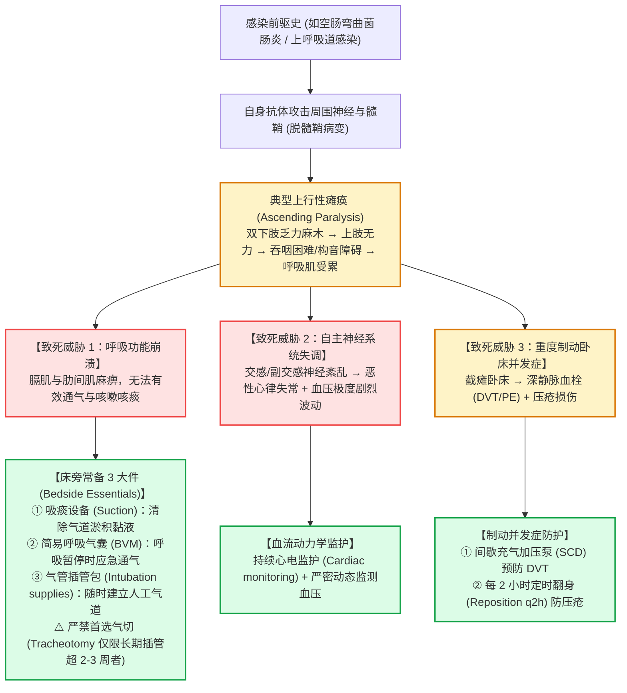
```mermaid
flowchart TD
    Infection["感染前驱史 (如空肠弯曲菌肠炎 / 上呼吸道感染)"] --> Autoimmune["自身抗体攻击周围神经与髓鞘 (脱髓鞘病变)"]
    Autoimmune --> Ascending["典型上行性瘫痪 (Ascending Paralysis)<br>双下肢乏力麻木 → 上肢无力 → 吞咽困难/构音障碍 → 呼吸肌受累"]
    
    Ascending --> Threat1["【致死威胁 1：呼吸功能崩溃】<br>膈肌与肋间肌麻痹，无法有效通气与咳嗽咳痰"]
    Ascending --> Threat2["【致死威胁 2：自主神经系统失调】<br>交感/副交感神经紊乱 → 恶性心律失常 + 血压极度剧烈波动"]
    Ascending --> Threat3["【致死威胁 3：重度制动卧床并发症】<br>截瘫卧床 → 深静脉血栓 (DVT/PE) + 压疮损伤"]

    Threat1 --> Action1["【床旁常备 3 大件 (Bedside Essentials)】<br>① 吸痰设备 (Suction)：清除气道淤积黏液<br>② 简易呼吸气囊 (BVM)：呼吸暂停时应急通气<br>③ 气管插管包 (Intubation supplies)：随时建立人工气道<br>⚠️ 严禁首选气切 (Tracheotomy 仅限长期插管超 2-3 周者)"]
    
    Threat2 --> Action2["【血流动力学监护】<br>持续心电监护 (Cardiac monitoring) + 严密动态监测血压"]
    
    Threat3 --> Action3["【制动并发症防护】<br>① 间歇充气加压泵 (SCD) 预防 DVT<br>② 每 2 小时定时翻身 (Reposition q2h) 防压疮"]

    classDef danger fill:#fee2e2,stroke:#ef4444,stroke-width:2px;
    classDef action fill:#dcfce7,stroke:#16a34a,stroke-width:2px;
    classDef warning fill:#fef3c7,stroke:#d97706,stroke-width:2px;
    class Threat1,Threat2 danger;
    class Action1,Action2,Action3 action;
    class Ascending,Threat3 warning;
```

---

### 2. GBS 恶化患者多系统核心护理干预矩阵 (Comprehensive Nursing Matrix)

| 系统维度 | 恶化病理机制与临床风险 | 规范护理干预措施 (Appropriate Interventions) | NCLEX 临床题眼与考点逻辑 |
| :--- | :--- | :--- | :--- |
| **呼吸系统**<br>*(最优先保障)* | 膈肌 (Diaphragm) 与肋间肌受累导致通气不足；呼吸肌无力无法有效自主咳嗽清除分泌物，极易误吸与窒息 | • **床旁备妥吸痰设备 (Suction equipment)** 清除口腔分泌物<br>• **床旁常备简易呼吸气囊面罩 (BVM)**<br>• **床旁常备气管插管装置 (Intubation supplies)**，评估肺活量 (FVC) 骤降时立即行紧急气管插管 | `Progressive upper extremity weakness`, `Inability to cough`, `Suction at bedside`, `BVM and intubation tray ready` |
| **自主神经系统**<br>*(致死心血管风险)* | 自主神经受累导致迷走神经过度兴奋或交感神经过度抑制，产生心跳骤停、窦缓、室性心律失常及体位性/突发性高血压或低血压 | • **上持续心电监护 (Continuous cardiac monitoring)**，及时捕捉严重恶性心律失常<br>• **血流动力学监测 (Hemodynamic monitoring)**：定时测量血压，警惕血压剧烈波动 (Labile blood pressure) | `Autonomic nervous system dysfunction`, `Arrhythmias`, `Blood pressure alterations`, `Continuous cardiac monitor` |
| **皮肤与骨骼运动**<br>*(制动失用风险)* | 患者进行性瘫痪导致自主翻身和活动能力完全丧失，局部骨隆突处长时间受压极易发生组织缺血性坏死 | • **严格每 2 小时翻身一次 (Reposition in bed every 2 hours)**<br>• 保持床单清洁平整干燥，受压处使用减压垫或气垫床 | `Immobility`, `Pressure-related skin injury`, `Turn every 2 hours`, `Skin assessment` |
| **外周循环系统**<br>*(致命性血栓风险)* | 下肢完全瘫痪导致骨骼肌“肌泵”回流作用消失，静脉血流极度淤滞，深静脉血栓 (DVT) 及肺栓塞 (PE) 发生率极高 | • **双下肢穿戴气压波序贯压力治疗仪 (Sequential Compression Device, SCD)**<br>• 遵医嘱预防性给予低分子肝素皮下注射 | `Venous stasis`, `Sequential compression device (SCD)`, `DVT/PE prophylaxis` |
| **专科免疫治疗**<br>*(病因学控制)* | 阻断并清除血液中攻击外周神经髓鞘的致病性自身抗体 | • **静脉注射免疫球蛋白 (IVIG)**：大剂量封闭自身抗体<br>• **血浆置换 (Plasmapheresis)**：物理滤除致病血浆抗体<br>• ⚠️ 糖皮质激素对 GBS 无效，不作为常规推荐 | `IVIG or plasmapheresis`, `Remove harmful antibodies`, `Immunotherapy` |

---

### 3. NCLEX 绝杀大坑深度剖析 (Critical Thinking & Option Dissection)

* ❌ **高频致命陷阱：看到“呼吸困难恶化”，立即安排“气管切开术 (Tracheotomy)”**
  - **错因解析**：
    - 在急性呼吸肌麻痹、濒临呼吸衰竭时，建立人工气道的**首选金标准永远是经口“气管插管 (Endotracheal intubation)”**！
    - 气管插管操作耗时极短（可在数十秒内完成）、创伤小，能最快解除急性窒息；
    - **气管切开 (Tracheostomy)** 是有创的外科手术操作，NCLEX 规定其仅适用于**预期需要长期接受机械通气（通常超过 2～3 周脱机困难者）**。在急性期为病人准备气管切开属于过度创伤且延误抢救的严重错误干预！
* 🌟 **床旁必备三大件的协同效应**：
  - 吸痰机（通气道） $\to$ 呼吸气囊（应急面罩给氧） $\to$ 插管包（上机通气），三位一体缺一不可。

---

### 4. 完整中英医学专业词汇对照表 (Key Terms)

| 英文专业术语 | 中文医学规范表达 | 题干核心考点及机制关联 |
| :--- | :--- | :--- |
| **Guillain-Barré syndrome (GBS)** | 格林-巴利综合征 | 感染后周围神经脱髓鞘；特征性对称性上行性麻痹 |
| **Ascending flaccid paralysis** | 上行性弛缓性瘫痪 | 下肢开始向上扩散至呼吸肌；腱反射减弱/消失 |
| **Respiratory failure** | 呼吸衰竭 | GBS 最主要死因；呼吸肌瘫痪无法排痰，需插管 |
| **Suction equipment** | 床旁吸痰设备 | 清除呼吸肌无力导致的下呼吸道黏液淤积 |
| **Bag-valve-mask (BVM)** | 简易呼吸气囊面罩 | 床旁紧急正压给氧复苏必备急救设备 |
| **Endotracheal intubation** | 经口气管插管 | GBS 呼吸衰竭急性建立人工气道的一线首选 |
| **Tracheostomy** | 气管切开术 | **非急性期首选**；仅用于长期机械通气（$> 2\sim 3$ 周）者 |
| **Autonomic dysfunction** | 自主神经功能紊乱 | 导致严重心律失常与血压骤变；需持续心电监护 |
| **Sequential compression device (SCD)** | 间歇充气下肢加压泵 | 瘫痪制动患者预防下肢深静脉血栓 (DVT) 标准措施 |
| **Intravenous immunoglobulin (IVIG)** | 静脉注射免疫球蛋白 | GBS 免疫治疗两大基石之一（封闭自身有害抗体） |
| **Plasmapheresis** | 血浆置换疗法 | GBS 免疫治疗两大基石之一（滤除有害抗体） |

---

## 54. 治疗性沟通：虚假安慰 (False Reassurance) 陷阱与破解法则 (简单方案)

> 💡 **核心秒杀**：
> - **“虚假安慰害死人，贬低担忧堵心门；空洞保证不可取，共情探究才是真！”**
> - 题干中任何 **“我相信你会做对的”**、**“一切都会变好的”**、**“别担心”**，**在 NCLEX 沟通题中 100% 为非治疗性错误选项**！

---

### 1. 虚假安慰 (False Reassurance) 核心剖析

* **典型非治疗性违规句式 (Trap Examples)**：
  - ❌ *“I am sure you will do the right thing.”*（“我相信你一定会做出正确决定的。”）
  - ❌ *“Everything is going to be fine, don't worry.”*（“别担心，一切都会好起来的。”）
* **两大致命沟通缺陷 (Why It Is Harmful)**：
  1. **漠视与贬低家属感受 (Devalues concerns)**：没有接纳与确认（Acknowledge）家属内心真实的焦虑、内疚与两难抉择。
  2. **阻断深入沟通 (Blocks conversation)**：让对方感到自己的顾虑被轻描淡写，不敢再向护士吐露进一步的疑虑与恐惧。

---

### 2. 正确治疗性替代方案 (Therapeutic Alternatives)

* 🌟 **黄金应对公式**：**确认情绪 (Validate feelings)** + **开放式探究 (Open-ended exploration)**
  - ✅ **正确示范**：*“You seem worried about making this decision. Tell me more about what concerns you the most.”*  
    （“看得出来做这个决定让您非常担忧，能跟我多说说您目前最顾虑的是什么吗？”）

---

## 55. 房间隔缺损 (ASD) 杂音 vs 心包填塞心音低钝速记卡 (简单方案)

> 💡 **核心秒杀**：
> - **房间隔缺损 (ASD)**：听诊为**收缩期杂音 (Systolic murmur)** + **第二心音固定分裂 (Fixed split S2)**；
> - **心音遥远/低钝 (Muffled heart tones)**：是**心包填塞 (Cardiac Tamponade) 的贝克三联征 (Beck's triad)**，绝非 ASD！

---

### 1. 两大心血管高频体征秒杀对照表

| 临床病症 (Condition) | 核心病理机制 (Pathophysiology) | 典型听诊与特征性体征 (Auscultation & Signs) | NCLEX 黄金题眼 |
| :--- | :--- | :--- | :--- |
| **房间隔缺损 (ASD)**<br>*(Atrial Septal Defect)* | **左向右分流 (Left-to-right shunt)**：高压左心房血液经缺损孔冲入低压右心房，肺动脉血流湍流剧增 | 🌟 **收缩期杂音 (Systolic murmur)**<br>🌟 **第二心音固定分裂 (Fixed split S2)** | `Systolic murmur`, `Fixed split S2`, `Acyanotic defect` |
| **心包填塞 (Cardiac Tamponade)**<br>*(术后致死急症)* | 心包腔大量积液积血，心包内高压严重限制心脏充盈，心输出量骤降 | 🚨 **贝克三联征 (Beck's Triad)**：<br>① **心音遥远低钝 (Muffled heart tones)**<br>② **颈静脉怒张 (JVD)**<br>③ **低血压 / 脉压变窄 (Hypotension)** | `Muffled/distant heart tones`, `Beck's triad`, `Post-cardiac surgery` |

---

## 56. 第一产程正常宫缩标准与宫缩过频 (Tachysystole) 红线速查卡 (简单方案)

> 💡 **核心秒杀口诀**：
> - **“持续莫超 90 秒，间隔莫短两分钟；静息张力莫过 20，超标停药护胎心！”**
> - **任何突破上限的宫缩** = **子宫收缩过频 (Uterine Tachysystole)** $\to$ 胎盘血流阻断致胎儿缺氧 $\to$ **立即停用催产素 (Stop Oxytocin)**！

---

### 1. 第一产程正常宫缩 4 大参数速查表 (Normal Contractions)

| 评估参数 (Parameter) | 正常标准范围 (Normal Range) | ⚠️ 绝对上限警戒红线 (Should NOT Exceed) | 临床机制与 NCLEX 考点依据 (Rationale) |
| :--- | :--- | :--- | :--- |
| **持续时间** *(Duration)* | **45 ～ 80 秒** | 🚨 **不得超过 90 秒** *(> 90 sec)* | 持续时间过长会持续压迫子宫胎盘血管，阻断胎儿氧合 |
| **发生频率** *(Frequency)* | **每 10 分钟 2 ～ 5 次** | 🚨 **间隔不得短于 2 分钟** *(< 2 min)* | 两次宫缩之间必须留有充足间歇，否则胎儿无法恢复血氧 |
| **收缩峰值强度** *(Intensity)* | **25 ～ 50 mm Hg** | 🚨 **不得超过 80 mm Hg** | 宫缩压力过高增加子宫破裂及胎儿颅内压骤增风险 |
| **间歇静息张力** *(Resting Tone)* | **平均 10 mm Hg** | 🚨 **不得超过 20 mm Hg** | 间歇期子宫肌必须充分松弛，保证胎盘绒毛间隙血流灌注 |

---

### 2. 异常预警与首要抢救行动 (Nursing Priority Action)

* **异常定义 (Uterine Tachysystole)**：持续 $> 90$ 秒 或 频率 $< 2$ 分钟/次（或 10 分钟 $> 5$ 次）或 静息张力 $> 20$ mm Hg。
* 🚨 **护理处置第一优先 (Priority Intervention)**：
  1. **第一步（最优先）**：**立即停用静脉催产素滴注 (Stop Oxytocin / Pitocin infusion)**！
  2. **第二步**：协助取**左侧卧位 (Left lateral position)**，解除下腔静脉压迫并最大化胎盘灌注；
  3. **第三步**：非重复呼吸面罩吸氧（$8 \sim 10\text{ L/min}$），静脉补液。

---

## 57. 孕期各阶段体重增长 (Gestational Weight Gain) 标准速查卡 (简单方案)

> 💡 **核心秒杀口诀**：
> - **“孕早三个月，总共长一到四磅（1.1~4.4 lb）；正常孕中晚，每周稳长一磅（1 lb/wk）；正常总增重 25~35 磅！”**
> - **BMI 越低（消瘦），越要多长（28~40 lb）；BMI 越高（肥胖），越要严控（11~20 lb）！**

---

### 1. 孕期体重增长全阶段速查表 (Weight Gain by Prepregnancy BMI)

| 孕前 BMI 分类 $(\text{kg/m}^2)$ | 孕早期前 12 周总增重 *(First Trimester)* | 孕中晚期每周增重速度 *(2nd & 3rd Trimesters)* | 🌟 孕期总增重标准 *(Total Weight Gain)* |
| :--- | :---: | :---: | :--- |
| **消瘦 / 低体重**<br>*(Underweight: $< 18.5$)* | **$1.1 \sim 4.4\text{ lb}$**<br>($0.5 \sim 2.0\text{ kg}$)<br>*(所有孕妇统一此标准)* | **约 $1.0\text{ lb/周}$**<br>($0.5\text{ kg/周}$) | **$28 \sim 40\text{ lb}$**<br>($12.7 \sim 18.1\text{ kg}$) |
| **正常体重**<br>*(Normal: $18.5 \sim 24.9$)* | **$1.1 \sim 4.4\text{ lb}$**<br>($0.5 \sim 2.0\text{ kg}$) | **约 $1.0\text{ lb/周}$**<br>($0.5\text{ kg/周}$) | 🎯 **$25 \sim 35\text{ lb}$**<br>($11.3 \sim 15.9\text{ kg}$)<br>*(NCLEX 最常考基准)* |
| **超重**<br>*(Overweight: $25.0 \sim 29.9$)* | **$1.1 \sim 4.4\text{ lb}$**<br>($0.5 \sim 2.0\text{ kg}$) | **约 $0.6\text{ lb/周}$**<br>($0.3\text{ kg/周}$) | **$15 \sim 25\text{ lb}$**<br>($6.8 \sim 11.3\text{ kg}$) |
| **肥胖**<br>*(Obese: $\ge 30.0$)* | **$1.1 \sim 4.4\text{ lb}$**<br>($0.5 \sim 2.0\text{ kg}$) | **约 $0.5\text{ lb/周}$**<br>($0.2\text{ kg/周}$) | **$11 \sim 20\text{ lb}$**<br>($5.0 \sim 9.1\text{ kg}$) |

---

### 2. NCLEX 绝杀考点与做题技巧 (Clinical Clues & Traps)

1. **孕早期（前 3 个月）不需额外大补**：
   - 胚胎微小，早孕期总增重仅 **$1.1 \sim 4.4\text{ lb}$ ($0.5 \sim 2.0\text{ kg}$)**；若前 12 周体重大幅飙升，提示营养过剩或病理性水肿。
2. **正常体重孕妇速算法**：
   - 12 周后进入孕中晚期，**每周约增重 1 磅 ($1\text{ lb/wk}$)**。
   - 题干考查第 28 周正常体重增长：$3\text{ lb (早期)} + (28 - 12) \times 1\text{ lb} \approx 19\text{ lb}$。
3. **异常激增警报（水肿红旗）**：
   - 孕晚期若出现**每周增重 $> 5\text{ lb}$**，绝非生理性长胖，必须高度怀疑**子痫前期 (Preeclampsia)** 引起的严重全身隐性水肿！
---

## 58. 神经病理性疼痛与纤维肌痛常用药物核心速记卡 (简单方案)

> 💡 **核心秒杀黄金法则**：
> - **神经病理性疼痛（如糖尿病神经病变 Diabetic Neuropathy）与纤维肌痛（Fibromyalgia, FM）一线首选非阿片类！**
> - **三大主力**：**度洛西汀 (Duloxetine)**、**普瑞巴林 (Pregabalin)**、**阿米替林 (Amitriptyline)**。
> - **度洛西汀 (Duloxetine) 题眼必杀**：“**一石二鸟**” —— **同时抗抑郁 (Depression) 又治慢性疼痛 (Neuropathic Pain/FM)**！

---

### 1. 三大神经痛/纤维肌痛药物对比矩阵

| 药物名称 *(Generic/Class)* | 作用机制与主要适应证 | NCLEX 核心题眼与独特优势 | 重点不良反应与护理考点 |
| :--- | :--- | :--- | :--- |
| **度洛西汀**<br>*(Duloxetine / SNRI)* | **5-HT 与 NE 双重再摄取抑制**<br>• 重度抑郁症 (MDD)<br>• 糖尿病周围神经痛<br>• 纤维肌痛 (FM) | 🌟 **双重获益（一石二鸟）**：<br>对合并**抑郁情绪**与**慢性躯体疼痛/纤维肌痛**的患者疗效最佳，能同时改善睡眠、疼痛与疲乏。 | • **不可骤停**：需逐步减量，防停药综合征 (Discontinuation syndrome)；<br>• 警惕 5-羟色胺综合征 (Serotonin syndrome)；<br>• 嗜睡、恶心、口干。 |
| **普瑞巴林 / 加巴喷丁**<br>*(Pregabalin / Gabapentin)*<br>*(钙通道调节剂/抗惊厥药)* | **阻断神经元钙通道**<br>减少兴奋性神经递质释放<br>• 糖尿病神经病变<br>• 纤维肌痛 (FM)<br>• 带状疱疹后神经痛 | • **神经痛靶向缓解**：<br>直接平息神经元过度兴奋，减轻烧灼样、刺痛样神经痛。 | • **中枢抑制**：头晕 (Dizziness)、嗜睡 (Somnolence)，需落实**防跌倒措施 (Fall precautions)**；<br>• **外周水肿** (Peripheral edema) 与体重增加。 |
| **阿米替林**<br>*(Amitriptyline / TCA)* | **三环类抗抑郁药**<br>阻断单胺再摄取，强化下行抑制通路<br>• 神经痛/神经病变<br>• 纤维肌痛 (FM)<br>• 偏头痛预防 | • **低剂量镇痛与助眠**：<br>睡前给药可显著改善慢性疼痛患者的睡眠障碍。 | • **抗胆碱能副作用 (Anticholinergic)**：口干、视力模糊、便秘、尿潴留；<br>• **体位性低血压** (Orthostatic hypotension)；<br>• 心脏毒性 (心律失常)；老年人慎用 (Beers criteria)。 |

---

### 2. NCLEX 绝杀大坑与做题要诀 (Clinical Clues & Traps)

1. **排除阿片类陷阱 (Avoid Opioids)**：
   - 慢性神经病理性疼痛（如糖尿病足麻木刺痛、截肢后幻肢痛、带状疱疹后遗神经痛）及纤维肌痛，**严禁常规长期使用麻醉性阿片类镇痛药 (Opioids)**（不仅效果差，极易成瘾耐受），首选抗抑郁药 (SNRIs/TCAs) 或抗惊厥药 (Gabapentin/Pregabalin)。
2. **“抑郁 + 慢性疼痛”直选度洛西汀**：
   - 考题若出现“*Client with fibromyalgia and comorbid major depressive disorder*”或“*Client with diabetic neuropathy reporting chronic fatigue and depressed mood*”，首选用药必定是 **Duloxetine**！
3. **服药依从性与起效时间宣教**：
   - 此类药物（尤其度洛西汀与阿米替林）需规律每日服用，通常需要 **数天至 1~2 周甚至更久** 才能达到最佳镇痛效果，切勿因用药 1~2 天后“疼痛未完全消失”而自行擅自停药或加量。

---

### 3. 高频英汉核心词汇 (Key Medical Terms)

* **Neuropathic Pain**：神经病理性疼痛（刺痛、灼痛、电击样痛）
* **Diabetic Neuropathy**：糖尿病神经病变
* **Fibromyalgia (FM)**：纤维肌痛综合征（广泛性肌肉骨骼压痛、疲劳、认知障碍）
* **Duloxetine (Cymbalta)**：度洛西汀（SNRI 类抗抑郁及神经镇痛药）
* **Pregabalin (Lyrica)**：普瑞巴林（抗惊厥、钙通道调节镇痛药）
* **Amitriptyline (Elavil)**：阿米替林（三环类抗抑郁药 TCA）
* **Serotonin-Norepinephrine Reuptake Inhibitor (SNRI)**：5-羟色胺和去甲肾上腺素再摄取抑制剂
* **Anticholinergic Side Effects**：抗胆碱能副作用（口干、便秘、尿潴留、视物模糊）
---

## 59. 新生儿戒断综合征 (Neonatal Abstinence Syndrome, NAS) 核心速记卡 (简单方案)

> 💡 **核心秒杀黄金法则**：
> - **病因考点**：母体孕期滥用**阿片类药物 (Opioids)**（如海洛因、美沙酮等）是最常见病因。
> - **经典三联特征**：**尖叫哭闹 (High-pitched cry)** ＋ **频繁打哈欠/喷嚏 (Yawning/Sneezing)** ＋ **消化道紊乱 (腹泻/吐奶)**。
> - **绝对致命禁忌**：**严禁使用纳洛酮 (Naloxone is STRICTLY CONTRAINDICATED)**！纳洛酮会诱发急骤剧烈的急性戒断并引发致命性抽搐 (Seizures)！
> - **首选基础护理**：**襁褓紧裹 (Swaddling)** ＋ **低刺激环境 (昏暗光线、极度安静)** ＋ **安抚奶嘴 (Non-nutritive sucking)**。

---

### 1. NAS 临床体征与护理干预三联矩阵

| 系统类别 | 典型临床体征 *(Clinical Signs)* | 护理干预与首要措施 *(Nursing Care)* |
| :--- | :--- | :--- |
| **中枢神经系统**<br>*(CNS)* | • **高尖叫声哭闹 (High-pitched cry)**（特征性题眼）<br>• 极度烦躁、易激惹 (Irritability)、少眠<br>• 肌张力增高 (Hypertonia)、震颤 (Tremors)<br>• 惊跳反射过强、严重者抽搐 (Seizures) | • **紧密襁褓包裹 (Swaddle tight)**：四肢屈曲位包裹，防止自我惊跳与擦伤；<br>• **减少外界刺激 (Low stimulation)**：调暗灯光、保持极静，集中护理 (Cluster care)；<br>• 提供**安抚奶嘴**满足过度吸吮需求。 |
| **自主与呼吸系统**<br>*(Autonomic & Resp)* | • **频繁打哈欠 (Frequent yawning)** 与 **打喷嚏 (Sneezing)**（经典特征）<br>• 鼻塞 (Nasal congestion)、鼻翼煽动、呼吸急促<br>• 异常出汗 (Diaphoresis)、体温不稳定/低热 | • 密切监测体温与呼吸频率；<br>• 保持呼吸道通畅，必要时轻柔吸痰，避免鼻腔黏膜破损。 |
| **胃肠消化系统**<br>*(Gastrointestinal)* | • 吸吮吞咽不协调 (Poor/uncoordinated feeding)<br>• 频繁反流、呕吐 (Vomiting)<br>• **水样腹泻 (Watery diarrhea)**、肠鸣音亢进<br>• 肛周/臀部严重皮肤红烂破溃 | • **少量多次 (Small, frequent feedings)** 喂高热量配方奶；<br>• 喂奶时及喂奶后保持直立位，充分拍嗝；<br>• 每次排便后立即清洁，涂抹护臀霜（氧化锌）保护皮肤屏障。 |

---

### 2. NCLEX 绝杀大坑与做题要诀 (Clinical Clues & Traps)

1. **绝对禁忌使用纳洛酮 (No Naloxone/Narcan)**：
   - 当阿片类依赖母亲分娩出呼吸受抑制的新生儿时，**绝不可盲目给予纳洛酮**！纳洛酮会瞬间完全阻断阿片受体，导致患儿发生灾难性急性戒断综合征，直接诱发顽固性惊厥抽搐与心跳呼吸骤停。
2. **非药物治疗为基石 (Non-pharmacologic First)**：
   - 除非 Finnegan 戒断评分过高需要医生开具口服吗啡 (Morphine) 或美沙酮，**非药物性安慰护理（紧裹襁褓 + 昏暗安静病房 + 安抚奶嘴）永远是护士独立优先实施的核心措施**。
3. **抱持安抚手法**：
   - 抱患儿时应动作轻缓、紧贴身体，**切忌剧烈摇晃或反复搬动**；过度逗弄或反复刺激会显著加剧其中枢兴奋与哭闹消耗。

---

### 3. 高频英汉核心词汇 (Key Medical Terms)

* **Neonatal Abstinence Syndrome (NAS)**：新生儿戒断综合征
* **Opioid Withdrawal**：阿片类戒断
* **High-pitched Cry**：高调哭闹 / 尖叫声哭闹（特征性题眼）
* **Irritability & Tremors**：烦躁易激惹与震颤
* **Frequent Yawning & Sneezing**：频繁打哈欠与打喷嚏
* **Swaddling**：襁褓包裹（四肢屈曲包裹法）
* **Non-nutritive Sucking**：非营养性吸吮（使用安抚奶嘴）
* **Cluster Care**：集中护理（减少打扰）
---

## 60. 急性胰腺炎并发感染与胰腺脓肿 (Acute Pancreatitis)

**原文 (Original)**：
Acute pancreatitis may cause severe midepigastric abdominal pain, elevated serum glucose levels, and steatorrhea. The nurse should watch closely for high fever, increasing abdominal pain, and leukocytosis because these findings may indicate infection of the necrosed pancreas or pancreatic abscess formation.

**中文对照翻译 (Translation)**：
急性胰腺炎可引起严重的中上腹部疼痛、血清葡萄糖水平升高（高血糖）以及脂肪泻。护士应密切监测患者是否出现高热、腹痛加剧以及白细胞增多（白细胞升高），因为这些表现可能提示坏死的胰腺发生感染或形成了胰腺脓肿。
---

## 61. 精神科三大致死急症鉴别速查卡：SS vs 高血压危象 vs NMS (简单方案)

> 💡 **核心秒杀黄金法则**：
> - **5-羟色胺综合征 (SS)**：**反射亢进、肌阵挛 (Clonus/Hyperreflexia) ＋ 腹泻**（神经肌肉兴奋亢进）。
> - **恶性综合征 (NMS)**：**“铅管样”肌肉强直 (Lead-pipe Rigidity) ＋ CK（肌酸激酶）暴增**（神经肌肉极度僵硬）。
> - **高血压危象 (Hypertensive Crisis)**：**MAOI ＋ 酪胺食物/拟交感药** $\to$ **剧烈枕部头痛 ＋ 血压极度飙升**。
> - **共同红线**：三者均可出现**高热 (Hyperthermia)、心动过速、意识改变**；鉴别全靠**肌张力状态（亢进抽动 vs 铅管僵直）**与**用药/饮食史**！

---

### 1. 精神科三大急症鉴别全景矩阵

| 急症名称 | 主要致病药物与诱因 | 典型药名举例 | 核心特异性机制与体征 | 特效处置/解毒药 |
| :--- | :--- | :--- | :--- | :--- |
| **5-羟色胺综合征**<br>*(Serotonin Syndrome, SS)* | **5-HT 浓度过量**<br>• SSRIs、SNRIs、MAOIs、TCAs<br>• 圣约翰草、曲马多等合用 | 氟西汀 (Fluoxetine)<br>帕罗西汀 (Paroxetine)<br>舍曲林 (Sertraline)<br>文拉法辛 (Venlafaxine) | • **神经肌肉亢进**：**反射亢进 (Hyperreflexia)**、**肌阵挛 (Clonus)**、震颤、震颤性谵妄；<br>• **自主神经**：瞳孔散大 (Mydriasis)、**肠鸣音亢进/腹泻**、出汗、高热。 | • 立即停用所有 5-HT 药物；<br>• 特异拮抗剂：**赛庚啶 (Cyproheptadine)**；<br>• 降温与补液支持。 |
| **高血压危象**<br>*(Hypertensive Crisis)* | **MAOI 抑制酪胺降解**<br>• MAOI 期间进食**高酪胺食物**（陈年奶酪、腌肉、红酒）<br>• 或混用感冒拟交感药（伪麻黄碱） | 苯乙肼 (Phenelzine)<br>反苯环丙胺 (Tranylcypromine)<br>异卡波肼 (Isocarboxazid)<br>司来吉兰 (Selegiline) | • **血压骤升**（收缩压常 $>180\text{ mmHg}$）；<br>• **剧烈枕部头痛 (Severe occipital headache)**、颈部僵硬；<br>• 恶心呕吐、心悸出汗、视物模糊；<br>• 极易诱发颅内出血与中风 (Stroke)。 | • 立即停药；<br>• 静脉降压：**酚妥拉明 (Phentolamine)**、硝普钠；<br>• MAOI 换药必守 **14 天洗脱期 (Washout period)**。 |
| **抗精神病药恶性综合征**<br>*(NMS)* | **中枢多巴胺 (DA) 受体阻断**<br>• 典型/非典型抗精神病药（高剂量或突然加量） | 氟哌啶醇 (Haloperidol)<br>氯丙嗪 (Chlorpromazine)<br>奥氮平 (Olanzapine)<br>利培酮 (Risperidone) | • **“铅管样”肌肉强直 (Lead-pipe rigidity)**、反射减退；<br>• **极高热 (Hyperpyrexia, 常 $>40^\circ\text{C}$)**；<br>• **横纹肌溶解**：**血清 CK（肌酸激酶）暴增**、肌红蛋白尿（警惕急性肾衰竭 ARF）；<br>• 血压剧烈波动、神志昏迷。 | • 立即停用抗精神病药；<br>• 肌松药：**丹曲林 (Dantrolene)**；<br>• 多巴胺激动剂：**溴隐亭 (Bromocriptine)**；<br>• 强力物理降温与大量补液。 |

---

### 2. NCLEX 绝杀考点与大坑题眼 (Clinical Clues & Traps)

1. **肌张力“一招辨雌雄” (SS vs NMS)**：
   - 看到 **Hyperreflexia（反射亢进）/ Clonus（肌阵挛）/ Shivering（发抖）** $\to$ 直选 **SS**！
   - 看到 **Lead-pipe rigidity（铅管样强直）/ Elevated CK（CK升高）** $\to$ 直选 **NMS**！
2. **MAOI 饮食“忌口黑名单”**：
   - 服用 MAOI 者严禁摄入 **Tyramine（酪胺）**：包括陈年奶酪 (Aged cheese)、加工腊肉腌肉 (Salami/Pepperoni)、红酒啤酒 (Wine/Beer)、酵母提取物、酸菜豆制品等，否则分分钟诱发**高血压危象致死**！
3. **安全洗脱期法则 (Washout Period)**：
   - MAOI 与 SSRI/SNRI 之间互相换药，必须严格间隔至少 **2 周 (14 天)**（若换氟西汀由于半衰期长需间隔 **5 周**），严防叠加热诱发致命性 SS 或高血压危象！

---

### 3. 高频英汉核心词汇 (Key Medical Terms)

* **Serotonin Syndrome (SS)**：5-羟色胺综合征
* **Neuroleptic Malignant Syndrome (NMS)**：抗精神病药恶性综合征
* **Hypertensive Crisis**：高血压危象
* **Hyperreflexia & Clonus**：反射亢进与肌阵挛（SS 标志）
* **Lead-pipe Muscle Rigidity**：铅管样肌肉强直（NMS 标志）
* **Creatine Kinase (CK)**：肌酸激酶（NMS 横纹肌溶解指标）
* **Occipital Headache**：枕部头痛（高血压危象典型主诉）
* **Tyramine**：酪胺（MAOI 禁忌食物成分）
* **Dantrolene**：丹曲林（骨骼肌松弛剂，用于 NMS）
* **Cyproheptadine**：赛庚啶（5-HT 受体拮抗剂，用于 SS）
---

## 62. 母乳喂养产妇乳房胀痛的处理 (Breast Engorgement)

**原文 (Original)**：
Treatment of breast engorgement for a client who is breastfeeding includes frequent breastfeeding with complete emptying of the breasts, avoidance of pumping and expressing breast milk between feedings, and managing pain with warm/cold compresses and anti-inflammatory analgesics (eg, NSAIDs).

**中文对照翻译 (Translation)**：
对于进行母乳喂养的产妇，乳房肿胀（乳胀）的处理措施包括：频繁进行母乳喂养并彻底排空双侧乳房、在两次喂奶间隔期避免使用吸乳器吸奶或用手挤奶，以及使用冷/热敷和抗炎镇痛药（例如非甾体抗炎药 NSAIDs）来缓解疼痛。
---

## 63. 磁共振胰胆管成像 (MRCP) 检查与禁忌症评估

**原文 (Original)**：
Magnetic resonance cholangiopancreatography uses MRI to visualize the biliary and hepatic ductal system. Contraindications, including pregnancy, the presence of certain metal implants, and an allergy to gadolinium (ie, noniodine contrast agent), should be assessed before the procedure.

**中文对照翻译 (Translation)**：
磁共振胰胆管成像（MRCP）利用 MRI 技术使胆管和肝管系统显影。在检查操作前，应全面评估禁忌症，包括妊娠、体内是否存在某些金属植入物，以及是否对钆造影剂（即非碘造影剂）过敏。
---

## 64. 转换障碍 / 功能性神经症状障碍 (Conversion Disorder / FND)

> [!NOTE]
> **原文语段 (UWorld Question Excerpt)**：
> "Conversion disorder (ie, functional neurological system disorder) refers to the presence of neurological symptoms caused by extreme stress and emotional conflict without a neurological cause. It is important for the nurse to establish a therapeutic relationship, as well as validate and provide reassurance about the client's feelings, while offering guidance on the diagnosis."

---

### 💡 一句话秒杀核心 (TL;DR)
* **“心病致瘫，非装非演”**：转换障碍（功能性神经症状障碍）是极度心理应激/情绪冲突在无任何器质性神经病变的前提下，直接**“转换”为真实的神经功能缺失**（如突发失明、肢体瘫痪、失声、假性癫痫发作）。
* **沟通黄金原则**：**承认并共情患者的痛苦与感受（对患者而言症状真实存在）＋ 不当面对质指责 ＋ 避免过度关注躯体残疾（防继发性获益） ＋ 引导关注背后的心理压力与应对**！

---

### 🎯 疾病特征与护理应对规律 (Clinical Manifestations & Interventions)

1. **核心特征与鉴别**：
   - **症状真实不造假**：患者**不是在装病（Not malingering / Not factitious）**，神经系统缺失感是患者潜意识转换形成的真实主观体验。
   - **典型诱因**：紧随严重心理创伤、人际冲突或急性生活剧变发生。
   - **“泰然处之” (La belle indifférence)**：部分患者对突如其来的严重肢体瘫痪或失明表现出令人匪夷所思的平静和漠不关心。

2. **治疗性沟通与护理干预三步法**：
   - **第一步：建立信任与共情验证 (Validate & Reassure)**：
     - 肯定其情绪困扰，表达支持：“*我知道你现在无法走动一定感到非常害怕/无助，我们在这陪你一起面对。*”
   - **第二步：客观解释检查结果 (Guidance on Diagnosis)**：
     - 告知神经系统结构完全完好，功能有恢复的潜能，给予康复希望与积极暗示。
   - **第三步：弱化躯体症状，聚焦情绪应对 (Avoid Secondary Gain)**：
     - **不主动反复盘问或过度探讨躯体瘫痪/失明细节**；
     - 协助进行日常自理康复，鼓励表达内心真正引发痛苦的生活应激事件。

---

### ⚠️ NCLEX 绝杀大坑与禁忌 (Traps & Don'ts)

| 考点方向 | 错误禁忌做法 (Don'ts) ❌ | 正确首选护理 (Do's) ✅ |
| :--- | :--- | :--- |
| **对质态度** | **严禁当面拆穿或指责**（如“检查都正常，你根本没病/别装了”）$	o$ 会激化阻抗，导致病情恶化。 | **接纳主观体验**，明确告知器质性结构正常的同时，承认心理压力导致了真实躯体功能障碍。 |
| **关注焦点** | **过度围着瘫痪/失明肢体打转**，过度代劳所有自理生活 $	o$ 强化**继发性获益 (Secondary gain)**。 | 鼓励患者尽最大能力参与日常生活与康复训练，讨论焦点**从“身体不能动”转向“内心感受与压力应对”**。 |
| **疾病鉴别** | 混淆装病 (Malingering) 与做作障碍 (Factitious disorder)。 | 明确转换障碍是**潜意识、非自愿 (Involuntary)**；装病是为经济利益自愿伪装；做作障碍是为寻求关注扮演病人。 |

---

### 📚 精炼中英专业词汇 (Key Medical Terms)

* **Conversion Disorder / Functional Neurological System Disorder**：转换障碍 / 功能性神经症状障碍
* **La Belle Indifférence**：泰然处之 / 漠不关心（对严重躯体残疾缺乏正常焦虑）
* **Secondary Gain**：继发性获益（因生病免除责任或获得额外关注）
* **Malingering**：装病（有明确外界经济/逃避惩罚动机的蓄意伪装）
* **Factitious Disorder**：做作障碍（为了扮演患者角色而刻意制造症状）
* **Therapeutic Relationship**：治疗性护患关系
---

## 65. 纳洛酮 (Naloxone) 半衰期与阿片类再中毒监测

**原文 (Original)**：
The half-life of naloxone (Narcan) is shorter than most narcotics. When naloxone is used to reverse the effects of narcotics, the nurse must monitor the client to ensure that the client does not fall again into excessive sedation and/or respiratory depression.

**中文对照翻译 (Translation)**：
纳洛酮（Narcan）的半衰期比绝大多数麻醉性镇痛药（阿片类药物）都要短。当使用纳洛酮逆转麻醉药药效时，护士必须持续密切监测患者，以确保患者不会再次陷入过度镇静和/或呼吸抑制。
---

## 66. 镰状细胞贫血急性疼痛发作期学龄期患儿消遣活动 (Sickle Cell Diversional Activities)

**原文 (Original)**：
Age-appropriate diversional activities that effectively distract from pain, maintain bed rest, and promote growth and development are important in the care of pediatric clients with sickle cell disease who are experiencing an episode of acute pain. For school-age clients, examples include watching movies/television and reading books.

**中文对照翻译 (Translation)**：
在照护正处于急性疼痛发作期的镰状细胞贫血患儿时，采取符合其年龄、能有效转移疼痛注意力、保证卧床休息并促进生长发育的消遣转移活动至关重要。对于学龄期儿童（School-age），适宜的活动包括观看电影/电视以及阅读书籍。
---

## 67. 艾迪生病 vs 库欣综合征临床特征对比 (Addison Disease vs Cushing Syndrome)

**原文 (Original)**：
Addison disease occurs when the adrenal glands produce inadequate amounts of steroid hormones (eg, mineralocorticoids, glucocorticoids). It is characterized by hyperpigmented skin, hypoglycemia, weight loss, muscle weakness, hypotension, and hyperkalemia.

Cushing syndrome (overproduction of steroid hormones) produces "opposite" symptoms from Addison disease. Clients have truncal obesity, "buffalo hump" (fat deposits in the shoulders), hyperglycemia from excess glucocorticoids, and hypertension from excess aldosterone. Increased sex hormones cause hirsutism (male-pattern hair growth in females). Immune suppression from increased glucocorticoids increases the risk of infection and delays healing.

**中文对照翻译 (Translation)**：
艾迪生病（Addison病）发生于肾上腺皮质激素（如盐皮质激素、糖皮质激素）分泌不足时。其特征表现为皮肤色素沉着、低血糖、体重减轻、肌肉无力、低血压以及高钾血症。

库欣综合征（Cushing综合征，类固醇激素分泌过多）则表现出与艾迪生病“相反”的症状。患者常表现为向心性肥胖、“水牛背”（肩部脂肪堆积）、由于糖皮质激素过量导致的高血糖，以及由于醛固酮过量导致的高血压。性激素增多可引起多毛症（女性呈男性样毛发生长）。而过量的糖皮质激素导致的免疫抑制会增加感染风险并延缓伤口愈合。
---

## 68. 心房颤动与地尔硫䓬治疗有效性评估 (Atrial Fibrillation & Diltiazem)

**原文 (Original)**：
Atrial fibrillation is a cardiac dysrhythmia characterized by disorganized electrical activity originating in the atria. A reduction in ventricular rate in clients who are receiving diltiazem indicates effective treatment.

**中文对照翻译 (Translation)**：
心房颤动（房颤）是一种以起源于心房的电活动紊乱为特征的心律失常。对于接受地尔硫䓬（Diltiazem）治疗的患者，心室率减慢（下降）提示治疗有效。
---

## 69. 儿科肠道疾病与特征性大便性状鉴别速查表 (Pediatric Stool Characteristics & Intussusception)

> 💡 **核心秒杀规律**：
> - **果酱样便 (Currant jelly)** $\to$ **肠套叠 (Intussusception)**（血液+黏液，伴阵发哭闹、屈膝抱胸、香肠样包块）；
> - **细带状便 (Ribbon-like)** $\to$ **先天性巨结肠 (Hirschsprung disease)**（神经节细胞缺如，括约肌不松弛）；
> - **油腻恶臭便 (Oily/bulky, foul-smelling / 脂肪泻)** $\to$ **囊性纤维化 (CF) / 乳糜泻 (Celiac disease)**；
> - **黑便/柏油样便 (Melena)** $\to$ **上消化道出血 (Upper GI bleed / Gastritis)**。

---

### 1. 儿科四大高频特征性大便中英文对照列表 (Stool Characteristics Comparison)

| 大便性状 *(Stool Characteristic)* | 典型外观与病理机制 *(Pathophysiology)* | 对应疾病 *(Associated Condition)* | 核心临床伴随特征 *(Clinical Features)* |
| :--- | :--- | :--- | :--- |
| **果酱样大便**<br>*(Red, "currant jelly" stool)* | **血液与黏液混合**<br>肠管套叠引起肠壁静脉受压缺血，黏膜脱落出血并分泌大量黏液。 | **肠套叠**<br>*(Intussusception)* | • **突发阵发性绞痛**，发作时**屈膝抱胸** (Drawing knees to chest)；<br>• 极度哭闹、烦躁，伴反射性呕吐；<br>• **发作间歇期神志与行为恢复完全正常**；<br>• 右上腹触及**香肠样包块** (Sausage-shaped mass)。 |
| **细带状 / 丝带样便**<br>*(Thin, ribbon-like stool)* | **狭窄通道挤压成形**<br>远端直肠肠壁肌间神经丛缺乏神经节细胞，内括约肌无法自主松弛，大便难以通过。 | **先天性巨结肠**<br>*(Hirschsprung disease / Congenital aganglionic megacolon)* | • 新生儿期**出生 24~48 小时内胎便排出延迟**；<br>• 顽固性便秘、腹胀 (Abdominal distension)；<br>• 恶心、胆汁性呕吐 (Bilious vomiting)。 |
| **油腻、粗大、恶臭便**<br>*(Oily or bulky, foul-smelling stool / Steatorrhea)* | **脂肪吸收不良 (脂肪泻)**<br>外分泌胰腺酶缺乏（脂肪酶不足）或小肠绒毛受损，导致未消化的脂肪随粪便大量流失。 | **囊性纤维化 (CF)**<br>*(Cystic fibrosis)*<br>**乳糜泻**<br>*(Celiac disease)*<br>**胰腺功能不全** | • 营养不良、生长迟缓 / 发育停滞 (Failure to thrive)；<br>• 脂溶性维生素 (A, D, E, K) 缺乏；<br>• CF 伴频繁肺部感染；乳糜泻需终身**无麸质饮食 (Gluten-free)**。 |
| **黑便 / 柏油样便**<br>*(Melena: dark red or black, sticky stool)* | **血液经消化道消化**<br>血红蛋白中的铁被胃酸和肠道细菌硫化形成硫化铁，粪便变黑黏稠。 | **上消化道出血**<br>*(Upper GI bleed / Gastritis)* | • 婴幼儿常见原因为**急性胃炎 (Gastritis)**、消化性溃疡或应激性黏膜病变；<br>• 可伴有呕血 (Hematemesis) 或咖啡渣样胃残留物。 |

---

### 2. 肠套叠 (Intussusception) 核心要点 (Educational Objective)

1. **经典教科书三联征 (Classic Triad)**：
   - **突发阵发性腹痛 (Severe episodic cramping)**；
   - **右上腹香肠样包块 (Sausage-shaped abdominal mass)**；
   - **红果酱样血黏液便 (Red, "currant jelly" stools)**。
2. **NCLEX 实际最常见发病模式 (Clinical Reality)**：
   - 患儿常呈现**周期性发作**：突发剧烈腹痛 $\to$ 屈膝抱胸 $\to$ 无法安抚地号啕大哭 $\to$ 伴呕吐 $\to$ **剧烈发作后陷入一段安静无痛、行为完全正常的平稳期 (Periods of normal behavior)**。
3. **紧急处理与警报**：
   - 首选确诊兼治疗：**空气灌肠或对比剂灌肠复位 (Air or contrast enema)**；
   - ⚠️ 若在灌肠前患儿排出了**正常成形大便 (Normal brown stool)**，提示套叠已自行复位，必须立即汇报医生并停止灌肠手术！
---

## 70. 高频外科手术与操作术后体位速查全景表 (Postoperative & Procedural Positioning)

> 💡 **核心秒杀黄金规律**：
> - **压迫止血类**：肝活检后**右侧卧位 (压迫穿刺点)**；股动脉穿刺后**平卧穿刺腿制动伸直 4~6h**。
> - **防气道/误吸类**：扁桃体术后**侧卧或俯卧头偏一侧 (利于排血)**；甲状腺切除术后**半卧中立位 (防气道压迫)**。
> - **防挛缩/脱位类**：髋关节置换术后**外展枕 (严禁内收/内旋/屈曲>90°)**；截肢 24h 后**每日多次俯卧位 (防髋关节屈曲挛缩)**。
> - **特殊肺部体位**：全肺切除**患侧卧 (防积液压健肺)**；肺叶切除**健侧卧 (促术侧残肺复张)**。

---

### 高频手术与操作术后体位大全 (Summary Table)

| 手术 / 操作类型 *(Surgery / Procedure)* | 推荐术后体位 *(Recommended Position)* | 核心临床考点 / 目的 *(Clinical Rationale)* |
| :--- | :--- | :--- |
| **乳腺切除术**<br>*(Mastectomy)* | **Semi-Fowler（半卧位）**，患肢垫枕抬高 | 利于呼吸，利用重力促进淋巴和静脉回流，防止患侧淋巴水肿。 |
| **甲状腺切除术**<br>*(Thyroidectomy)* | **Semi-Fowler（半卧位）**，颈部保持中立位（沙袋/枕头固定） | 减少颈部切口张力与水肿，防止气道压迫，避免颈部过屈或过伸。 |
| **全肺切除术**<br>*(Pneumonectomy)* | **半卧位 或 患侧卧位** *(Operative side down)* | 促进健侧肺充分膨胀，同时防止患侧胸腔积液压迫或流向健肺。 |
| **开胸 / 肺叶切除**<br>*(Lobectomy)* | **半卧位，通常健侧卧位** *(Non-operative side down)* | 促进术侧残余肺叶复张与气体交换。 |
| **腹部大手术 / 伤口裂开**<br>*(Abdominal Surgery / Dehiscence)* | **Low to Semi-Fowler，双膝微屈** *(Knees flexed)* | 极大程度松弛腹肌，减轻切口缝合张力，缓解疼痛。 |
| **白内障摘除术**<br>*(Cataract Surgery)* | **仰卧位 或 健侧卧位** *(Unoperated side)* | 严格禁止压迫术侧眼部，避免眼内压（IOP）升高。 |
| **视网膜气体填充术**<br>*(Pneumatic Retinopexy)* | **Prone（俯卧位） 或 低头俯倾体位** | 利用气体浮力将视网膜推回原位，需持续数天。 |
| **全髋关节置换术**<br>*(Total Hip Arthroplasty)* | **仰卧位，双腿外展** *(Abduction)* | 使用外展枕（Abductor pillow），严禁髋关节屈曲 >90° 或内收/内旋，防假体脱位。 |
| **下肢截肢术**<br>*(Amputation)* | **术后 24h 内**：可短暂抬高残端防肿；<br>**术后 24–48h 后**：每日多次 **Prone（俯卧位）** | 俯卧位每次 20–30 分钟（每日 3–4 次），核心目的为防止髋关节屈曲挛缩。 |
| **脊柱手术**<br>*(Laminectomy / Spinal Fusion)* | **平卧保持脊柱平直**，翻身必须 **Logroll（轴线翻身）** | 禁止扭转或弯曲脊柱，床头抬高需严格遵医嘱（通常极低或平卧）。 |
| **心导管介入 / 股动脉穿刺**<br>*(Femoral Cardiac Cath)* | **平卧位** *(Flat / Low-Fowler ≤30°)*，穿刺腿严格制动伸直 | 保持股动脉伸直 4–6 小时，预防穿刺部位血肿和活动性出血。 |
| **腰椎穿刺 / 蛛网膜下麻醉**<br>*(Lumbar Puncture / Spinal Anesthesia)* | **平卧去枕** *(Flat / Supine)* 4–8 小时 | 减少脑脊液从硬膜孔渗漏，预防低颅压性穿刺后头痛 (Spinal headache)。 |
| **肝活检术后**<br>*(Post Liver Biopsy)* | **右侧卧位** *(Right side-lying)* 至少 2–4 小时 | 利用身体自身重量直接压迫肝脏穿刺点止血，随后严格平卧卧床。 |
| **扁桃体切除术恢复期**<br>*(Post-Tonsillectomy)* | **侧卧位** *(Side-lying)* 或 **俯卧头偏向一侧** | 清醒前促进口咽部分泌物及血液流出，预防误吸。 |
---

## 71. 儿童铅中毒与神经系统并发症 (Lead Poisoning)

**原文 (Original)**：
Lead poisoning can lead to many severe complications of the neurological system (eg, developmental delays, cognitive impairment, seizures). Elevated blood lead levels are particularly dangerous in young children due to immature development of the brain and nervous system.

**中文对照翻译 (Translation)**：
铅中毒可导致神经系统出现多种严重并发症（例如发育迟缓、认知功能受损、癫痫抽搐）。由于婴幼儿的大脑和神经系统尚未发育成熟，血铅水平升高对他们尤其具有危险性。
---

## 72. 注意缺陷多动障碍 (ADHD) 照护与行为干预原则

**原文 (Original)**：
Attention deficit hyperactivity disorder, a chronic condition that starts in childhood and continues into adulthood, presents with inattention, impulsivity and/or hyperactivity. Medications and behavioral therapy help clients cope with and manage their symptoms, allowing for improved academic and workplace performance and relationships. Parents should minimize distractions and prevent overstimulation (eg, limit choices to two options, avoid multitasking, advocate for individualized education plan).

**中文对照翻译 (Translation)**：
注意缺陷多动障碍（ADHD，多动症）是一种始于童年期并可持续至成年期的慢性疾病，主要表现为注意力不集中、冲动和/或多动。药物治疗与行为疗法有助于患者应对和控制症状，从而改善学业、职场表现及人际关系。家长应尽量减少干扰并防止过度刺激（例如：提供选择时可以给不超过 2 个选项、避免同时进行多项任务、争取制定个性化教育计划 [IEP]）。
---

## 73. 肿瘤急症：脊髓压迫症 (Spinal Cord Compression, SCC) 极简逻辑速查卡 (简单方案)

> 💡 **核心秒杀黄金法则**：
> - **肿瘤急症三联预警**：**癌症病史（前列腺癌/乳腺癌/肺癌骨转移）** ＋ **进行性剧烈背痛** ＋ **下肢无力/麻木/大小便障碍** ＝ **脊髓压迫 (SCC)**！
> - **护士第一要务**：立即报告医生，争分夺秒！首要药物是**大剂量静脉地塞米松 (IV Dexamethasone，快速脱水消水肿减压)**，确诊首选**急诊全脊柱 MRI**！

---

### 1. 根本原因与病理进展极简逻辑链 (Pathophysiologic Progression)

$$\begin{matrix}
\textbf{原发肿瘤骨转移} \\
\text{(前列腺癌/乳腺癌浸润椎体)}
\end{matrix}
\xrightarrow{\text{破坏椎体/硬膜外扩散}}
\begin{matrix}
\textbf{椎管狭窄与占位压迫} \\
\text{(机械压迫脊髓与硬膜外血管)}
\end{matrix}
\xrightarrow{\text{微循环受阻}}
\begin{matrix}
\textbf{脊髓缺血水肿坏死} \\
\text{(局灶剧烈背痛 $\to$ 神经传导阻断)}
\end{matrix}$$

$$\downarrow$$

$$\begin{matrix}
\textbf{感觉/运动传导中断} \\
\text{(下肢麻木、肌无力、行走困难)}
\end{matrix}
\xrightarrow{\text{马尾与自主神经受累}}
\begin{matrix}
\textbf{大小便括约肌失控} \\
\text{(排尿困难/尿潴留 ＋ 顽固便秘)}
\end{matrix}
\xrightarrow{\text{若延误减压}}
\begin{matrix}
\textbf{永久不可逆截瘫} \\
\text{(Permanent Paralysis)}
\end{matrix}$$

---

### 2. SCC 核心诊断证据五联清单 (Clinical Evidence Checklist)

| 核心证据模块 | 临床典型表现 *(Clinical Manifestations)* | 病理生理机制意义 *(Significance)* |
| :--- | :--- | :--- |
| **① 恶性肿瘤背景** | 前列腺癌 (Prostate cancer) 伴骨转移 | 极易通过椎静脉丛（Batson plexus）转移至脊椎骨。 |
| **② 局灶剧烈背痛** | 背痛持续数周，**突发加剧（如达 8/10 分）**，平卧不能缓解 | **最早、最常见症状**（占 95%），提示肿瘤压迫骨膜或神经根。 |
| **③ 运动功能受损** | **行走困难 (Trouble walking)**、双下肢进行性无力 | 皮质脊髓束受压，运动传导中断（提示脊髓受压进行性加重）。 |
| **④ 感觉功能受损** | **双脚麻木、感觉减退 (Decreased sensation)** | 脊髓丘脑束受压，感觉传入纤维受损，可出现明确的感觉平面。 |
| **⑤ 自主神经障碍** | **排尿困难/感觉减退（尿潴留）＋ 3 天无大便（便秘）** | **晚期危险红旗**！马尾神经与脊髓副交感中枢受压，再不减压将终身瘫痪失禁。 |

---

### 3. NCLEX 核心救命抢救流程 (Priority Actions)

1. **第一反应**：**立即报告医生 (Notify HCP immediately)**，绝不可当作普通腰痛观察！
2. **首要急救药物**：**大剂量静脉地塞米松 (IV Dexamethasone)**，快速消除脊髓水肿、抑制炎症渗出以减轻机械压迫。
3. **首选确诊检查**：**急诊全脊柱 MRI (Spine MRI)**。
4. **根治减压**：急诊体外放射治疗 (Radiation therapy) 或手术椎板切除减压术 (Surgical decompression)。

---

### 4. 高频英汉核心词汇 (Key Medical Terms)

* **Spinal Cord Compression (SCC / MSCC)**：脊髓压迫症 / 转移性脊髓压迫症
* **Metastatic Prostate Cancer**：前列腺癌骨转移
* **Local Back Pain**：局灶性背痛（最早报警征）
* **Motor & Sensory Deficits**：运动与感觉功能缺失（行走困难、足部麻木）
* **Urinary Retention & Constipation**：尿潴留与便秘（自主神经受损红旗）
* **IV Dexamethasone**：静脉注射地塞米松（急救消水肿首选）
* **Emergency Spine MRI**：急诊全脊柱磁共振（金标准检查）
---

## 74. 开角型青光眼 vs 闭角型青光眼核心鉴别速查全景表 (Open-Angle vs Angle-Closure Glaucoma)

> 💡 **核心秒杀黄金法则**：
> - **开角型 (Open-Angle)**：“**视力小偷**”，潜隐无痛、慢条斯理，典型表现为**进行性外周视野缺失 / 管状视野 (Tunnel vision)**。
> - **闭角型 (Angle-Closure)**：“**眼科暴症**”，急骤剧烈眼痛、视物模糊、**看到光晕/彩虹环 (Halos around lights)** 伴恶心呕吐，需急诊降眼压挽救视力！
> - **终极致命禁忌**：青光眼（尤其是闭角型）**严禁使用散瞳药（如阿托品 Atropine、抗胆碱药）**，散瞳会彻底堵死房角诱发失明！

---

### 1. 两大青光眼核心区别与考点全景对比表

| 鉴别维度 | 开角型青光眼 *(Open-Angle Glaucoma, POAG)* | 闭角型青光眼 *(Angle-Closure Glaucoma, PACG)* |
| :--- | :--- | :--- |
| **发病缓急与性质** | **慢性、渐进性、双侧性**（最常见类型，占 90%） | **急性突发、单侧急症**（眼科致盲危象，需紧急抢救） |
| **发病机制** | 房角解剖结构开放，但**小梁网退行性硬化/堵塞**，房水外流受阻，眼内压 (IOP) **缓慢持续上升**。 | 虹膜机械性前移贴附于角膜，**彻底物理封堵房角**，房水循环瞬间中断，眼内压 **急骤暴增（常 $>50	ext{ mmHg}$）**。 |
| **临床典型表现<br>*(NCLEX 核心题眼)*** | • **潜隐起病、完全无痛**（早期毫无自觉症状）；<br>• **进行性双侧外周视野丧失 (Tunnel Vision 管状视野)**；<br>• 病情晚期中心视力才逐渐受损。 | • **突发眼球剧烈剧痛 (Severe ocular pain)**，伴同侧偏头痛；<br>• **视力急剧模糊、灯光周围出现彩虹光晕 (Halos around lights)**；<br>• 眼压剧烈升高引发迷走神经兴奋：**恶心、频繁剧烈呕吐**；<br>• 患眼结膜充血、角膜水肿混浊、瞳孔固定中度散大。 |
| **急救与治疗原则** | • **终身规律滴眼药水控制眼压**；<br>• 降前房水生成：$β$受体阻滞剂（噻吗洛尔 Timolol）；<br>• 促房水流出：前列腺素类似物（拉坦前列素 Latanoprost）。 | • **按眼科急症立即施救**：<br>  1. 渗透性脱水降眼压：**高渗甘露醇 (IV Mannitol)**；<br>  2. 减少房水合成：乙酰唑胺 (Acetazolamide)；<br>  3. 紧急缩瞳拉开房角：毛果芸香碱 (Pilocarpine)；<br>  4. 激光周边虹膜切除术 (Laser iridotomy) 根治。 |
| **NCLEX 绝杀大坑<br>*(Contraindications)*** | 依从性差擅自停药（强调眼药水需终生使用，漏滴会导致视力不可逆丢失）。 | ⚠️ **绝对禁用散瞳药 (Mydriatics) 及抗胆碱能药物 (Anticholinergics)**（如阿托品 Atropine、抗组胺药、三环抗抑郁药），散瞳会导致虹膜向外周聚拢堵死房角！ |

---

### 2. NCLEX 四大高频眼科疾病视野缺损秒杀对照

| 眼科疾病 *(Ophthalmic Disorder)* | 标志性视野与主诉特征 *(Vision Hallmark)* | 形象记忆口诀 |
| :--- | :--- | :--- |
| **开角型青光眼** *(POAG)* | **外周视野缺失 / 管状视野 (Loss of peripheral / Tunnel vision)** | “青光管状看筒子” |
| **白内障** *(Cataract)* | **全视野均匀模糊、眩光、夜视力差 (Blurred vision / Glare)** | “白内障如磨砂玻璃” |
| **黄斑变性** *(Macular Degeneration)* | **中心视野丧失 / 中心暗点 (Loss of central vision / Scotoma)** | “黄斑中心黑一块” |
| **视网膜脱离** *(Retinal Detachment)* | **闪光感、飞蚊症、幕帘样视野遮挡 (Curtain-like shadow / Floaters)** | “视网膜如幕帘拉下（急症）” |

---

### 3. 高频英汉核心词汇 (Key Medical Terms)

* **Open-Angle Glaucoma**：开角型青光眼
* **Angle-Closure Glaucoma**：闭角型青光眼（眼科急症）
* **Tunnel Vision / Peripheral Vision Loss**：管状视野 / 外周视野丧失
* **Halos Around Lights**：灯周彩虹光晕 / 虹视
* **Intraocular Pressure (IOP)**：眼内压（正常值 $10 \sim 21	ext{ mmHg}$）
* **Miotics (eg, Pilocarpine)**：缩瞳药（治疗青光眼拉开房角）
* **Mydriatics (eg, Atropine)**：散瞳药（青光眼绝对禁忌！）
* **IV Mannitol**：静脉注射甘露醇（闭角型急救高渗脱水剂）
---

## 75. 针刺伤预防与针头安全处置 (Needlestick Injury Prevention)

**原文 (Original)**：
Needlestick injuries can facilitate transmission of bloodborne pathogens. After using a needle for an injection, the needle safety device should be engaged. The nurse should avoid recapping needles because this can result in needlestick injuries.

**中文对照翻译 (Translation)**：
针刺伤可促进血源性病原体的传播。使用针头完成注射后，应立即启动针头安全保护装置。护士应避免重新盖上针帽（双手回套针帽），因为该操作极易导致针刺伤。
---

## 76. 常见心脏缺陷与高频特征性心脏杂音速查全景表 (Heart Defects & Murmurs)

> 💡 **核心秒杀黄金法则**：
> - **机器样连续杂音 (Machine-like murmur)** $\to$ **动脉导管未闭 (PDA)**（主动脉高压分流至肺动脉）；
> - **粗糙全收缩期杂音 (Harsh systolic murmur)** $\to$ **室间隔缺损 (VSD)**（左室高压穿孔喷向右室）；
> - **吹风样舒张期杂音 (Blowing diastolic murmur)** $\to$ **主动脉瓣关闭不全 (Aortic Regurgitation, AR)**；
> - **收缩期射血杂音 ＋ 喀喇音 (Ejection murmur with click)** $\to$ **肺动脉瓣狭窄 (Pulmonic Stenosis, PS)**。

---

### 1. 常见心脏缺陷及杂音表现全景总结表

| 疾病名称 *(Disease / Defect)* | 类型与发病特征 *(Type & Features)* | 杂音表现 *(Murmur Characteristics)* | 病理机制与血流动力学 *(Mechanism)* |
| :--- | :--- | :--- | :--- |
| **动脉导管未闭**<br>*(Patent Ductus Arteriosus, PDA)* | • 常见于早产儿；<br>• **非紫绀型 (Acyanotic)**，左向右分流 | **响亮的、机器样连续性收缩期与舒张期杂音**<br>*(Loud, machine-like systolic and diastolic murmur)* | 主动脉高压血液通过未闭合的导管持续分流回肺动脉；出生后因血氧分压升高及前列腺素下降本应自然闭合。若持续开放可致肺充血与心衰。 |
| **室间隔缺损**<br>*(Ventricular Septal Defect, VSD)* | • 最常见的先天性心脏病；<br>• **非紫绀型 (Acyanotic)**，左向右分流 | **粗糙的全收缩期杂音**（胸骨左缘下段最响）<br>*(Harsh holosystolic murmur)* | 心室收缩期左心室高压血液经室间隔缺损喷射分流至低压右心室，异常高湍流产生粗糙杂音。 |
| **主动脉瓣关闭不全**<br>*(Aortic Regurgitation, AR)* | • 瓣膜退行性变、心内膜炎等；<br>• 舒张期主动脉瓣无法完全闭合 | **叹气样/吹风样舒张期杂音**<br>*(Blowing diastolic murmur)* | 心脏舒张期，主动脉根部血液反流回左心室，引起左室容量负荷过重与脉压差增大（水冲脉）。 |
| **肺动脉瓣狭窄**<br>*(Pulmonic Stenosis, PS)* | • 先心病（如法洛四联症成分之一）；<br>• 未修复可导致**右心室肥厚 (RVH)** | **伴有可闻及喀喇音的收缩期射血杂音**<br>*(Systolic ejection murmur with an audible click)* | 肺动脉瓣口狭窄，心室收缩期右心室向肺动脉射血受阻，产生高速湍流杂音与收缩早期射血喀喇音。 |

---

### 2. NCLEX 考点补充与联动做题技巧 (Clinical Clues & Pearls)

1. **先心病导管开闭药物考点 (PDA Pharmacology)**：
   - 促进 PDA **闭合**：使用**吲哚美辛 (Indomethacin)** 或布洛芬（前列腺素合成抑制剂）；
   - 维持导管**开放救命**（如复杂青紫型先心病转运期间）：使用**前列腺素 E1 (Prostaglandin E1, Alprostadil)**。
2. **房间隔缺损 (ASD) vs 室间隔缺损 (VSD) 听诊鉴别**：
   - **ASD**：典型体征是**第二心音固定分裂 (Fixed split S2)** 伴收缩期轻度喷射杂音；
   - **VSD**：典型体征是**粗糙刺耳的收缩期杂音 (Harsh systolic murmur)**。
3. **收缩期 vs 舒张期杂音危险度**：
   - 收缩期杂音（Systolic murmur）可能是生理性良性杂音；但**舒张期杂音 (Diastolic murmur, 如 AR / MS) 几乎全为器质性病理杂音**，需全面排查！

---

### 3. 高频英汉核心词汇 (Key Medical Terms)

* **Patent Ductus Arteriosus (PDA)**：动脉导管未闭
* **Ventricular Septal Defect (VSD)**：室间隔缺损
* **Aortic Regurgitation (AR)**：主动脉瓣关闭不全
* **Pulmonic Stenosis (PS)**：肺动脉瓣狭窄
* **Machine-like Murmur**：机器样杂音（PDA 特征）
* **Harsh Holosystolic Murmur**：粗糙全收缩期杂音（VSD 特征）
* **Blowing Diastolic Murmur**：吹风样舒张期杂音（AR 特征）
* **Ejection Click**：射血喀喇音（瓣膜狭窄特征）
---

## 77. 新生儿生理性脱屑与正常头围评估 (Newborn Desquamation & Head Circumference)

**原文 (Original)**：
Flaking or peeling skin, known as desquamation, is a normal finding in some newborns. Moisturizers can be applied if desired, but desquamation resolves on its own over several days.

(Option 3) The average newborn head circumference is approximately 13-14 inches (33-35 cm). The RN should be notified if a newborn has a smaller or larger head circumference, which may indicate an abnormal condition (eg, microcephaly, hydrocephalus).

**中文对照翻译 (Translation)**：
皮肤起屑或脱皮（称为生理性落屑/脱屑，Desquamation）在部分新生儿中属于正常的生理现象。可根据需要涂抹温和的保湿润肤霜，但脱屑通常会在数天内自行消退缓解。

新生儿平均头围通常约为 13~14 英寸（33~35 厘米）。若新生儿头围过小或过大，应及时通知注册护士（RN）或医生，这可能提示潜在的异常病理状态（例如：小头畸形、脑积水）。
---

## 78. 非甾体抗炎药 (NSAIDs) 的心血管风险与降压药相互作用

**原文 (Original)**：
NSAIDs (eg, ibuprofen) can cause cardiovascular side effects (eg, myocardial infarction, stroke, hypertension, heart failure exacerbation) and decrease the effectiveness of diuretics and antihypertensives. The risk is increased in clients with preexisting cardiovascular disease (eg, hypertension) and/or those who take NSAIDs routinely. These clients should use NSAIDs cautiously, at the lowest dose necessary, and only for a short time. The nurse should notify the health care provider that this client is routinely taking ibuprofen (Option 2).

**中文对照翻译 (Translation)**：
非甾体抗炎药（NSAIDs，如布洛芬）可引起心血管副作用（例如心肌梗死、脑卒中、高血压、心力衰竭急性加重），并会降低利尿剂与降压药物的药效。在既往患有心血管基础疾病（如高血压）和/或长期常规服用 NSAIDs 的患者中，这种风险显著增加。此类患者应谨慎使用 NSAIDs，严格控制在最低必要剂量，且仅短期使用。若发现患者正在常规规律服用布洛芬，护士应及时向医生（HCP）汇报（选项 2）。
---

## 79. NSAIDs（非甾体抗炎药）多系统禁忌症与高危人群速查全景表 (NSAID Contraindications)

> 💡 **核心秒杀黄金口诀**：
> - **NSAID 绝杀五大死穴**：**“烂胃、烂肾、心脑梗、诱发哮喘、晚孕导管闭”**！
> - **胃**：消化性溃疡与活动性出血（胃黏膜保护性前列腺素被断绝）；
> - **肾**：肾功能不全/心衰灌注不足（入球小动脉收缩诱发 AKI）；
> - **心脑**：心梗病史、严重高血压、心衰（血栓水钠潴留）；
> - **肺/过敏**：阿司匹林加重性哮喘（AERD，白三烯剧增致支气管痉挛）；
> - **孕**：妊娠晚期（第 3 孕期，诱发胎儿动脉导管过早关闭与羊水过少）。

---

### 1. NSAID 药物多系统禁忌症与临床高危全景表

| 受累系统 *(System)* | 常见禁忌症 / 高风险临床情况 *(Contraindications)* | 核心病理机制与 NCLEX 考点 *(Mechanism & Rationale)* |
| :--- | :--- | :--- |
| **胃肠道系统**<br>*(Gastrointestinal)* | • 消化性溃疡活动期 (Active peptic ulcer)<br>• 胃肠道出血史 (History of GI bleed) | 抑制 COX-1 阻断保护胃黏膜的前列腺素合成，导致胃酸直接侵蚀黏膜，极易诱发溃疡穿孔与致死性出血。 |
| **肾脏系统**<br>*(Renal)* | • 慢性肾脏病 (CKD) / 肾功能不全<br>• 心力衰竭导致的肾脏低灌注 | 前列腺素是维持肾脏**入球小动脉扩张**的关键；抑制后入球小动脉强烈收缩，肾滤过率断崖下跌，诱发**急性肾损伤 (AKI)** 与液体潴留。 |
| **心血管系统**<br>*(Cardiovascular)* | • 冠心病 / 心肌梗死病史 (CAD / Post-MI)<br>• 缺血性脑卒中史 (Stroke)<br>• 严重未控制的高血压 / 心衰加重期 | 除阿司匹林外，传统及选择性 COX-2 抑制剂均可促进血栓形成、对抗降压药/利尿剂、加重水钠潴留，显著增加心血管死亡风险。 |
| **血液系统**<br>*(Hematologic)* | • 凝血功能障碍 (Bleeding diathesis)<br>• 正在使用抗凝药（华法林、肝素、DOACs） | 药物具有抗血小板聚集活性，与抗凝药物合用或用于凝血异常患者会呈几何级数增加大出血风险。 |
| **呼吸与过敏**<br>*(Respiratory / Allergy)* | • 对阿司匹林或其他 NSAID 过敏<br>• **阿司匹林诱发的哮喘 (AIA / AERD)** | 阻断环氧合酶途径后花生四烯酸大量转入脂氧酶途径，生成大量**白三烯**，诱发致死性支气管剧烈痉挛或过敏性休克。 |
| **特殊时期 (产科)**<br>*(Pregnancy)* | • **妊娠晚期（第三孕期，$\ge 30$ 周）** | 抑制前列腺素会导致**胎儿动脉导管过早关闭 (Premature closure of ductus arteriosus)**，并破坏胎儿肾灌注引起**羊水过少 (Oligohydramnios)**。 |

---

### 2. NCLEX 绝杀大坑与用药监护 (Clinical Clues & Traps)

1. **心血管患者镇痛首选**：
   - 冠心病、高血压或心衰患者发热/疼痛，首选解热镇痛药为**对乙酰氨基酚 (Acetaminophen / Tylenol)**，而非布洛芬等 NSAIDs。
2. **术前停药标准 (Pre-op Washout)**：
   - 具有不可逆抗血小板作用的阿司匹林，通常要求在大手术前 **停用至少 5~7 天**，以恢复正常血小板生理凝血功能。
3. **胃肠保护合用原则**：
   - 若慢性关节炎患者确实必须长期使用 NSAIDs，必须同时联用 **PPI（质子泵抑制剂，如奥美拉唑）** 或 **米索前列醇 (Misoprostol)** 以保护胃黏膜。

---

### 3. 高频英汉核心词汇 (Key Medical Terms)

* **NSAIDs (Nonsteroidal Anti-inflammatory Drugs)**：非甾体抗炎药
* **Peptic Ulcer Disease (PUD)**：消化性溃疡
* **Acute Kidney Injury (AKI)**：急性肾损伤
* **Aspirin-Exacerbated Respiratory Disease (AERD)**：阿司匹林加重性呼吸系统疾病（哮喘发作）
* **Premature Closure of Ductus Arteriosus**：动脉导管过早关闭（妊娠晚期禁用核心原因）
* **Oligohydramnios**：羊水过少
* **Fluid Retention & Edema**：液体潴留与水肿（加重心衰与高血压）
---

## 80. 前置胎盘 (Placenta Previa) 孕期照护与分娩管理原则

**原文 (Original)**：
Clients with placenta previa are at risk for hemorrhage. Bed rest with bathroom privileges is recommended for clients at less than 36 weeks gestation. A nonstress test or biophysical profile should be performed once or twice per week to evaluate fetal well-being and pelvic rest is instituted to prevent disruption of the cervix. A cesarean birth is planned prior to onset of labor.

**中文对照翻译 (Translation)**：
前置胎盘（Placenta previa）孕妇存在大出血风险。对于孕周小于 36 周的孕妇，建议采取允许如厕的卧床休息（Bed rest with bathroom privileges）。应每周进行 1~2 次无应激试验（NST）或胎儿生物物理评分（BPP）以评估胎儿宫内状况，并严格执行骨盆休息（Pelvic rest，严禁性生活、灌肠及阴道检查）以防止刺激并破坏宫颈。通常计划在规律临产发动之前实施择期剖宫产分娩。
---

## 81. 婴儿发育里程碑与儿童虐待疑似鉴别 (Infant Milestones & Suspected Abuse)

**原文 (Original)**：
Infants begin to roll at age 4-5 months. Reported history that does not match an infant's growth and development is a concern for abuse. Splatter burns, bruises from areas typically hit when falling, and Mongolian spots are expected findings.

**中文对照翻译 (Translation)**：
婴儿通常在 4~5 个月大时开始学会翻身。若照护者陈述的受伤经过与婴儿当前的生长发育水平不相符合，则需高度警惕虐待儿童的可能。飞溅样烫伤（如意外热液泼溅）、跌倒时常见碰撞部位的瘀斑（如骨隆突处）以及蒙古斑，均属于符合预期的常见表现（通常提示为意外或生理性标记，而非蓄意虐待）。
---

## 82. 学龄期儿童心理社会发育（勤奋感）与住院护理 (School-Age Industry)

**原文 (Original)**：
The primary psychosocial developmental stage of school-aged children (age 6-12) is developing a sense of industry (ie, confidence in skills and abilities). Interventions that cultivate industry during hospitalization include providing the child an opportunity to complete schoolwork.

**中文对照翻译 (Translation)**：
学龄期儿童（6~12 岁）的主要心理社会发展阶段是建立勤奋感（Industry，即对自身技能和能力的自信心）。在患儿住院期间，有助于培养其勤奋感的护理干预措施包括：为患儿提供继续完成学业/学校功课的机会。
---

## 83. 慢性心力衰竭患者的限钠饮食宣教 (Heart Failure Sodium Restriction)

**原文 (Original)**：
Clients with chronic heart failure should limit sodium intake to prevent exacerbations caused by fluid volume overload. Clients should be taught to avoid foods that are generally high in sodium, including frozen meals and restaurant foods.

**中文对照翻译 (Translation)**：
慢性心力衰竭患者应严格限制钠盐摄入，以防止因体液容量超负荷诱发心衰急性加重。护士应指导患者避免进食通常含钠量极高的食物，包括冷冻即食餐（微波预制餐）以及餐馆外食。
---

## 84. 新生儿肢端发绀 (Acrocyanosis) 与皮肤接触保暖

**原文 (Original)**：
Acrocyanosis manifests as a bluish discoloration of the newborn's hands and feet; it is considered a normal finding during the first day of life or if the newborn becomes cold. The best nursing action is to promote warmth by placing the newborn skin-to-skin with the parent. (Place infant skin-to-skin with mother)

**中文对照翻译 (Translation)**：
肢端发绀（Acrocyanosis）表现为新生儿手足部位呈青紫色改变；在出生后前 24 小时内或新生儿受凉时，这属于正常的生理现象。最佳护理措施是通过让新生儿与母亲进行皮肤接触（Skin-to-skin contact）来促进保暖。（正确选项：将婴儿放置于母亲胸前进行皮肤接触）
---

## 85. 学龄前期儿童住院玩耍与适宜玩具选择 (Preschool Play & Toys)

**原文 (Original)**：
Providing a child with opportunities to play during a hospital stay enables the child to express stress or anxiety. Appropriate toys for preschoolers (age 3-5) are those that encourage imagination and imitation of the world around them (eg, dolls, puppets, plastic medical kits, dress-up clothing).

**中文对照翻译 (Translation)**：
在患儿住院期间为其提供玩耍的机会，能够让孩子表达并宣泄压力或焦虑情绪。适合学龄前期儿童（3~5 岁）的适宜玩具应能够激发想象力并促进对周围世界的模仿（例如：洋娃娃、玩偶/手偶、塑料医疗玩具包、换装扮演服饰）。

---

## 86. 心脏核素药物负荷试验前准备与用药禁忌 (Cardiac Nuclear Stress Testing)

**原文 (Original)**：
Clients scheduled for cardiac nuclear pharmacologic stress testing should not eat, drink, or smoke on the day of the test; they should avoid caffeinated products for 24 hours before the test and avoid taking certain cardiac medications (eg, nitrates, beta blockers) unless otherwise instructed by the health care provider.

**中文对照翻译 (Translation)**：
拟行心脏核素药物负荷试验的患者在检查当天不得进食、饮水或吸烟（禁食禁饮禁烟）；检查前 24 小时内应避免摄入含咖啡因的产品，并避免服用某些心脏病药物（如硝酸酯类、β受体阻滞剂），除非医疗保健提供者（医生）另有明确指示。
---

## 87. 肾病综合征 (Nephrotic Syndrome) 病因与四大经典表现

**原文 (Original)**：
Nephrotic syndrome is a collection of symptoms resulting from various causes of glomerular injury (Option 2). The most common cause of nephrotic syndrome in children is minimal change nephrotic syndrome, which is generally considered idiopathic. Less common secondary causes may be related to systemic disease or infection, such as glomerulonephritis, drug toxicity, or acquired immunodeficiency syndrome.

The 4 classic manifestations of nephrotic syndrome are as follows:
- Edema – periorbital edema is usually the first sign; peripheral edema and ascites develop later due to fluid shifts
- Massive proteinuria – caused by increased glomerular permeability
- Hypoalbuminemia – resulting from excess protein loss in the urine
- Hyperlipidemia – related to increased compensatory protein and lipid production by the liver

**中文对照翻译 (Translation)**：
肾病综合征是由各种原因引起的肾小球损伤所致的一组临床症候群（选项 2）。儿童肾病综合征最常见的病因是微小病变型肾病综合征（MCNS），通常被认为是特发性的。较少见的继发性病因可能与全身性疾病或感染有关，例如肾小球肾炎、药物毒性反应或获得性免疫缺陷综合征（艾滋病）。

肾病综合征的 4 大经典临床表现如下：
- 水肿 (Edema) —— 眶周/眼睑水肿通常是最早期的特征体征；随后因体液向间隙转移而逐渐发展为外周肢体水肿和腹水
- 大量蛋白尿 (Massive proteinuria) —— 由肾小球滤过膜通透性异常增高引起
- 低白蛋白血症 (Hypoalbuminemia) —— 大量血浆蛋白从尿液中丢失所致
- 高脂血症 (Hyperlipidemia) —— 与肝脏代偿性增加蛋白质与脂质合成有关
---

## 88. 偏执型人格障碍 (Paranoid Personality Disorder, PPD) 核心特征

**原文 (Original)**：
Paranoid personality disorder (PPD) is characterized by a pervasive distrust and suspicion of others. Clients with PPD do not trust other people and often have an intense need to control others and their personal environment.

**中文对照翻译 (Translation)**：
偏执型人格障碍（PPD）的特征是对他人普遍存在的不信任与无端猜忌。PPD 患者不信任他人，并且通常对控制他人以及掌控其所处的个人环境有着极其强烈的需求。
---

## 89. 原发性肾上腺皮质功能减退症 (艾迪生病) 临床表现与机制 (Addison Disease)

**原文 (Original)**：
Primary adrenal insufficiency (Addison disease) is caused by decreased function of the adrenal gland, which is responsible for the secretion of glucocorticoids, androgens, and mineralocorticoids. Bronze hyperpigmentation of the skin in sun-exposed areas is due to increased secretion of adrenocorticotropic hormone by the pituitary gland in response to low cortisol (ie, glucocorticoid) levels (Option 1).

Clients with Addison disease may develop hypovolemia, hyponatremia, and hyperkalemia from low aldosterone (ie, mineralocorticoid) levels. Other manifestations include:
- Slow, progressive onset of weakness and fatigue
- Anorexia and weight loss
- Nausea and vomiting
- Vitiligo

**中文对照翻译 (Translation)**：
原发性肾上腺皮质功能不全（艾迪生病，Addison disease）是由于肾上腺功能低下所致，肾上腺负责分泌糖皮质激素、雄激素和盐皮质激素。因皮质醇（即糖皮质激素）水平降低，垂体代偿性分泌促肾上腺皮质激素（ACTH）增多，导致暴露于阳光区域的皮肤出现特征性古铜色色素沉着（选项 1）。

由于醛固酮（即盐皮质激素）水平低下，艾迪生病患者可出现低血容量、低钠血症以及高钾血症。其他临床表现包括：
- 缓慢、进行性加重的乏力与虚弱
- 食欲减退与体重减轻
- 恶心与呕吐
- 白癜风
---

## 90. 米索前列醇促宫颈成熟与宫缩过频的急救体位 (Misoprostol & Uterine Tachysystole)

**原文 (Original)**：
Misoprostol is used for cervical ripening during labor induction. A common adverse effect is uterine tachysystole that may cause nonreassuring fetal heart rate patterns. The practical nurse's first intervention after notifying the registered nurse is to reposition the client to a side-lying position.

**中文对照翻译 (Translation)**：
米索前列醇（Misoprostol）在引产过程中用于促进宫颈成熟。其常见的不良反应是宫缩过频（Uterine tachysystole），这可能会导致令人担忧的（可疑/异常的）胎心监护图形。实用护士（PN/LPN）在通知注册护士（RN）后，首要采取的护理干预措施是将产妇调整为侧卧位（以增加胎盘血流灌注）。
---

## 91. 肝硬化病理改变与五大常见并发症 (Liver Cirrhosis Complications)

**原文 (Original)**：
Liver cirrhosis leads to damaged hepatic tissue, which causes diffuse hepatic fibrosis, leading to structural changes to hepatic tissue, altering liver blood flow, and decreasing the liver's functionality. Common complications of liver cirrhosis include abdominal ascites, coagulopathies, esophageal varices, hepatic encephalopathy, and malnutrition.

**中文对照翻译 (Translation)**：
肝硬化会导致肝脏组织受损，引起弥漫性肝纤维化，进而造成肝脏组织结构改变、改变肝内血流分布，并降低肝脏的正常生理功能。肝硬化的常见并发症包括：腹水、凝血功能障碍、食管静脉曲张、肝性脑病以及营养不良。
---

## 92. 输血护理安全规范：输注时限与预充溶液选择 (Blood Transfusion Safety)

**原文 (Original)**：
(Option 1) Transfusing a blood product for >4 hours increases the risk of bacterial growth within the blood bag/tubing and may lead to infection.

(Option 2) Blood tubing should be primed only with 0.9% sodium chloride (ie, normal saline). Mixing blood products with other fluids (eg, lactated Ringer solution, 5% dextrose in 0.9% sodium chloride) may hemolyze blood products.

**中文对照翻译 (Translation)**：
（选项 1）输注单袋血液制品的时间超过 4 小时会增加血袋及输血管路内细菌滋生繁殖的风险，极易导致输血相关感染（菌血症/败血症）。

（选项 2）输血管路仅能使用 0.9% 氯化钠（即生理盐水）进行预充和冲管。将血液制品与其他任何液体（如乳酸林格氏液、含 5% 葡萄糖的生理盐水等）混合，均可能导致红细胞发生溶血或凝集破坏。
---

## 93. 头虱病居家环境消毒与非耐洗物品处置 (Head Lice / Pediculosis Capitis)

**原文 (Original)**：
Items that cannot be washed or dry cleaned may be placed in sealed plastic bags for 14 days to kill active lice or lice that hatch from nits in 7-10 days. Vacuuming furniture, carpets, stuffed toys, rugs, and mattresses is also recommended to prevent the spread of lice and nits.

**中文对照翻译 (Translation)**：
无法水洗或干洗的物品可密封于塑料袋中放置 14 天，以杀灭存活的活动头虱以及在 7~10 天内从虮子（虱卵）中孵化出来的幼虫。此外，建议使用吸尘器彻底吸尘家具、地毯、毛绒填充玩具、地垫和床垫，以预防头虱及虱卵的传播与扩散。
---

## 94. 轮状病毒感染传播途径、预防与脱水风险 (Rotavirus Infection)

**原文 (Original)**：
Rotavirus is a contagious infection that is easily spread via the fecal-oral route by touching contaminated objects (eg, toys, diapers), food, and hands; therefore, handwashing is essential to prevent spreading the virus. Parents should be taught the symptoms of dehydration because children with rotavirus are at risk for dehydration.

**中文对照翻译 (Translation)**：
轮状病毒（Rotavirus）是一种高传染性感染，极易通过接触受污染的物品（如玩具、尿布）、食物以及手经粪-口途径传播；因此，严格洗手是防止病毒扩散的核心关键。必须向患儿家长宣教脱水相关症状，因为感染轮状病毒的儿童存在发生严重脱水的高度风险。
---

## 95. 癫痫持续状态 (Status Epilepticus) 定义与急救止惊用药

**原文 (Original)**：
Status epilepticus is a life-threatening emergency in which a client has a seizure for ≥5 minutes without recovering, which can lead to death from anoxia and/or hypoglycemia. Benzodiazepines (eg, rectal diazepam, IV lorazepam) depress the central nervous system and help stop seizure activity.

**中文对照翻译 (Translation)**：
癫痫持续状态（Status epilepticus）是一种危及生命的急症，指患者抽搐持续发作 $\ge 5$ 分钟且发作间歇期神志未能恢复，可因严重的组织缺氧和/或低血糖导致死亡。苯二氮䓬类药物（例如直肠给药的地西泮、静脉注射的劳拉西泮）可抑制中枢神经系统，帮助迅速终止癫痫发作。
---

## 96. 产后子宫内膜炎 (Postpartum Endometritis) 临床表现与特征

**原文 (Original)**：
Postpartum endometritis is an infection of the endometrium. Manifestations include temperature >100.4 F (38 C), chills, pelvic pain, uterine tenderness, and foul-smelling or purulent lochia.

**中文对照翻译 (Translation)**：
产后子宫内膜炎是子宫内膜的感染。临床表现包括体温 $>100.4^\circ\text{F}\ (38^\circ\text{C})$、寒战、盆腔疼痛、子宫压痛以及恶臭或脓性恶露。
---

## 97. 孤独症谱系障碍 (ASD) 核心表现与鉴别诊断 (Autism Spectrum Disorder)

**原文 (Original)**：
Clients with autism spectrum disorder often demonstrate a ritualized pattern of behavior causing distress and self-harm in response to changes in routine or environment, disinterest in social interaction, deficiency in verbal and nonverbal communication, and restricted, fixated thoughts or interests. Ritualistic and repetitive behaviors and restricted, fixated, intrusive thoughts are manifestations of obsessive-compulsive disorder. Clients with separation anxiety disorder experience disinterest in social interaction.

**中文对照翻译 (Translation)**：
孤独症谱系障碍（ASD，自闭症）患者常表现出仪式化的行为模式（当日常生活规律或环境发生改变时会引发痛苦和自伤行为）、对社交互动缺乏兴趣、言语和非言语沟通存在缺陷，以及狭隘、固着性的思维或兴趣。仪式化与重复性行为以及狭隘、固着、侵入性的想法是强迫症（OCD）的表现。分离焦虑障碍患者也会经历对社交互动的缺乏兴趣。
---

## 98. 自恋型人格障碍 (Narcissistic Personality Disorder, NPD) 核心特征与心理机制

**原文 (Original)**：
Narcissistic personality disorder (NPD) is characterized by recurrent patterns of grandiosity, exaggerated belief of self-importance, need for admiration, and inability to empathize with others. Clients with NPD develop characteristics of self-importance due to a fragile self-esteem and a fear of abandonment.

**中文对照翻译 (Translation)**：
自恋型人格障碍（NPD）的特征表现为反复出现的夸大模式、过分夸大自我重要性、渴望被赞赏与崇拜，以及缺乏共情他人的能力。NPD 患者之所以形成自高自大的特征，根源在于其极其脆弱的自尊心和对被遗弃的内心恐惧。
---

## 99. 脱水与低钠诱发锂盐中毒机制 (Lithium Toxicity & Dehydration)

**原文 (Original)**：
Dehydration and sodium loss from vomiting and diarrhea can lead to toxic lithium levels in clients receiving lithium therapy.

**中文对照翻译 (Translation)**：
呕吐和腹泻引起的脱水及钠离子丢失，可导致接受碳酸锂治疗的患者血锂浓度剧烈蓄积并达到中毒水平（锂中毒）。
---

## 100. 使用拐杖上下楼梯的规范顺序 (Ascending and Descending Stairs with a Cane)

**原文 (Original)**：
When descending stairs, the client should:
- Lead with the cane.
- Bring the affected leg down next.
- Finally, step down with the unaffected leg (Option 1).

When ascending stairs, the client should:
- Step up with the unaffected leg first.
- Move the cane next, while bearing weight on the unaffected leg.
- Finally, move the affected leg.

**中文对照翻译 (Translation)**：
下楼梯时，患者应当：
- 拐杖先行（拐杖先向下迈一步）。
- 接着将患肢（患侧腿）迈下。
- 最后将健肢（健侧腿）迈下（选项 1）。
*(口诀记忆：Down with the bad，坏的先下)*

上楼梯时，患者应当：
- 健肢（健侧腿）先迈上一级台阶。
- 接着移动拐杖，同时由健侧腿支撑身体重量。
- 最后将患肢（患侧腿）迈上。
*(口诀记忆：Up with the good，好的先上)*
---

## 101. 华法林抗凝治疗性 INR 目标值与安全阈值 (Warfarin Therapeutic INR Range)

**原文 (Original)**：
The therapeutic INR can be anywhere between 1.5-4.0 depending on the indication. The risk of bleeding increases as the INR rises. Clients should not receive warfarin if the INR is greater than 4.0.

**中文对照翻译 (Translation)**：
治疗性国际标准化比值（INR）根据不同的临床适应证通常处于 1.5~4.0 之间。随着 INR 水平升高，出血风险显著增加。若患者的 INR 大于 4.0，则不应再给予华法林（应暂停用药并立即报告医生）。
---

## 102. 无菌操作台倒无菌溶液 (Pouring Sterile Solution) 规范与考点速记卡

> 💡 **一句话秒杀核心 (TL;DR)**：
> - **高度参数**：瓶口距离无菌容器上方 **4~6 英寸（10~15 cm）** 垂直平稳倾倒，**严禁触碰无菌碗/台**！
> - **护标握法**：**手心握住药瓶标签处 (Palm the label)**，防止滴流液体模糊损坏标签。
> - **边缘与跨越禁忌**：**绝不可手臂跨越无菌台 (Never reach across)**；无菌台四周 **1 英寸（2.5 cm）外缘属于非无菌区**，容器必须放在 1 英寸安全线以内。
> - **冲洗瓶口 (Lipping)**：若为已开封瓶装溶液，倒液前先向污物桶倾倒少量冲洗瓶口边缘；若液体溅湿无菌铺单发生**毛细浸湿 (Strike-through)**，整个无菌台即刻报废！

---

### 🎯 标准操作规范流程 (Step-by-Step Procedure)

1. **核对与检查 (Inspect & Verify)**：
   - 检查溶液名称、浓度、有效期、澄清度以及瓶体完整性。
2. **瓶盖放置 (Cap Placement)**：
   - 取下瓶盖，若放置在台面上，必须**盖口朝上 (Inside facing upward)** 放在无菌区外的清洁平面；或直接手持，避免内面被污染。
3. **保护标签 (Palm the Label)**：
   - 用手掌直接包裹覆盖住瓶身标签，防止倒液时残液顺着瓶壁流下腐蚀浸湿药瓶标签。
4. **冲洗瓶口 (Lipping the Bottle)**：
   - 若使用已开启的多剂量瓶（开封需标注日期时间且 $\le 24$ 小时），必须先向废液桶/水槽倒出 **少量（$1 \sim 2	ext{ mL}$）** 溶液冲洗瓶口边缘并弃去。
5. **倒液高度与位置 (Pouring Technique)**：
   - 从无菌台**侧面**靠近，瓶口悬空于容器上方 **4~6 英寸（10~15 cm）**；
   - 缓慢平稳倒入，避免液体飞溅（飞溅的水滴会引起毛细渗透污染）。
6. **移出与盖帽 (Completion)**：
   - 倒完后垂直抬起并移开瓶身，切勿让瓶口接触无菌容器边缘；立即盖好瓶盖。
7. **开封标记 (Dating & Timing)**：
   - 重新盖好后，立即在瓶身注明开封日期、具体时间及护士签名，通常未用完部分在 **24 小时后必须废弃**。

---

### ⚠️ NCLEX 绝杀大坑与禁忌 (Traps & Don'ts)

| 考点要害 | 致命错误做法 (Don'ts) ❌ | 正确标准做法 (Do's) ✅ |
| :--- | :--- | :--- |
| **手臂方位** | 手臂直接从无菌操作台正上方横跨穿过 (Reaching over)。 | 身体与手臂始终**保持在无菌区侧方**，从边缘侧向接近倒入。 |
| **倒液高度** | 瓶口贴近无菌碗边缘（$<1$ 英寸）或过高（$>6$ 英寸溅水）。 | 严格保持 **4~6 英寸（10~15 cm）**，平稳无飞溅。 |
| **浸湿污染** | 液体洒在纸质/织物无菌铺单上，以为“擦干即可”。 | 产生**毛细虹吸作用 (Strike-through)**，台底细菌顺水逆流，**整个无菌区全部作废，必须重新铺台**！ |
| **瓶盖放置** | 瓶盖内面朝下放在桌面上。 | 瓶盖**内面朝上 (Face up)** 放置于无菌区外的干净台面，或手持不接触任何物体。 |
| **无菌边缘** | 将盛液容器直接贴在无菌铺单最外侧边缘。 | 无菌铺单最外缘 **1 英寸（2.5 cm）** 视为非无菌区，容器必须置于安全边界以内。 |

---

### 📚 精炼中英专业词汇 (Key Medical Terms)

* **Pouring Sterile Solution**：倾倒无菌溶液
* **Palm the Label**：手掌保护瓶身标签（防液体流淌损坏）
* **Lipping the Bottle**：冲洗瓶口（倾倒少量液体洗去瓶口可能附着的飞尘细菌）
* **Strike-Through Contamination**：毛细浸透/虹吸污染（液体浸湿无菌单导致下层细菌逆流）
* **1-Inch Border**：1 英寸非无菌边缘
* **4–6 Inches (10–15 cm)**：倾倒无菌溶液的标准安全高度
---

## 103. 职称等同与任务委派：Nursing Assistant (NA/CNA) = UAP 核心速查卡

> 💡 **核心秒杀黄金法则**：
> - **考点等同原则**：在 NCLEX 考试中，**Nursing Assistant (NA) = CNA = Nurse Aide = Patient Care Tech (PCT) = UAP (Unlicensed Assistive Personnel)**！无论题干用哪个称谓，其**职责权限完全等同**。
> - **委派铁律口诀（不能委派 EAT）**：
>   - **E**valuate（评估/评价效果）❌
>   - **A**ssess（初次评估/重点评估）❌
>   - **T**each（健康宣教/出院指导）❌
> - **UAP 仅能做非侵入性、常规基础照料与稳定患者日常生活活动 (ADLs)！**

---

### 1. 称谓等同全景清单 (Equivalent Terminology)

在 NCLEX 题干与选项中，以下称谓均视同 **UAP（无执照辅助人员）**：
* **Nursing Assistant (NA)**：护理助理
* **Certified Nursing Assistant (CNA)**：认证护理助理
* **Patient Care Technician / Assistant (PCT / PCA)**：患者照护技师
* **Nurse Aide / Health Care Aide**：护工 / 照护助理

---

### 2. UAP 职责授权红绿灯 (Delegation Scope)

| 可以委派给 UAP (Do's) ✅ | 严禁委派给 UAP (Don'ts) ❌ |
| :--- | :--- |
| • **日常生活自理 (ADLs)**：洗澡、更衣、如厕、梳洗。<br>• **稳定患者喂饭**（无吞咽障碍/吸入性肺炎风险者）。<br>• **常规生命体征测量**（仅限病情稳定的患者）。<br>• **记录液体出入量 (I&O)**、排空引流袋。<br>• **协助稳定患者活动与移位**（非术后首次下床）。<br>• 采集清洁中段尿标本、称体重、整理床单位。 | • **任何形式的评估 (Assessment)**：如压疮分期、疼痛程度、肠鸣音听诊。<br>• **任何健康教育 (Teaching)**：包括初次宣教与强化宣教。<br>• **给药 (Medication Administration)**：口服药、滴眼液、药膏等一律不行。<br>• **侵入性/无菌操作**：留置导尿 (Foley)、换药、吸痰、静脉输液。<br>• **不稳定患者照护**：术后首次下床活动、急症抢救。 |

---

### 3. 高频英汉核心词汇 (Key Medical Terms)

* **Unlicensed Assistive Personnel (UAP)**：无执照辅助人员
* **Certified Nursing Assistant (CNA)**：认证护理员 / 护理助理
* **Delegation**：任务委派 / 授权
* **Activities of Daily Living (ADLs)**：日常生活自理能力（洗漱、更衣、进食、如厕）
* **Intake and Output (I&O)**：液体出入量
* **EAT Rule**：评估、评估效果、宣教不可委派原则
---

## 104. 急性胰腺炎全身并发症与首选补液复苏 (Acute Pancreatitis & Fluid Resuscitation)

**原文 (Original)**：
Without appropriate management, a client with acute pancreatitis may develop severe systemic complications involving the cardiovascular and respiratory systems. Ensuring that the client's breathing and perfusion are maintained is essential to preventing acute respiratory distress syndrome, hypotension, and hypovolemic shock.

Inflammation of the pancreas releases chemical mediators that increase capillary permeability and cause third spacing (ie, fluid shifting into normally empty spaces). Therefore, the nurse should first administer lactated Ringer solution to maintain adequate circulatory fluid volume, and to prevent hypovolemic shock and complications related to electrolyte imbalance (ie, cardiac arrhythmias, neurologic complications) (Option 1).

**中文对照翻译 (Translation)**：
若未得到恰当的治疗管理，急性胰腺炎患者可发生累及心血管与呼吸系统的严重全身并发症。确保维持患者的有效呼吸和组织灌注，对于预防急性呼吸窘迫综合征（ARDS）、低血压以及低血容量性休克至关重要。

胰腺炎症会释放大量炎性化学介质，导致全身毛细血管通透性增加并引起第三间隙液体转移（即体液渗漏转移至腹膜后与腹腔等生理空虚间隙）。因此，护士应首先静脉输注乳酸林格氏液（Lactated Ringer solution）以维持充足的循环血容量，预防低血容量性休克及与电解质紊乱相关的并发症（如恶性心律失常、神经系统并发症）（选项 1）。
---

## 105. 进食后上腹剧痛鉴别、胰腺炎体位与慢性酗酒风险 (Postprandial Epigastric Pain)

**原文 (Original)**：
Severe epigastric pain that occurs after eating can be associated with acute cholecystitis, acute pancreatitis, or a bleeding gastric ulcer. In clients with acute pancreatitis, pain is relieved by leaning forward. Chronic alcohol use increases the risk for acute pancreatitis or a bleeding gastric ulcer.

**中文对照翻译 (Translation)**：
进食后出现的严重上腹部疼痛可能与急性胆囊炎、急性胰腺炎或出血性胃溃疡相关。对于急性胰腺炎患者，采取身体前倾位（前屈坐位或膝胸卧位）可有效缓解腹痛。长期慢性饮酒（酗酒）会显著增加罹患急性胰腺炎或出血性胃溃疡的危险性。
---

## 106. 协助行走时患者跌倒的防护与控制下滑手法 (Assisting a Falling Client)

> [!NOTE]
> **原文考点 (UWorld Question Excerpt)**：
> "These nursing actions can help prevent injury if a client is falling while the nurse is assisting with ambulation: step slightly behind the client with feet wide apart and knees bent, place arms under the axillae or around the client's waist, place one leg behind the other and extend the front leg, and let the client slide down the extended leg to the floor."

---

### 💡 一句话秒杀核心 (TL;DR)
* **“顺腿下滑，切莫硬拉”**：协助患者下床行走发生虚脱/跌倒时，**护士绝对不能试图硬将患者拽起或抱住阻止跌倒**（不仅拉不住，还极易造成护患双双严重扭伤骨折）！
* **核心目标**：**屈膝扩大支撑面 ＋ 揽住腋下/腰部 ＋ 前腿前伸 ＋ 引导患者顺着大腿缓慢滑到地面（Controlled Descent），重点保护头部不受撞击**！

---

### 🎯 保护性控制下滑标准四步法 (Controlled Descent Technique)

```
1. 站位与重心 ──> 站于患者身侧略后方，双脚分开宽底支撑 (Feet wide apart)，屈膝降低重心
       │
2. 稳固把持   ──> 双手揽入患者双侧腋下 (Under axillae) 或紧握行走安全带/腰部 (Waist)
       │
3. 伸腿成坡   ──> 一腿后移支撑，另一条前腿前伸 (Extend front leg) 形成人体倾斜滑梯
       │
4. 顺势缓滑   ──> 引导患者背部贴靠自身躯干，顺前伸腿缓慢滑坐至地面，手掌托护头部防撞地
```

---

### ⚠️ NCLEX 绝杀大坑与禁忌 (Traps & Don'ts)

| 考点要害 | 致命错误做法 (Don'ts) ❌ | 正确标准做法 (Do's) ✅ |
| :--- | :--- | :--- |
| **应对跌倒姿态** | 拼死用力向上硬拽、试图阻止患者倒下或将患者强行抱起。 | **顺势而为**：扩大支撑面屈膝，让患者顺着护士前伸的大腿缓慢滑向地面 (Slide down)。 |
| **跌倒后第一反应** | 看到患者倒地，慌忙立刻把患者从地上扶起坐回床上或轮椅上。 | **原地保持静止**：先评估呼吸脉搏、神志及是否有骨折外伤，呼叫增援，**严禁在全面评估前盲目搬动患者**！ |
| **行走保护站位** | 走在患者正前方（背对患者）或离患者过远。 | 走在患者身侧略偏后方，**靠近患者患侧/较虚弱的一侧**（Weak/Affected side）。 |
| **防护着力点** | 直接大力拉扯患者的手臂或手腕 $	o$ 极易导致肩关节脱位或上肢撕脱伤。 | 双手托住**双侧腋下 (Axillae)** 或紧握**行走移位带 (Gait belt)**。 |

---

### 📚 精炼中英专业词汇 (Key Medical Terms)

* **Assisting with Ambulation**：协助行走 / 辅助活动
* **Controlled Descent / Slide Down**：控制性缓慢下滑（跌倒防伤害核心手法）
* **Gait Belt / Transfer Belt**：行走安全带 / 移位带
* **Wide Base of Support**：宽底支撑（两脚分开与肩同宽）
* **Axillae**：双侧腋下
* **Post-Fall Assessment**：跌倒后即刻评估（生命体征、神经状态、骨折排查）
---

## 107. 无菌敷料更换操作规范与旧敷料包裹手法 (Sterile Dressing Change Technique)

**原文 (Original)**：
Sterile dressing changes are indicated to prevent the introduction of pathogens into wounds. Correct technique includes performing hand hygiene before and after gloving, opening a sterile gauze package from the corner and peeling back the cover away from the body, and removing clean gloves by turning them inside out over the soiled dressing.

**中文对照翻译 (Translation)**：
进行无菌敷料更换旨在防止病原微生物侵入伤口。正确的操作规范包括：在戴手套前和脱手套后均严格执行手卫生、从包装边角处开启无菌纱布并将封盖朝远离身体的方向向外剥开，以及脱去清洁手套时由内向外反转翻折直接将污染的旧敷料包裹在手套内部丢弃。
---

## 108. 化疗骨髓抑制与非格司亭升白机制 (Bone Marrow Suppression & Filgrastim)

**原文 (Original)**：
Bone marrow suppression from chemotherapy can cause decreased WBCs, RBCs, and platelets. Filgrastim stimulates neutrophil production and is given prophylactically or if the client has an infection.

**中文对照翻译 (Translation)**：
化疗所致的骨髓抑制可导致白细胞（WBC）、红细胞（RBC）和血小板计数下降。非格司亭（Filgrastim，粒细胞集落刺激因子）可刺激骨髓生成中性粒细胞，通常用于预防性给药，或在患者出现中性粒细胞减少伴感染时使用。
---

## 109. 肌肉注射 Z 径路注射法 (Z-Track Technique) 操作要领

**原文 (Original)**：
When an IM injection is administered, the Z-track technique should be used to prevent leakage of medication into the subcutaneous tissue and to reduce pain. To perform this technique, the nurse should displace the subcutaneous tissue laterally using the nondominant hand and maintain traction before inserting the needle.

**中文对照翻译 (Translation)**：
进行肌肉注射（IM）时，应使用 Z 字径路注射法（Z-track technique），以防止药液渗漏反流至皮下组织并减轻注射疼痛。执行该操作时，护士应使用非优势手（非利手）将皮下组织向侧方拉开移位，并在进针前和整个注射过程中始终维持这种牵拉状态，拔针后方可松手。
---

## 110. 肾上腺皮质功能亢进与减退：库欣综合征 vs 艾迪生病全景对比表 (Cushing vs Addison)

> 💡 **核心秒杀黄金法则**：
> - **库欣综合征 (Cushing) = “全多 / 极度充沛 (High / More)”**：
>   - **“四高”**：**高血糖 (Hyperglycemia)**、**高血压 (Hypertension)**、**高血钠 (Hypernatremia)**、**多毛 (Hirsutism)**；
>   - **体态特征**：向心性肥胖、满月脸 (Moon face)、水牛背 (Buffalo hump)、腹部紫纹 (Purple striae)；
>   - **例外两低**：**低血钾 (Hypokalemia)** ＋ **肌无力萎缩/骨质疏松**（类固醇分解代谢）。
> - **艾迪生病 (Addison) = “全少 / 极度枯竭 (Low / Less)”**：
>   - **“四低”**：**低血糖 (Hypoglycemia)**、**低血压 (Hypotension)**、**低血钠 (Hyponatremia)**、**体重断崖下降 (Weight loss)**；
>   - **特征两高**：**高血钾 (Hyperkalemia)** ＋ **全身皮肤古铜色色素沉着 (Bronze hyperpigmentation)**。

---

### 1. 库欣 vs 艾迪生 核心临床症状全景鉴别矩阵表

| 生理与临床维度 *(Clinical Dimension)* | 库欣综合征 *(Cushing Syndrome)*<br>**(糖皮质激素过量 / 皮质醇增多)** | 艾迪生病 *(Addison Disease)*<br>**(皮质醇 ＋ 醛固酮双重严重匮乏)** |
| :--- | :--- | :--- |
| **病因机制** | • 最常见于**长期外源性使用糖皮质激素**（如泼尼松）；<br>• 内源性多见于垂体腺瘤（分泌 ACTH 刺激双肾上腺）。 | 自身免疫攻击或感染破坏肾上腺皮质，导致皮质醇、醛固酮及雄激素全部枯竭。 |
| **体重大脑与体态**<br>*(Weight & Fat Distribution)* | • **体重增加、向心性肥胖 (Truncal obesity)**；<br>• **“满月脸” (Moon face)** 与 **“水牛背” (Buffalo hump)**；<br>• 四肢纤细骨感与躯干肥胖形成极鲜明对比。 | • **进行性体重显著下降 (Weight loss)**；<br>• 严重食欲减退、消瘦虚弱、恶心呕吐与脱水。 |
| **糖代谢**<br>*(Blood Glucose)* | • **高血糖 (Hyperglycemia)**：皮质醇极度促进糖异生并拮抗胰岛素。 | • **低血糖 (Hypoglycemia)**：糖异生不足，患者常感头昏心慌与冷汗。 |
| **血压与循环容量**<br>*(BP & Volume)* | • **高血压 (Hypertension)**：水钠潴留及小血管对儿茶酚胺敏感性增强。 | • **进行性严重低血压 (Hypotension)** 与体位性低血压；血容量不足极易发生休克。 |
| **电解质平衡**<br>*(Na+ & K+)* | • **高血钠 (Hypernatremia)**；<br>• **低血钾 (Hypokalemia)**（保钠排钾效应）。 | • **低血钠 (Hyponatremia)**；<br>• **高血钾 (Hyperkalemia)**（醛固酮缺乏致钾排不出，警惕心律失常！）。 |
| **皮肤与毛发特征**<br>*(Skin & Hair)* | • 胶原蛋白分解：**皮肤菲薄脆弱、极易瘀青 (Easy bruising)**；<br>• 腹部及大腿**宽大紫纹 (Purple striae)**、伤口愈合极慢；<br>• 雄激素过多：**痤疮、多毛症 (Hirsutism)**、女性月经紊乱。 | • **特征性古铜色皮肤色素沉着 (Bronze hyperpigmentation)**（垂体代偿性大量分泌 ACTH/MSH 所致）；<br>• 可伴发白癜风 (Vitiligo)；体毛脱落变稀。 |
| **肌肉与骨骼系统**<br>*(Musculoskeletal)* | • 骨质疏松 (Osteoporosis) 与病理性骨折；<br>• 蛋白质分解增加：近端肌无力与肌肉萎缩 (Muscle wasting)。 | • 慢性格局性肌无力 (Muscle weakness)、极度疲劳与乏力；<br>• 严重低血容量引起的全身虚脱。 |
| **免疫系统**<br>*(Immune Function)* | • 强烈**免疫抑制**：极易并发隐匿性严重感染，发热往往不明显。 | • 自身免疫基础疾病相关表现。 |

---

### 2. NCLEX 绝杀大坑与做题技巧 (Clinical Clues & Traps)

1. **题眼“反义词”秒杀法则**：
   - 看到 **Hyponatremia（低钠）+ Hyperkalemia（高钾）+ Hypotension（低血压）** $\to$ 秒选 **Addison**！
   - 看到 **Hyperglycemia（高糖）+ Purple striae（紫纹）+ Buffalo hump（水牛背）** $\to$ 秒选 **Cushing**！
2. **皮肤表征绝对不搞混**：
   - **Bronze（青铜色/晒黑样沉着）** $\to$ **艾迪生病专用词**！
   - **Purple striae（宽大紫色腹纹）/ Easy bruising（轻碰即瘀）** $\to$ **库欣综合征专用词**！
3. **致死急症警惕 (Addisonian Crisis)**：
   - 艾迪生病患者在应激（感染、创伤、手术）或擅自停用皮质激素时，会急骤诱发**艾迪生危象 (Addisonian Crisis)**：表现为难治性重度低血压休克、低血糖与致死性高钾血症，必须立即**静脉大剂量注射氢化可的松 (IV Hydrocortisone) 联合大量生理盐水复苏**！

---

### 3. 高频英汉核心词汇 (Key Medical Terms)

* **Cushing Syndrome**：库欣综合征（皮质醇增多症）
* **Addison Disease**：艾迪生病（原发性慢性肾上腺皮质功能减退症）
* **Truncal Obesity & Buffalo Hump**：向心性肥胖与水牛背
* **Moon Face & Purple Striae**：满月脸与皮肤紫纹
* **Hirsutism**：多毛症（女性男性化体毛生长）
* **Bronze Hyperpigmentation**：古铜色皮肤色素沉着
* **Addisonian Crisis**：艾迪生危象（致死性肾上腺危象）
---

## 111. 精神心理高频鉴别全景：高频人格障碍群 (Clusters A/B/C) 与神经发育行为障碍 (ASD/ADHD/ODD/CD)

> 💡 **核心秒杀黄金法则**：
> - **表演型 (Histrionic)**：“**聚光灯戏精**” —— 必须成为全场焦点，夸张戏剧化，挑逗性感，过度自来熟。
> - **自恋型 (Narcissistic)**：“**唯我独尊**” —— 自大狂妄，缺乏共情，索求赞美，内心脆弱怕抛弃。
> - **边缘型 (Borderline)**：“**非黑即白**” —— 分裂机制 (Splitting)，情绪剧烈摇摆，频繁自残自杀威胁。
> - **反社会型 (Antisocial)**：“**法外之徒**” —— 操纵欺骗，无道德内疚，侵犯践踏他人权益（需满 18 岁）。
> - **依赖型 (Dependent)**：“**没主见巨婴**” —— 顺从黏人，连日常琐事都无法独立做决定，极度依赖他人照护。
> - **分裂样 (Schizoid)** vs **回避型 (Avoidant)**：
>   - **分裂样 (Schizoid)**：**主动孤僻**，“我就喜欢一个人待着”，对人际交往毫无兴趣，情感冷漠；
>   - **回避型 (Avoidant)**：**被动孤僻**，“我很想和大家做朋友，但我怕被嘲笑拒绝”，极度自卑敏感。
> - **ASD (自闭症)** vs **ADHD (多动症)**：
>   - **ASD**：社交与言语缺陷 ＋ 刻板仪式化行为 ＋ 环境改变即崩溃；
>   - **ADHD**：注意缺陷 ＋ 冲动多动 ＋ 外界刺激易分心（护理干预：每次只给不超过 2 个选择）。
> - **ODD (对立违抗)** vs **CD (品行障碍)**：
>   - **ODD**：顶撞权威、易怒争辩，但**不违法、不残害生命**；
>   - **CD**：虐待动物、纵火打架、偷盗霸凌，**严重践踏社会准则（ASPD 的未成年版）**！

---

### 1. NCLEX 高频人格障碍鉴别全景矩阵 (Personality Disorders)

| 人格障碍类别 *(Disorder & Cluster)* | 核心病理心理机制 | NCLEX 标志性特征（题眼特征词） | 重点护理应对原则 |
| :--- | :--- | :--- | :--- |
| **表演型人格障碍**<br>*(Histrionic, HPD)*<br>*(Cluster B)* | 极度恐惧被忽视，通过引人注目来确立自我价值 | • **必须成为关注中心 (Center of attention)**；<br>• **过分戏剧化情绪表达 (Exaggerated emotions)**；<br>• 不恰当的挑逗/诱惑行为，过分注重外表吸引力；<br>• 误以为彼此关系比实际更加亲密无间。 | • 保持专业职业界限 (Professional boundaries)；<br>• 不给予过多非必要的戏剧化关注；<br>• 鼓励用理智客观语言表达真实诉求。 |
| **自恋型人格障碍**<br>*(Narcissistic, NPD)*<br>*(Cluster B)* | 自尊极度脆弱、深层恐惧被抛弃，用自大进行心理防御 | • **自视甚高与夸大倾向 (Grandiosity)**；<br>• 极度渴求外界持续赞美与崇拜 (Need for admiration)；<br>• **严重缺乏同理心 (Inability to empathize)**；<br>• 认为自己享有特权，常利用剥削他人。 | • 态度坚定且就事论事；<br>• 明确设立行为界限，防范操纵；<br>• 避免直接公开硬碰硬击碎其脆弱自尊。 |
| **边缘型人格障碍**<br>*(Borderline, BPD)*<br>*(Cluster B)* | 极度害怕被抛弃，自我认同与情绪调节严重受损 | • **“非黑即白”分裂机制 (Splitting)**：在医护人员中拉一派打一派；<br>• 人际关系剧烈动荡（极度崇拜 $\leftrightarrow$ 极度贬低）；<br>• **反复自残 (Self-harm)**、自杀威胁与手势；情绪极不稳定。 | • **团队统一战线 (Consistent communication)**，绝不落入挑拨离间陷阱；<br>• 立即评估自杀自残风险；签订安全协议。 |
| **反社会型人格障碍**<br>*(Antisocial, ASPD)*<br>*(Cluster B)* | 缺乏道德良知超我功能，无共情能力 | • **漠视并侵犯他人权益 (Disregard for rights of others)**；<br>• **狡诈操纵 (Manipulative)、习惯性撒谎欺诈**；<br>• 毫无内疚悔恨感 (Lack of remorse)，冲动违法；<br>• $\ge 18$ 岁诊断，15 岁前常有品行障碍病史。 | • **设立不可动摇的刚性界限 (Set firm, clear limits)**；<br>• 明确违反规则的直接后果；<br>• 防范对其他脆弱病友的操纵剥削。 |
| **依赖型人格障碍**<br>*(Dependent, DPD)*<br>*(Cluster C)* | 极度自卑，认为自己完全无力独立生存 | • **极度渴望被他人照顾 (Need to be taken care of)**；<br>• **顺从与黏人行为 (Submissive & clinging)**；<br>• 无法独立做出日常决策（穿什么衣服都要反复询问）；<br>• 极度害怕分离与独处。 | • 帮助并鼓励其**自主做小决定 (Promote independence)**；<br>• 拒绝为其大包大揽做决定；<br>• 教授决断力训练 (Assertiveness training)。 |
| **分裂样人格障碍**<br>*(Schizoid)*<br>*(Cluster A)* | 社交内驱力彻底缺失 | • **社会脱离与情感冷漠 (Social detachment)**；<br>• **主动选择孤立 (Prefers isolation / Loner)**；<br>• 对赞美或批评均无动于衷，不渴望也不享受亲密关系。 | • 尊重其独处的空间需求；<br>• 不强迫其参加大型群体社交互动；<br>• 沟通保持简短、明确、专业。 |
| **偏执型人格障碍**<br>*(Paranoid, PPD)*<br>*(Cluster A)* | 投射性防御机制，深信外界怀有恶意 | • **普遍的不信任与怀疑 (Pervasive distrust & suspicion)**；<br>• 极度敏感、防卫心强，常感觉周围人在密谋害自己；<br>• **对控制环境和他人有强烈需求**。 | • 提供严谨守时的护理；直截了当解释治疗目的；<br>• 严禁耳语窃窃私语；提供未开封包装药物/食物。 |

---

### 2. 高频儿童青少年发育与行为障碍鉴别 (ASD, ADHD, ODD, CD)

| 疾病类型 | 核心发病机制与本质 | NCLEX 标志性核心体征 | 核心护理与行为干预黄金法则 |
| :--- | :--- | :--- | :--- |
| **孤独症谱系障碍**<br>*(Autism, ASD)* | 神经发育缺陷，大脑社交回路与信息整合受损 | • **社交与沟通严重缺陷**：无眼神对视、缺乏言语表达；<br>• **刻板重复行为 (Ritualized patterns)**：摇晃身体、拍手；<br>• **对改变极度痛苦与自残**：生活规律稍有变动即剧烈崩溃；<br>• 兴趣狭隘局限，过度沉迷特定物体。 | • **维持严格结构化的日程规律 (Strict routine)**；<br>• 减少感官刺激（单间、柔和灯光、低噪音）；<br>• 避免未经预告突然改变护理计划；引入过渡物品。 |
| **注意缺陷多动障碍**<br>*(ADHD)* | 前额叶多巴胺/去甲肾上腺素回路调节不足 | • **注意力不集中 (Inattention)**：做作业粗心走神；<br>• **多动与冲动 (Hyperactivity & Impulsivity)**：小动作不断、插嘴、坐立不安；<br>• 易受外界环境微小刺激干扰而任务中断。 | • **每次给不超过 2 个选择 (Limit choices to two)**！<br>• 学习环境杜绝多任务与多余杂物 (Minimize distractions)；<br>• 任务分解为微步骤；用药：早晨服用中枢兴奋剂。 |
| **对立违抗性障碍**<br>*(Oppositional Defiant, ODD)* | 情绪控制与自主性发展失衡 | • **针对权威人物的愤怒易怒、顶撞与争辩**；<br>• 故意激怒他人、拒绝服从规则、怀恨在心；<br>• ⚠️ **核心界限：绝不侵犯他人基本权利，绝不违反社会刑律**！ | • 给予清晰一致的规则框架；<br>• 避免卷入无意义的情绪争吵 (Don't enter power struggle)；<br>• 针对良好合作行为给予正向强化奖励。 |
| **品行障碍**<br>*(Conduct Disorder, CD)* | 严重破坏性行为障碍，道德规范完全缺失 | • **残害虐待人畜 (Cruelty to people/animals)**；<br>• **蓄意破坏公私财物**（如纵火、打砸）；<br>• 欺凌、偷盗、逃学、离家出走、触犯法律；<br>• ⚠️ **是成年后反社会人格障碍 (ASPD) 的前驱阶段**！ | • 优先保障他人及环境安全；<br>• 设立严格外在纪律界限；<br>• 尽早开展多系统协同行为干预与家庭治疗。 |

---

### 3. NCLEX 命题绝杀大坑与陷阱 (Clinical Traps)

1. **“孤独独处”鉴别（Schizoid vs Avoidant vs ASD）**：
   - **Schizoid（分裂样）**：自己主动要独处，根本不需要朋友，没有孤独感；
   - **Avoidant（回避型）**：内心非常渴望被爱被接纳，但因为极度自卑害怕被嘲笑而不敢上前；
   - **ASD（自闭症）**：神经发育性社交理解障碍（读不懂眼神语气），伴随严重的仪式化刻板动作。
2. **“违纪违法”鉴别（ODD vs CD vs ASPD）**：
   - 看到“冲着父母老师大喊大叫不听话” $\to$ 选 **ODD**；
   - 看到“拿刀虐待小猫小狗、故意纵火烧毁他人财物、打架抢劫” $\to$ 未满 18 岁选 **CD**，已满 18 岁选 **ASPD**！
3. **“强迫现象”鉴别（OCD vs OCPD vs ASD）**：
   - **OCD（强迫症）**：强迫思维带来痛苦焦虑，为了缓解焦虑做重复动作（自我不协调 Egodystonic）；
   - **OCPD（强迫型人格）**：认为追求绝对完美、死抠规则是天经地义的，并强求别人配合（自我协调 Egosyntonic）；
   - **ASD（自闭症）**：刻板机械动作，改变时诱发自伤与剧烈行为崩溃。

---

### 4. 高频英汉核心词汇 (Key Medical Terms)

* **Histrionic Personality Disorder (HPD)**：表演型人格障碍
* **Narcissistic Personality Disorder (NPD)**：自恋型人格障碍
* **Borderline Personality Disorder (BPD)**：边缘型人格障碍（非黑即白 Splitting、自残）
* **Antisocial Personality Disorder (ASPD)**：反社会型人格障碍（操纵欺诈、无愧疚）
* **Dependent Personality Disorder (DPD)**：依赖型人格障碍（顺从黏人、无法决断）
* **Schizoid vs Avoidant**：分裂样（主动无欲独处）vs 回避型（渴望社交但极怕拒绝）
* **Autism Spectrum Disorder (ASD)**：孤独症谱系障碍（社交缺陷、刻板仪式、拒变）
* **Attention Deficit Hyperactivity Disorder (ADHD)**：注意缺陷多动障碍（限制2个选择）
* **Oppositional Defiant Disorder (ODD)**：对立违抗性障碍（顶撞权威、无犯罪）
* **Conduct Disorder (CD)**：品行障碍（残害人畜、破坏财物、ASPD前身）

## 112. 雷氏综合征 (Reye Syndrome) 的临床特征、诱发病毒与阿司匹林禁忌 (方案3)

Reye syndrome is characterized by fever, acute encephalopathy, and altered hepatic function.  It often develops following a viral infection, especially influenza or varicella.  The risk for Reye syndrome may increase even further if aspirin is used to manage fever associated with influenza or varicella infection.

雷氏综合征（Reye syndrome）的特征为发热、急性脑病（acute encephalopathy）以及肝功能异常（altered hepatic function）。该病通常发生于病毒感染之后，尤其是流行性感冒（流感，influenza）或水痘（varicella）。如果在罹患流感或水痘感染期间使用阿司匹林（aspirin）退热，发生雷氏综合征的风险将进一步大幅增加。

---

## 113. 女婴乳腺肿大、白带与假月经的母体雌激素生理反应 (方案3)

Mammary gland enlargement, nonpurulent vaginal discharge (leukorrhea), and mild uterine withdrawal bleeding (pseudomenstruation) are benign transient findings commonly seen in female newborns.  They are physiologic responses to transplacental maternal estrogen exposure.

乳腺增大（mammary gland enlargement）、非脓性阴道分泌物（白带，leukorrhea）以及轻微子宫撤退性出血（假月经，pseudomenstruation）是女婴中常见的一过性良性体征（benign transient findings）。这些均是对经胎盘传来的母体雌激素暴露（transplacental maternal estrogen exposure）的正常生理性反应。

---

## 114. 预立医疗指示 (Advance Directive) 的存放归档、副本分发与见证人资质规范 (方案3)

An advance directive is placed in the client's medical record and copies are given to health care proxies.  Two witnesses are required for completion of the advance directive, but they should not be the health care proxies listed in the document or the client's health care providers.

预立医疗指示（Advance directive）应归入患者的病历（medical record）中，且其副本需提供给指定的医疗代理人（health care proxies）。签署并完成预立医疗指示需要两名见证人（two witnesses），但这两人不得为文件中列明的医疗代理人，亦不得为患者的医疗服务提供者/医护人员（health care providers）。

---

## 115. 慢性阻塞性肺疾病 (COPD) 危险因素与高频排除干扰项 (Risk Factors vs Non-factors)

Tobacco smoke (cigarette smoking) and prolonged exposure to environmental/occupational air pollutants (eg, dust, chemical fumes) are the primary risk factors for chronic obstructive pulmonary disease (COPD). Obesity and alcohol consumption are not established risk factors for COPD.

慢性阻塞性肺疾病（COPD）的核心致病与危险因素是吸烟（包括主动吸烟与二手烟）以及长期暴露于环境/职业性空气污染物（如粉尘、化学烟雾、生物燃料）。**肥胖（Obesity）和饮酒（Alcohol consumption）与 COPD 的发病无直接关联**（二者为 NCLEX 经典排除干扰项）。

---

### 1. COPD 危险因素 vs 常见干扰项对照表 (Risk Factors vs Distractors)

| 类别 | 因素与临床意义 | NCLEX 考点解析与机制说明 |
| :--- | :--- | :--- |
| **确立相关因素**<br>*(Major Risk Factors)* | • **吸烟 (Tobacco smoke)**：最主要的病因（占 80%~90% 以上）<br>• **职业粉尘与化学气体 (Occupational dusts & fumes)**<br>• **环境空气污染 (Air pollution / Biomass fuels)**<br>• **$\alpha_1$-抗胰蛋白酶缺乏症 ($\alpha_1$-Antitrypsin deficiency)**：青年/非吸烟者基因缺陷 | 导致气道与肺实质慢性炎症、粘液纤毛清除功能受损、蛋白水解酶与抗蛋白酶失衡，造成肺泡壁破坏（肺气肿）及细支气管狭窄重构。 |
| **明确无关干扰项**<br>*(NOT Risk Factors)* | • ❌ **肥胖 (Obesity)**<br>• ❌ **饮酒 (Alcohol consumption)** | • **肥胖**是阻塞性睡眠呼吸暂停（OSA）、代谢综合征及心血管疾病的高危因素，但**不是 COPD 的发病诱因**。相反，晚期 COPD 常因呼吸做功剧增和高代谢状态出现恶病质（消瘦、体重严重下降）。<br>• **长期酗酒**主要与急性胰腺炎、胃溃疡出血、肝硬化及脑病相关，与 COPD 气道炎症无因果关系。 |

---

### 2. NCLEX 命题陷阱与解题核心 (Clinical Clues & Traps)

1. **“体型”干扰大坑**：
   - 题目如果问“哪项是 COPD 的诱发因素”，选项中出现“BMI 32 kg/m²（肥胖）”是典型干扰项，切勿与睡眠呼吸暂停（OSA）或心衰混淆；
   - 晚期 COPD 患者典型体征是“粉红扑气样（Pink Puffer）”伴全身肌肉消耗、皮包骨头（Nutritional depletion / Cachexia），护理措施重点反而是**高热量、高蛋白小餐频进**以防体重进一步消耗。
2. **“病因 vs 诱发加重”区分**：
   - **根本致病诱因**：吸烟、环境污染、基因缺陷；
   - **急性加重（Exacerbation）诱因**：呼吸道病毒/细菌感染（如流感、肺炎链球菌），故 COPD 患者必须常规接种流感疫苗和肺炎球菌疫苗。

---

### 3. 高频核心词汇 (Key Medical Terms)

* **Chronic Obstructive Pulmonary Disease (COPD)**：慢性阻塞性肺疾病
* **Tobacco Smoke Exposure**：烟草烟雾暴露（主动/被动）
* **Occupational Airborne Pollutants**：职业空气污染物
* **Alpha-1 Antitrypsin Deficiency**：$\alpha_1$-抗胰蛋白酶缺乏症
* **Obesity / Metabolic Syndrome**：肥胖 / 代谢综合征（COPD 干扰项）
* **Pulmonary Cachexia**：肺性恶病质（晚期消瘦）

---

## 116. 经蝶窦垂体切除术 (Transsphenoidal Hypophysectomy) 术后护理与禁忌 (方案3)

Transsphenoidal hypophysectomy involves the insertion of an endoscope through the inner aspect of the upper lip to remove part of the pituitary gland.  Postoperative nursing care includes performing frequent mouth care with a soft sponge to avoid infection and disruption to the suture line, conducting frequent neurologic checks, maintaining the head of the bed at a 30-degree angle, and reminding the client to avoid use of a toothbrush for at least 10 days.

经蝶窦垂体切除术（Transsphenoidal hypophysectomy）涉及经上唇内侧置入内窥镜以切除部分垂体腺。术后护理措施包括：使用软海绵进行频繁的口腔护理，以防感染并避免缝合线裂开受损；进行密集的神经系统评估检查；保持床头抬高 30 度；并提醒患者在术后至少 10 天内避免使用牙刷刷牙。

---

## 117. 糖尿病酮症酸中毒 (DKA) 与高渗高血糖状态 (HHS) 的共同体征与核心鉴别 (方案3)

Both diabetic ketoacidosis (DKA) and hyperosmolar hyperglycemia state have some common findings, including tachycardia, hypotension, and poor skin turgor.  DKA can be differentiated by the presence of metabolic acidosis, fruity odor on the breath, positive urine ketones, and Kussmaul respirations.

糖尿病酮症酸中毒（diabetic ketoacidosis, DKA）与高渗性高血糖状态（hyperosmolar hyperglycemia state, HHS）存在若干共同的脱水与血流动力学表现，包括心动过速（tachycardia）、低血压（hypotension）和皮肤弹性变差（poor skin turgor）。DKA 的特异性鉴别点在于其伴有代谢性酸中毒（metabolic acidosis）、呼吸带有烂苹果果香味（fruity odor on the breath）、尿酮体阳性（positive urine ketones）以及深大酸中毒呼吸（库斯莫尔呼吸，Kussmaul respirations）。

---

## 118. 空气隔离措施的任务委派：UAP 可执行任务 vs 护士核心职责 (方案3)

Experienced unlicensed assistive personnel can post signs on the client's door that display airborne isolation precautions, stock necessary equipment, and remind visitors to wear a respirator mask when entering the client's room.  The nurse is responsible for appropriate communication with other departments and reinforcement of instructions to clients and their families.

有经验的无执照辅助人员（UAP）可以在患者房门上张贴标明空气隔离防护（airborne isolation precautions）的标识、补充存放所需的防护物资设备，并在访客进入病房时提醒其佩戴颗粒物防护口罩（N95呼吸防护口罩，respirator mask）。护士则负责与其他科室部门进行合宜的沟通联络，并负责向患者及其家属强化宣教解释各项医嘱与隔离指导。

---

## 119. 产后情绪低落 (Postpartum Blues) vs 产后抑郁症 (PPD) 诊断时间轴与鉴别速记

Postpartum blues is transient and typically resolves within 2 weeks postpartum.  Symptoms of postpartum depression (PPD) persist for more than 2 weeks and interfere with daily functioning; therefore, depressive symptoms occurring within the first week cannot be diagnosed as postpartum depression.

产后情绪低落（Postpartum blues）具有一过性，通常在产后 2 周内自行缓解。产后抑郁症（Postpartum depression, PPD）的表现则必须**持续超过 2 周**且干扰正常日常生活功能；因此，产后一周内出现的短暂情绪低落不能判定为产后抑郁症。

---

### 1. 产后三大精神心理状态横向鉴别矩阵 (Postpartum Mood Disorders)

| 分型 | 起病与持续时间 | 核心临床表现与特征 | 日常功能与母婴安全 | 首要护理与干预措施 |
| :--- | :--- | :--- | :--- | :--- |
| **产后情绪低落**<br>*(Postpartum Blues)* | • 产后 2~3 天出现<br>• 第 4~5 天达峰<br>• **≤ 2 周内自行缓解** | • 情绪不稳、易哭泣、流泪<br>• 焦虑、疲乏、失眠、易激惹<br>• 属于正常激素骤降的生理适应反应 | • **照料婴儿能力保持完好**<br>• 日常生活功能无严重受损<br>• 无伤害自杀/伤婴念头 | • 给予情感支持与同理心倾听<br>• 协助休息、分担育儿家务<br>• **宣教：若超过 2 周未缓解需立即就医评估 PPD** |
| **产后抑郁症**<br>*(Postpartum Depression, PPD)* | • 产后 4 周内至 1 年内起病<br>• **持续时间 > 2 周**<br>（⚠️ 1周内不能下诊断） | • 持续心境低落、快感缺失 (Anhedonia)<br>• 严重无价值感、过度自责内疚<br>• 极度疲倦、睡眠障碍、食欲骤变<br>• 甚至出现自杀意念 (Suicidal thoughts) | • **照料婴儿能力受损/无能为力**<br>• 难以与婴儿建立母婴依恋纽带<br>• 可能出现无意疏忽婴儿 | • 启动抑郁量表评估（如爱丁堡 EPDS）<br>• 心理治疗 + 哺乳期相容抗抑郁药（如 SSRI）<br>• 评估自杀风险与家庭支持系统 |
| **产后精神病**<br>*(Postpartum Psychosis)* | • 产后数天至数周内急骤起病<br>• **精神科绝对急危重症**！ | • 幻觉（如幻听命令杀死婴儿）<br>• 妄想（坚信婴儿被恶魔附身）<br>• 严重定向障碍、狂躁、行为错乱 | • **极高杀婴 (Infanticide) 与自杀风险**！<br>• 完全丧失现实检验能力 | • **立即住院隔离监护（母婴绝对分开）**！<br>• 24小时防范意外，紧急抗精神病/心境稳定剂治疗 |

---

### 2. NCLEX 命题绝杀大坑与陷阱 (Clinical Traps)

1. **“2 周时间红线”陷阱**：
   - 题目描述“产妇产后第 3 天出现爱哭、疲惫、易发脾气，自诉感到照顾孩子力不从心” $\to$ 正确诊断是 **Postpartum blues**，不是 PPD！
   - 正确护理指导：向家属解释这是常见的正常一过性现象，提供休息和支持，并**告知若症状持续超过 2 周（> 14 days）必须返院排查 PPD**。
2. **“安全第一”原则（Blues vs Psychosis）**：
   - 只要产妇言语中透露出“宝宝是被恶魔诅咒的”或“有声音叫我掐死他”等幻觉妄想 $\to$ 立即触发紧急行动：**禁止单独与婴儿相处，立即通知医疗团队进行精神专科急诊干预**。

---

### 3. 高频英汉核心词汇 (Key Medical Terms)

* **Postpartum Blues (Baby Blues)**：产后情绪低落（≤ 2周，自限性）
* **Postpartum Depression (PPD)**：产后抑郁症（> 2周，功能受损）
* **Postpartum Psychosis**：产后精神病（幻觉妄想、急危重症）
* **Emotional Lability & Tearfulness**：情绪不稳与易哭泣
* **Infant Care / Bonding Deficit**：婴儿照料与母婴依恋建立受损
* **Infanticide Ideation**：杀婴念头（绝对警戒红线）

---

## 120. 亲密伴侣暴力 (IPV) 的流行特征、孕期升级与受害者困境 (方案3)

Intimate partner violence (IPV) can occur in any demographic or type of intimate relationship.  IPV may begin or escalate during pregnancy.  Abusive partners may demonstrate jealousy, possessiveness, and controlling behaviors.  Victims may remain in the relationship for a variety of reasons, including fear of harm and financial or child custody concerns.

亲密伴侣暴力（Intimate partner violence, IPV）可发生于任何人群特征或任何类型的亲密关系中。IPV 可能在孕期首次出现或进一步升级加剧。施暴伴侣往往表现出病态嫉妒、极强占有欲和全面控制行为。受害者出于多种原因可能仍选择留在该关系中，包括害怕遭受报复伤害、经济依附或对子女抚养权归属的担忧。

---

## 121. 婴儿辅食添加时间轴与牛奶禁忌原则 (方案3)

Solid foods are introduced at age 4-6 months, beginning with iron-fortified cereal and progressing to soft fruits and vegetables.  5 to 7 days should elapse before a new food is introduced to observe for allergies.  Simple finger foods may be introduced at age 6-9 months.  Cow's milk should not be introduced until after age 1 year.

辅食（固体食物，solid foods）应在 4 至 6 月龄时开始引入，首选强化铁米粉（iron-fortified cereal），随后逐渐过渡到软质蔬菜和水果泥。每引入一种新食物之间应间隔 5 至 7 天，以便密切观察是否有食物过敏表现。简单的手指食物（finger foods）可在 6 至 9 月龄时引入。普通鲜牛奶（cow's milk）必须等到 1 周岁以后方可饮用。

---

## 122. 亲密伴侣暴力 (IPV) 的多维表现形式与首要评估访谈原则 (方案3)

Intimate partner violence (IPV) is physically, emotionally, verbally, sexually, or economically abusive behavior inflicted by one partner against the other in an intimate relationship to maintain power and control.  If IPV is suspected, the nurse should first interview the client in a private setting without the suspected abuser.

亲密伴侣暴力（Intimate partner violence, IPV）是指在亲密关系中，一方为了维持权力与控制，对另一方施加的躯体、情感、言语、性或经济层面的虐待行为。一旦怀疑存在亲密伴侣暴力，护士的首要行动应是在没有疑似施暴者在场的私密环境（private setting）中单独对患者进行访谈评估。

---

## 123. 中效胰岛素 (NPH) 作用持续时间与日常给药频次 (方案3)

NPH is an intermediate-acting insulin with a duration of 12-18 hours and typically prescribed twice a day.

中效胰岛素（中性鱼精蛋白锌胰岛素，NPH）是一种中效胰岛素（intermediate-acting insulin），其降糖作用持续时间为 12 至 18 小时，通常处方为每日给药两次（早晨和晚间各一次，twice a day）。

---

## 124. 冠状动脉旁路移植术 (CABG) 出院宣教核心规范与红线禁忌 (方案3)

Discharge teaching for a client recovering from coronary artery bypass grafting should include instructions related to hygiene (showering instead of bathing, no soaking or applying lotions to incisions), medications, activity level (no lifting of objects >5 lb [2.26 kg], no driving for 4-6 weeks) sexual activity (resume when able to walk 1 block or climb 2 flights of stairs without symptoms), and symptoms to report to the health care provider (chest pain or shortness of breath during rest, signs of infection).

冠状动脉旁路移植术（CABG，冠脉搭桥术）康复期患者的出院宣教应包括以下核心指导：卫生习惯（只可淋浴不得盆浴，手术切口严禁浸泡或涂抹乳液护肤品）、遵医嘱服药、活动耐受与限制（严禁搬提超过 5 磅 [2.26 kg] 的重物，术后 4 至 6 周内严禁驾驶汽车）、性生活恢复标准（能够在无胸痛或气促症状下步行 1 个街区或攀登 2 层楼梯后方可恢复），以及需立即向主管医生报告的异常症状（静息状态下的胸痛或呼吸急促、切口发红化脓等感染迹象）。

---

## 125. 全胃肠外营养 (TPN) 并发高血糖的表现与常见诱发因素 (方案3)

A complication of total parenteral nutrition (TPN) is hyperglycemia, as evidenced by excessive thirst, increased urination, abdominal pain, headache, fatigue, and blurred vision.  The development of hyperglycemia is related to the following:

* Excessive dextrose infusion
* Increased production of counterregulatory hormones in response to acute illness
* High infusion rate
* Administration of medications such as corticosteroids
* Infection

全胃肠外营养（total parenteral nutrition, TPN）的一项常见并发症为高血糖（hyperglycemia），表现为极度口渴、多尿、腹痛、头痛、乏力以及视物模糊。高血糖的发生通常与以下因素相关：

* 葡萄糖输入过量（Excessive dextrose infusion）
* 急性危重疾病应激导致升糖反向调节激素分泌增多（Increased production of counterregulatory hormones in response to acute illness）
* 输注速度过快（High infusion rate）
* 使用皮质类固醇等升高血糖的药物（Administration of medications such as corticosteroids）
* 全身或局部感染（Infection）

---

## 126. 抗病毒药物 (阿昔洛韦/伐昔洛韦/泛昔洛韦) 的疗效局限与用药宣教 (方案3)

Antiviral medication (eg, famciclovir, valacyclovir, acyclovir) can reduce the duration of the illness but will not prevent future outbreaks.

抗病毒药物（如泛昔洛韦 famciclovir、伐昔洛韦 valacyclovir、阿昔洛韦 acyclovir）可以缩短病程并减轻症状持续时间，但无法彻底清除病毒，亦无法预防未来的病情复发（will not prevent future outbreaks）。

---

## 127. 带状疱疹 (Herpes Zoster / Shingles) 启动空气与接触隔离指征 (方案3)

Herpes zoster (shingles) lesions that are active and fluid-filled can transmit infection through direct contact and airborne transmission.  Clients with disseminated herpes zoster or localized herpes zoster in an immunocompromised host require both airborne and contact precautions (eg, negative-pressure room, N95 respirator, gown, gloves) until all lesions are crusted.

带状疱疹（Herpes zoster / shingles）充满液体的活动性皮损可通过直接接触及空气途径传播病毒。当患者发生播散性带状疱疹（disseminated herpes zoster），或免疫受损/免疫功能低下患者发生局限型带状疱疹时，必须同时启动空气隔离与接触隔离（airborne and contact precautions，包括负压病房、N95 呼吸口罩、隔离衣和手套），直至所有皮损完全结痂。

---

## 128. 眼部带状疱疹 (Herpes Zoster Ophthalmicus / CN V1) 神经受累、脑神经鉴别与脓疱疮横向剖析 (Med-Surg 深度版)

> [!CAUTION]
> **眼科急危重症红线 (Ophthalmic Emergency)**：
> 带状疱疹病毒在**三叉神经节（Trigeminal ganglion）**再激活并沿**眼支（CN V, V1）**分布时，累及额头、鼻侧及眼周。由于三叉神经负责传导**角膜感觉冲动（角膜/瞬目反射的感觉传入支）**，病毒浸润可诱发**急性角膜炎（Acute keratitis）**，若未在第一时间启动紧急抗病毒与眼科专科干预，将迅速进展为**角膜溃疡瘢痕形成与永久性视力丧失（Blindness）**！

---

### 1. 病理传导与角膜受损恶化流程图 (Pathophysiology & Triage)

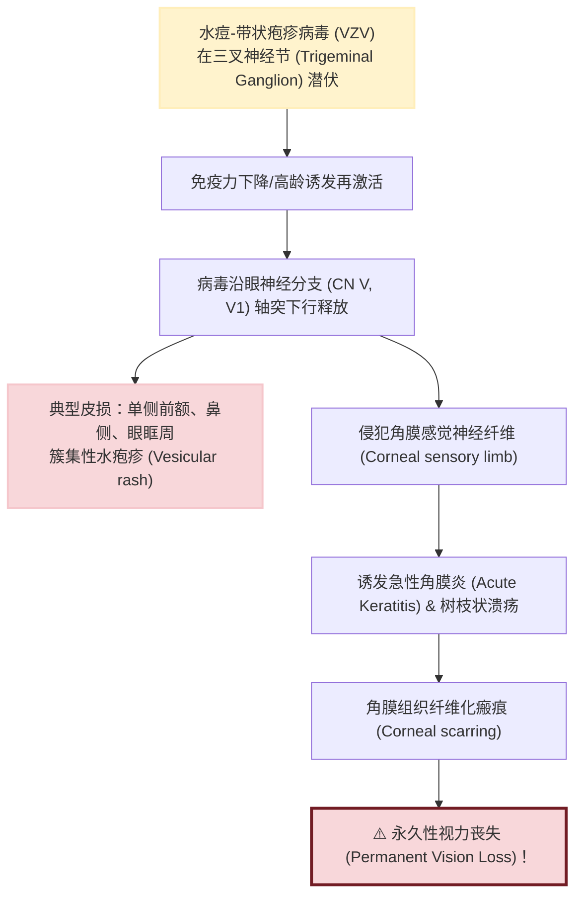
```mermaid
flowchart TD
    A["水痘-带状疱疹病毒 (VZV)<br>在三叉神经节 (Trigeminal Ganglion) 潜伏"] --> B["免疫力下降/高龄诱发再激活"]
    B --> C["病毒沿眼神经分支 (CN V, V1) 轴突下行释放"]
    C --> D["典型皮损：单侧前额、鼻侧、眼眶周<br>簇集性水疱疹 (Vesicular rash)"]
    C --> E["侵犯角膜感觉神经纤维 (Corneal sensory limb)"]
    E --> F["诱发急性角膜炎 (Acute Keratitis) & 树枝状溃疡"]
    F --> G["角膜组织纤维化瘢痕 (Corneal scarring)"]
    G --> H["⚠️ 永久性视力丧失 (Permanent Vision Loss)！"]

    style A fill:#fff3cd,stroke:#ffeeba,stroke-width:2px;
    style D fill:#f8d7da,stroke:#f5c6cb,stroke-width:2px;
    style H fill:#f8d7da,stroke:#721c24,stroke-width:3px;
```

---

### 2. 高频脑神经眼部与面部功能横向鉴别矩阵 (Cranial Nerves Matrix)

| 脑神经编号与名称 | 神经性质与核心支配区域 | 典型受损/病变临床表现 | 与角膜瘢痕/视力丧失的关联判定 |
| :--- | :--- | :--- | :--- |
| **CN V (三叉神经)**<br>*(Trigeminal nerve)*<br>★ **眼支 (V1)** | • **感觉纤维**：支配眼球、角膜、结膜、上眼睑、前额及鼻背皮肤感觉；<br>• **功能**：**角膜反射的感觉传入支 (Sensory limb)** | • 额头/眼周剧烈神经性针刺灼痛与水疱；<br>• **急性角膜炎、角膜感觉减退、角膜溃疡及永久性失明** | ✅ **直接病因**！三叉神经眼支受累是导致角膜炎与角膜瘢痕的核心机制！ |
| **CN III (动眼神经)**<br>*(Oculomotor)* | • **运动纤维**：支配上斜肌和外直肌以外的全部眼外肌；<br>• **副交感**：瞳孔括约肌及睫状肌（缩瞳与对光反射） | • **眼睑下垂 (Ptosis)**；<br>• 眼球向外下方斜视；<br>• **复视 (Diplopia)**、瞳孔散大固定 | ❌ **无关**。仅控制眼球运动与瞳孔，不支配角膜上皮感觉，不引起角膜瘢痕。 |
| **CN IV (滑车神经)**<br>*(Trochlear)* | • **运动纤维**：专一支配**上斜肌 (Superior oblique)** | • 眼球向内下方注视受限；<br>• **下楼梯或阅读时出现复视 (Vertical diplopia)** | ❌ **无关**。单纯运动神经，不累及角膜组织。 |
| **CN VI (展神经)**<br>*(Abducens)* | • **运动纤维**：专一支配**外直肌 (Lateral rectus)** | • **眼球外展不能 (Inability to abduct eye)**；<br>• 内斜视（斗鸡眼）及水平复视 | ❌ **无关**。单纯运动神经，不引起角膜病变。 |
| **CN VII (面神经)**<br>*(Facial nerve)* | • **运动纤维**：支配全部面部表情肌（闭眼眼轮匝肌）；<br>• **功能**：**角膜反射的运动传出支 (Motor limb)** | • 贝尔面瘫 (Bell's palsy)：额纹消失、口角歪斜；<br>• **不能闭眼 (Lagophthalmos)** 引起暴露性角膜炎 | ⚠️ **鉴别关键**：面神经负责闭眼（传出支）；三叉神经负责角膜知觉（传入支）。本题为 VZV 神经节浸润。 |
| **CN X (迷走神经)**<br>*(Vagus nerve)* | • 感觉、运动及强大副交感神经；支配咽喉肌、声带运动、内脏器官 | • 吞咽困难、声音嘶哑、心动过缓或过速、胃肠蠕动减弱 | ❌ **无关**。属于咽喉与胸腹腔脏器支配神经。 |
| **CN XII (舌下神经)**<br>*(Hypoglossal)* | • **纯运动神经**：支配舌内肌及绝大多数舌外肌 | • 伸舌偏向患侧、舌肌萎缩与肌束震颤、构音障碍 | ❌ **无关**。完全不参与任何眼部或角膜神经反射。 |

---

### 3. 带状疱疹 (Herpes Zoster) vs 脓疱疮 (Impetigo) 核心鉴别对比表

| 鉴别维度 | 带状疱疹 (Herpes Zoster / Shingles) | 脓疱疮 (Impetigo) |
| :--- | :--- | :--- |
| **典型共有特征**<br>*(Shared Findings)* | • 水疱/大疱破溃并伴有渗液 (Vesicular/bullous oozing lesions)；<br>• 表面覆盖**黄褐色/蜜黄色干燥结痂 (Yellow-brown / Honey-colored crusts)**。 |
| **好发人群**<br>*(Population)* | • **中老年人 (Older adults)**；<br>• 免疫抑制者、肿瘤化疗或重度应激人群。 | • **儿童与幼儿 (Toddlers & Young children)**；<br>• 好发于托幼机构、炎热潮湿环境。 |
| **病原体本质**<br>*(Etiology)* | • **病毒感染**：水痘-带状疱疹病毒 (Varicella-zoster virus, VZV) 再激活。 | • **细菌感染**：金黄色葡萄球菌 (Staphylococcus aureus) 或 A 组链球菌。 |
| **皮损分布特征**<br>*(Pattern & Lesions)* | • **严格单侧性、沿单一神经节段（皮节）呈线性带状分布 (Linear unilateral dermatomal pattern)**；<br>• 绝不越过躯体中线（除非发生全身播散）。 | • **散在、无节段性分布**；<br>• 典型集中在**口周、鼻周 (Perioral/Perinasal)** 及暴露部位皮肤。 |
| **前驱与主观症状**<br>*(Sensory Symptoms)* | • 出疹前及伴随**剧烈灼痛、刺痛、抽痛或感觉过敏 (Burning pain, tingling)**；<br>• 属于典型的神经病理性剧痛（常遗留带状疱疹后神经痛 PHN）。 | • **剧烈瘙痒 (Pruritus)**；<br>• 通常**无明显神经痛**，病灶浸润表浅。 |
| **治疗首选药物**<br>*(Management)* | • **系统性抗病毒药物**：阿昔洛韦 (Acyclovir)、伐昔洛韦、泛昔洛韦；<br>• 眼部受累时需静脉滴注抗病毒 + 急诊眼科专科用药。 | • **局部或口服抗生素**：莫匹罗星软膏 (Mupirocin)、头孢氨苄；<br>• 温水肥皂液轻轻软化并清除结痂后涂药。 |
| **隔离与防范措施**<br>*(Infection Control)* | • 播散型或免疫低下者：**空气隔离 + 接触隔离 (Airborne & Contact)**；<br>• 局限且完全覆盖者：标准预防；皮疹未结痂前严禁接触孕妇与无水痘抗体者。 | • **接触隔离 (Contact precautions)**；<br>• 极度具有接触传染性；用药 24~48 小时后且皮损结痂方可解除居家隔离返回学校。 |

---

### 4. NCLEX 命题绝杀大坑与做题陷阱 (Clinical Traps & Clues)

1. **“鼻尖疱疹”必选眼科会诊（Hutchinson's Sign 赫钦森征）**：
   - 只要题目中出现带状疱疹患者**鼻尖、鼻背或侧翼出现水疱**，说明累及三叉神经鼻睫支（Nasociliary branch）！
   - **解题黄金法则**：鼻尖水疱意味着角膜几乎 100% 存在隐匿性或活动性受累风险，必须立即选择**“紧急眼科医师评估 (Immediate ophthalmologic referral/consultation)”**与静脉/大剂量口服抗病毒治疗，防止角膜不可逆溃疡瘢痕！
2. **角膜/瞬目反射（Blink Reflex）的“传入 vs 传出”神经混淆大坑**：
   - **传入神经（Sensory Limb）**：**CN V（三叉神经眼支）**——感受棉签触碰角膜的触觉与痛觉刺激；
   - **传出神经（Motor Limb）**：**CN VII（面神经）**——支配眼轮匝肌快速收缩完成眨眼闭眼动作。
   - 题目考查“角膜感觉受损”必选 CN V；考查“不能闭眼”选 CN VII。
3. **皮质类固醇滴眼液的使用红线**：
   - 在未排查排除单纯疱疹或带状疱疹病毒性角膜炎之前，**绝对严禁随意局部使用糖皮质激素眼药水**，否则可导致病毒爆发性增殖形成角膜穿孔与急性失明！

---

### 5. 高频英汉核心词汇 (Key Medical Terms)

* **Herpes Zoster Ophthalmicus (HZO)**：眼带状疱疹
* **Trigeminal Ganglion & Nerve (CN V)**：三叉神经节与三叉神经
* **Ophthalmic Division (V1)**：三叉神经眼支（支配角膜感觉）
* **Corneal / Blink Reflex (Sensory limb)**：角膜反射（感觉传入支）
* **Acute Keratitis**：急性角膜炎
* **Corneal Scarring & Vision Loss**：角膜瘢痕形成与视力丧失
* **Extraocular Motor Nerves (CN III, IV, VI)**：眼外肌运动神经（动眼、滑车、展神经 $\to$ 引起复视）
* **Hutchinson's Sign**：赫钦森征（鼻尖水疱，角膜受累的危险预警信号）
* **Impetigo**：脓疱疮（儿童高发、口周蜜黄色结痂、无神经痛）
* **Yellow-brown / Honey-colored Crusts**：黄褐色/蜜黄色结痂

---

## 129. 室性期前收缩 (PVCs) 心电图特征、心肌梗死应激恶化与高频心律失常全景鉴别 (Med-Surg 深度版)

> [!CAUTION]
> **心梗室早恶性恶化红线 (Ventricular Irritability & Sudden Death)**：
> 在健康心脏中，室性期前收缩（PVCs）通常属于**良性生理现象**（多由咖啡因、烟酒、情绪压力或轻度疲劳诱发）；但在**急性心肌梗死（MI）或严重心肌缺血**患者中，PVCs 绝非良性，它标志着**心室肌严重易激惹（Ventricular Irritability）**，极易快速恶化为致死性恶性心律失常——**室性心动过速（VT）或心室颤动（VF，心脏骤停）**！护士必须立即评估患者血流动力学反应并同步监测**心尖脉-桡动脉脉搏短绌（Apical-radial pulse deficit）**。

---

### 1. PVCs 病理分级与恶性心律失常抢救决策流程图 (Clinical Decision Tree)

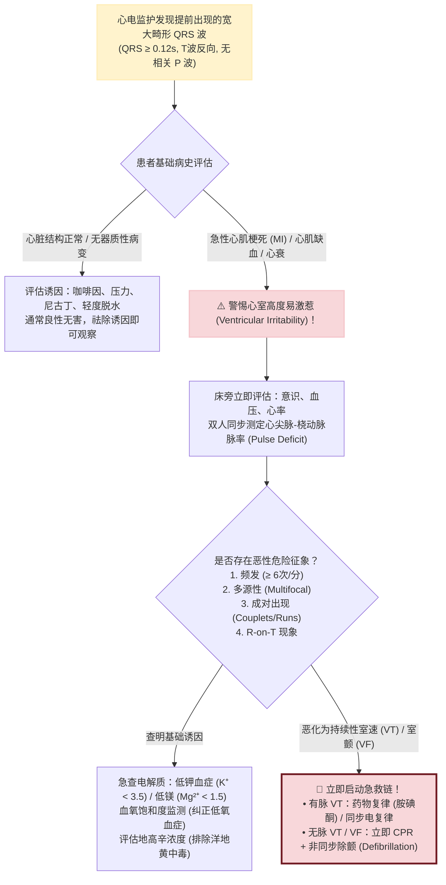
```mermaid
flowchart TD
    A["心电监护发现提前出现的宽大畸形 QRS 波<br>(QRS ≥ 0.12s, T波反向, 无相关 P 波)"] --> B{"患者基础病史评估"}
    B -->|"心脏结构正常 / 无器质性病变"| C["评估诱因：咖啡因、压力、尼古丁、轻度脱水<br>通常良性无害，祛除诱因即可观察"]
    B -->|"急性心肌梗死 (MI) / 心肌缺血 / 心衰"| D["⚠️ 警惕心室高度易激惹 (Ventricular Irritability)！"]
    
    D --> E["床旁立即评估：意识、血压、心率<br>双人同步测定心尖脉-桡动脉脉率 (Pulse Deficit)"]
    E --> F{"是否存在恶性危险征象？<br>1. 频发 (≥ 6次/分)<br>2. 多源性 (Multifocal)<br>3. 成对出现 (Couplets/Runs)<br>4. R-on-T 现象"}
    
    F -->|"查明基础诱因"| G["急查电解质：低钾血症 (K⁺ < 3.5) / 低镁 (Mg²⁺ < 1.5)<br>血氧饱和度监测 (纠正低氧血症)<br>评估地高辛浓度 (排除洋地黄中毒)"]
    F -->|"恶化为持续性室速 (VT) / 室颤 (VF)"| H["🚨 立即启动急救链！<br>• 有脉 VT：药物复律 (胺碘酮) / 同步电复律<br>• 无脉 VT / VF：立即 CPR + 非同步除颤 (Defibrillation)"]

    style A fill:#fff3cd,stroke:#ffeeba,stroke-width:2px;
    style D fill:#f8d7da,stroke:#f5c6cb,stroke-width:2px;
    style H fill:#f8d7da,stroke:#721c24,stroke-width:3px;
```

---

### 2. 高频心律失常心电图与临床鉴别全景矩阵 (Dysrhythmias Matrix)

| 心律失常类型 | 起搏异位灶与机制 | 心电图 (ECG) 关键特征 | 血液动力学危害与临床表现 | 首要处理与抢救黄金法则 |
| :--- | :--- | :--- | :--- | :--- |
| **室性期前收缩**<br>*(PVCs)* | 心室肌内单个或多个异位起搏点提前除极 | • **提前出现宽大畸形的 QRS 波**（时限 $\ge 0.12$ 秒）；<br>• **QRS 前无 P 波**；<br>• T 波方向与 QRS 主波完全相反；<br>• 代偿间歇通常完全。 | • 健康人常感“漏跳一次”或心悸；<br>• 心梗患者提示**心室应激性增高**；<br>• 心室过早收缩充盈不足，产生**脉搏短绌 (Pulse deficit)**。 | • **针对病因治疗**：吸氧纠正缺氧、补充钾镁、停用咖啡因；<br>• 心梗伴恶性早搏：静脉使用**胺碘酮 (Amiodarone)** 或利多卡因。 |
| **房性期前收缩**<br>*(PACs)* | 心房肌内（窦房结以外）异位点提前发放冲动 | • 提前出现异常形态的 P' 波；<br>• **QRS 波形态与时限基本正常**（狭窄，$< 0.12$ 秒）；<br>• 代偿间歇多不完全。 | • 通常无血流动力学障碍；<br>• 偶有轻微心悸或胸部跳动感；<br>• 频发时可诱发房扑、房颤或室上速。 | • 一般无须特殊药物治疗；<br>• 戒除烟酒、咖啡浓茶，避免交感过度兴奋；<br>• 消除情绪焦虑与睡眠剥夺。 |
| **心房颤动**<br>*(Atrial Fibrillation, AF)* | 心房内多发微折返电活动，心房电活动彻底紊乱 | • **P 波完全消失**，代之以大小不一的颤动波（f 波）；<br>• **心室律绝对不规则 (Irregularly irregular)**；<br>• QRS 波群形态时限多正常。 | • 心房丧失有效收缩泵血（心排量下降 20%~30%）；<br>• 心房内血流瘀滞易形成左心耳血栓 $	o$ **脑卒中 (Stroke)**！ | • **控制心室率**：$β$受体阻滞剂、地尔硫䓬；<br>• **长期抗凝**：华法林、DOACs；<br>• 血流动力学不稳定时行**同步直流电复律**。 |
| **室性心动过速**<br>*(Ventricular Tachycardia, VT)* | 心室异位灶连续快速发放冲动（连续 $\ge 3$ 个 PVCs） | • 心室率通常在 **150~250 次/分**；<br>• 宽大畸形 QRS 波群连续出现；<br>• 房室分离，极少见到规则 P 波。 | • 心室极度充盈不良，心排量断崖式暴跌；<br>• 迅速导致低血压、休克、意识丧失；<br>• 极易恶化为心室颤动。 | • **评估有无大动脉脉搏**！<br>• **有脉搏**：胺碘酮抗心律失常 / 同步电复律；<br>• **无脉搏 (Pulseless VT)**：**按心跳骤停立即除颤 + 高质量 CPR**！ |
| **心室颤动**<br>*(Ventricular Fibrillation, VF)* | 心室各部分心肌完全无序的混乱颤动，丧失泵血功能 | • 正常的 P-QRS-T 波群彻底消失；<br>• 代之以形态、振幅极其混乱的室颤波；<br>• 频率 200~500 次/分。 | • **心脏骤停与临床死亡**！<br>• 意识丧失、大动脉搏动消失、呼吸停止、无血压测出。 | • **第一优先级：立即非同步电除颤 (Defibrillation)**！<br>• 同步启动 CPR + 气道管理 + 肾上腺素/胺碘酮静推。 |

---

### 3. PVCs 核心诱发因素与靶向干预矩阵 (Etiologies & Clinical Links)

| 诱发机制与因素 | 临床病理生理过程 | 护士首要针对性干预措施 |
| :--- | :--- | :--- |
| **电解质紊乱 (Electrolytes)** | • **低钾血症 ($K^+ < 3.5$ mEq/L)**：静息电位过度负极化，心肌自律性与兴奋性异常升高；<br>• **低镁血症 ($Mg^{2+} < 1.5$ mEq/L)**：易诱发尖端扭转型室速及难治性早搏。 | • 立即复查血生化；<br>• 遵医嘱经静脉补钾（严禁静脉推注！速度 $\le 10\sim 20$ mEq/h 并全程监护）；<br>• 同步补充硫酸镁。 |
| **心肌缺氧 (Hypoxia)** | 心肌细胞能量代谢耗竭，细胞膜钠钾泵失灵导致自发去极化。 | • 立即给予氧气吸入，维持 $SpO_2 \ge 95\%$；<br>• 查动脉血气分析（ABG），排查呼吸衰竭或肺栓塞。 |
| **兴奋剂与毒物 (Stimulants)** | 咖啡因（Caffeine）、尼古丁、可卡因、安非他命刺激交感肾上腺素能受体。 | • 宣教严格限制浓茶、咖啡、能量饮料及烟草；<br>• 毒物筛查与对症镇静支持。 |
| **洋地黄毒性 (Digoxin Toxicity)** | 抑制 $Na^+/K^+$-ATP 酶导致细胞内钙超载，**PVCs（尤其是二联律/三联律）是其高频早期预警**。 | • 监测地高辛血药浓度（治疗窗 0.5~0.9 ng/mL）；<br>• 评估恶心、呕吐、黄绿视；若中毒立即停药，必要时用地高辛特异性抗体 (DigiFab)。 |
| **急性缺血/心梗 (Myocardial Infarction)** | 梗死灶边缘缺血心肌组织传导减慢与电生理折返形成。 | • 评估心前区疼痛、心肌酶（肌钙蛋白）；<br>• 绝对卧床休息、抗缺血扩冠治疗、准备再灌注与抗心律失常药物。 |

---

### 4. NCLEX 命题绝杀大坑与做题技巧 (Clinical Traps & Clues)

1. **“脉搏短绌 (Pulse Deficit)”的测量标准手法**：
   - 当室早频繁发生时，过早收缩的心室舒张期极短、充盈血量极低，泵出的搏出量无法有效传导到远端肢体动脉，导致**外周桡动脉搏动触不到（漏跳），但心前区听诊却能听到过早搏动**。
   - **NCLEX 标准操作**：必须由**两名护士同时计数**，一人听诊心尖脉（Apical pulse），另一人触诊桡动脉脉搏（Radial pulse），计数满整整 **1 分钟（60秒）**！心尖脉率减去桡动脉脉率即为“脉搏短绌”。
2. **“恶性室早”四大多发红线（立即报告医生）**：
   - ① **频发室早**：每分钟出现超过 6 次；
   - ② **多源性室早 (Multifocal PVCs)**：心电图上 QRS 波群形态各异，说明有多个心室起搏点；
   - ③ **连发/成对室早 (Couplets / Runs of PVCs)**：连续 2 个甚至连续 3 个（连续 3 个即为短阵室速！）；
   - ④ **R-on-T 现象**：PVC 的 R 波恰好落在前一个窦性心搏的 T 波易损期上，极易直接触发致死性心室颤动（VF）。
3. **首要护理行动优先级（Assessment Priority）**：
   - 看到监护仪出现 PVCs，**第一步绝不是盲目给药**，而是**立即到床旁评估患者的生理反应（Physiological response）**：患者是否清醒？有无头晕、出冷汗、低血压、发绀、胸痛？同时触诊脉搏质量。

---

### 5. 高频英汉核心词汇 (Key Medical Terms)

* **Premature Ventricular Contraction (PVC)**：室性期前收缩 / 室性早搏
* **Ventricular Irritability**：心室易激惹 / 心室应激性增高（心梗后的危险征象）
* **Ectopic Focus / Foci**：异位起搏点
* **Wide and Distorted QRS Complex**：宽大畸形的 QRS 波群（$\ge 0.12$ 秒）
* **Apical-Radial Pulse Deficit**：心尖脉-桡动脉脉搏短绌
* **Atrial Fibrillation (AFib)**：心房颤动（P波消失、f波、节律绝对不齐）
* **Premature Atrial Contraction (PAC)**：房性期前收缩 / 房性早搏
* **Ventricular Tachycardia (VT)**：室性心动过速（150~250次/分，连续宽QRS）
* **Ventricular Fibrillation (VF)**：心室颤动（致命骤停，立即非同步除颤）
* **R-on-T Phenomenon**：R-on-T 现象（可瞬间诱发室颤）
